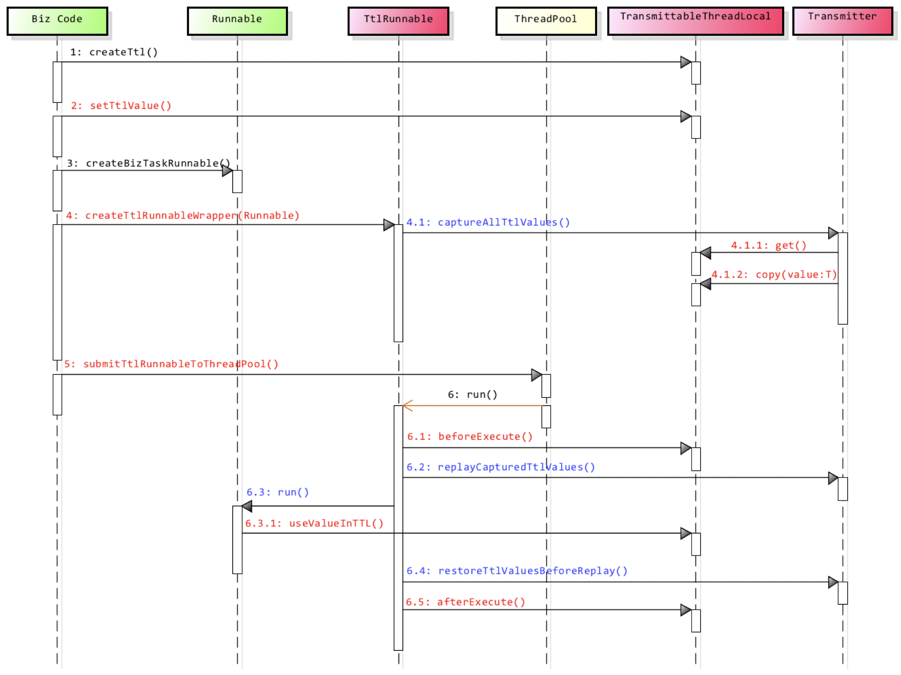

> TTL（transmittable-thread-local）是一个线程间传递ThreadLocal，异步执行时上下文传递的解决方案。整个库的核心是构建在TransmittableThreadLocal类（继承并加强InheritableThreadLocal类）之上，同时包含线程池修饰（ExecutorService/ForkJoinPool/TimerTask）以及Java Agent支持，代码小于1k行，短小精悍。

在往下看之前，最好大致看下 https://github.com/alibaba/transmittable-thread-local 文档，效果会更好。JDK的InheritableThreadLocal类可以完成父线程到子线程的值传递。但对于使用线程池等会池化复用线程的组件的情况，线程由线程池创建好，并且线程是池化起来反复使用的；这时父子线程关系的ThreadLocal值传递已经没有意义，应用需要的实际上是把 **任务提交给线程池时的ThreadLocal值传递**到 **任务执行时**。原理是使用TtlRunnable/Ttlcallable包装了Runnable/Callable类：

1. 在TtlRunnable/Ttlcallable初始化时**capture** TransmittableThreadLocal变量
2. 在run方法调用runnable.run()前进行**replay**，设置到当前线程ThreadLocal
3. 在run方法调用runnable.run()后进行**restore**，上下文还原，也就是replay的反向操作

注意，步骤1和步骤2/3不是在同一个线程中执行的。

既然TTL的TransmittableThreadLocal是继承并加强InheritableThreadLocal类的，那么首先需要分析下InheritableThreadLocal是什么东东，源码如下：

```java
public class InheritableThreadLocal<T> extends ThreadLocal<T> {
    /**
     * 新建线程时，如果当前inheritableThreadLocals非空，则会获取当前inheritableThreadLocals传递给新线程
     */
    protected T childValue(T parentValue) {
        return parentValue;
    }
    /**
     * InheritableThreadLocal变量的set/get/remove操作都是在inheritableThreadLocals上
     */
    ThreadLocalMap getMap(Thread t) {
       return t.inheritableThreadLocals;
    }
    /**
     * 创建inheritableThreadLocals
     */
    void createMap(Thread t, T firstValue) {
        t.inheritableThreadLocals = new ThreadLocalMap(this, firstValue);
    }
}
```

Thread类中有两个ThreadLocal相关的ThreadLocalMap属性，如下：

```java
ThreadLocal.ThreadLocalMap threadLocals：ThreadLocal变量使用
ThreadLocal.ThreadLocalMap inheritableThreadLocals：InheritableThreadLocal变量使用
```

新建线程时，将当前线程的inheritableThreadLocals传递给新线程，这里的传递是对InheritableThreadLocal变量的数据做浅拷贝（引用复制），这样新线程可以使用同一个InheritableThreadLocal变量查看上一个线程的数据。

下面分析下使用InheritableThreadLocal的一个demo：

```java
void testInheritableThreadLocal_线程池() throws InterruptedException {
    final InheritableThreadLocal<String> parent = new InheritableThreadLocal<>();
    parent.set("value-set-in-parent");

    ExecutorService executor = Executors.newFixedThreadPool(1);
    executor.submit(() -> System.out.println(Thread.currentThread().getName() + ": " + parent.get()));
}
// 输出结果：pool-1-thread-1: value-set-in-parent
```

上面代码在submit任务时会伴随着（线程池工作）线程的创建，会继承当前线程的InheritableThreadLocal，所以会有上述输出结果。如果将代码改成下面的样子，会有什么不同呢？

```java
void testInheritableThreadLocal_线程池() throws InterruptedException {
    ExecutorService executor = Executors.newFixedThreadPool(1);
    executor.submit(() -> {}); // 先进行工作线程创建

    final InheritableThreadLocal<String> parent = new InheritableThreadLocal<>();
    parent.set("value-set-in-parent");
    executor.submit(() -> System.out.println(Thread.currentThread().getName() + ": " + parent.get()));
}
// 输出结果：pool-1-thread-1: null
```

因为创建线程时当前线程并没有inheritableThreadLocals，所以线程池中线程打印结果为null。这种场景下如何才能获取到parent变量的数据呢？这时就该TTL出场了，将上述代码改成TTL方式如下：

```java
void testTtlInheritableThreadLocal_线程池() throws InterruptedException {
    ExecutorService executor = Executors.newFixedThreadPool(1);
    executor.submit(() -> {}); // 先进行工作线程创建

    // 使用TTL
    final TransmittableThreadLocal<String> parent = new TransmittableThreadLocal<>();
    parent.set("value-set-in-parent");
    // 将Runnable通过TtlRunnable包装下
    executor.submit(TtlRunnable.get(() -> System.out.println(Thread.currentThread().getName() + ": " + parent.get())));
}
// 输出结果：pool-1-thread-1: value-set-in-parent
```

下面以TtlRunnable.get()为起点分析TTL的设计实现，TtlRunnable.get源码如下（TtlRunnable.get流程对应的初始化时**capture**操作，保存快照。TtlCallable和TtlRunnable流程类似）：

```java
public static TtlRunnable get(@Nullable Runnable runnable) {
	return get(runnable, false, false);
}
public static TtlRunnable get(@Nullable Runnable runnable, boolean releaseTtlValueReferenceAfterRun, boolean idempotent) {
	if (runnable instanceof TtlEnhanced) {
		// 幂等时直接返回，否则执行会产生问题，直接抛异常
		if (idempotent) return (TtlRunnable) runnable;
		else throw new IllegalStateException("Already TtlRunnable!");
	}
	return new TtlRunnable(runnable, releaseTtlValueReferenceAfterRun);
}
private TtlRunnable(@Nonnull Runnable runnable, boolean releaseTtlValueReferenceAfterRun) {
	this.capturedRef = new AtomicReference<Object>(capture());
	this.runnable = runnable;
	this.releaseTtlValueReferenceAfterRun = releaseTtlValueReferenceAfterRun;
}
public static Object capture() {
	Map<TransmittableThreadLocal<?>, Object> captured = new HashMap<TransmittableThreadLocal<?>, Object>();
	// 从holder获取所有threadLocal，存到captured，这里相当于对当前线程holder做一个快照保存
	// 到TtlRunnable实例属性中，在执行TtlRunnable时进行回放
	for (TransmittableThreadLocal<?> threadLocal : holder.get().keySet()) {
		captured.put(threadLocal, threadLocal.copyValue());
	}
	return captured;
}
```

在新建TtlRunnable过程中，会保存下TransmittableThreadLocal.holder到captured，记录到TtlRunnable实例中的capturedRef字段，TransmittableThreadLocal.holder类型是：

```java
// Note about holder:
// 1. The value of holder is type Map<TransmittableThreadLocal<?>, ?> (WeakHashMap implementation),
//    but it is used as *set*. 因为没有WeakSet的原因
// 2. WeakHashMap support null value.
private static InheritableThreadLocal<Map<TransmittableThreadLocal<?>, ?>> holder =
        new InheritableThreadLocal<Map<TransmittableThreadLocal<?>, ?>>() {
            @Override
            protected Map<TransmittableThreadLocal<?>, ?> initialValue() {
                return new WeakHashMap<TransmittableThreadLocal<?>, Object>();
            }
            @Override
            protected Map<TransmittableThreadLocal<?>, ?> childValue(Map<TransmittableThreadLocal<?>, ?> parentValue) {
                return new WeakHashMap<TransmittableThreadLocal<?>, Object>(parentValue);
            }
        };
```

从上面代码我们知道初始化TtlRunnable时已经将TransmittableThreadLocal保存下来了，那么什么时候应用到当前线程ThreadLocal中呢，这是就需要看下TtlRunnable.run方法：

```java
public void run() {
    Object captured = capturedRef.get();
    // captured不应该为空，releaseTtlValueReferenceAfterRun为true时设置capturedRef为null，防止当前Runnable重复执行
    if (captured == null || releaseTtlValueReferenceAfterRun && !capturedRef.compareAndSet(captured, null)) {
        throw new IllegalStateException("TTL value reference is released after run!");
    }

    // captured进行回放，应用到当前线程中
    Object backup = replay(captured);
    try {
        runnable.run();
    } finally {
        restore(backup);
    }
}
```

注意，TTL中的replay操作是以captured为当前inheritableThreadLocals的（处理逻辑是在TtlRunable run时，会以TtlRunnable.get时间点获取的captured（类似TTL快照）为准，holder中不在captured的先移除，在的会被替换）。关于replay中的clean extra TTL value讨论可以参考：https://github.com/alibaba/transmittable-thread-local/issues/134。回放captured和执行完runnable.run之后，再restore恢复到原来inheritableThreadLocals的状态。

说完了TTL中的capture、replay和restore流程，再看下官方提供的这个时序图，是不是感觉清晰很多。



除了通过TtlRunable.get()修饰用户自定义的task之外，还可以修饰线程池和使用Java Agent修饰JDK线程池实现类的方式实现TTL功能。

修饰线程池省去每次Runnable和Callable传入线程池时的修饰，这个逻辑可以在线程池中完成，其实就是在提交task时调用TtlRunable.get()修饰下。通过工具类com.alibaba.ttl.threadpool.TtlExecutors完成，有下面的方法：

- getTtlExecutor：修饰接口Executor
- getTtlExecutorService：修饰接口ExecutorService
- getTtlScheduledExecutorService：修饰接口ScheduledExecutorService

使用Java Agent来修饰JDK线程池实现类，这种方式，实现线程池的传递是透明的，代码中没有修饰Runnable或是线程池的代码。即可以做到应用代码无侵入。关于 无侵入 的更多说明参见文档 [Java Agent方式对应用代码无侵入](https://github.com/alibaba/transmittable-thread-local/blob/master/docs/developer-guide.md#java-agent方式对应用代码无侵入)。

使用Java Agent 实例如下：

```java
// 启动参数中需加上 -javaagent:path/transmittable-thread-local-x.x.x.jar
ExecutorService executor = Executors.newFixedThreadPool(1);
executor.submit(() -> {});

final TransmittableThreadLocal<String> parent = new TransmittableThreadLocal<>();
parent.set("value-set-in-parent");

executor.submit(() -> System.out.println(Thread.currentThread().getName() + ": " + parent.get()));
executor.shutdown();
```

TTL代码实现来看，确实短小精悍，值得花几个小时看下源码。通过看源码，我发现了，可以通过new ThreadLocal对象时，直接重写其initialValue方法，可以在threadLocal.get为空时初始化一个值，使用示例如下：

```java
ThreadLocal<String> local = new ThreadLocal<String>() {
    @Override
    protected String initialValue() {
        return "init";
    }
};

System.out.println(local.get()); // init

local.set("hello world");
System.out.println(local.get()); // hello world

local.remove();
System.out.println(local.get()); // init
```

