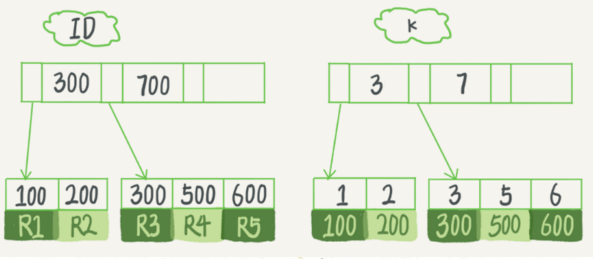

> MySQL基础概念相关的名词还是挺多的，比如3大范式、4种隔离界别、ACID、DQL、DML、DDL，还有redo、undo、binlog等，本文就统一整理下MySQL常见的基础概念，方便小伙伴们翻阅~

MySQL相关的名词概念还是挺多的，但是常用的也不多，因此将常用的统计整理下，便于回顾：
*   **DQL**：data query language，指SELECT查询语句；
*  ** DML**：data manipulation language，指SELECT、UPDATE、INSERT、DELETE这4种对数据操控语句；
*   **DDL**：data definition language，数据定义语句，创建/修改/删除表结构，主要有CREATE、ALTER、DROP等；
*   **MDL锁**：Metadata Locking，这里的metalock指的是数据库及表的结构信息。MySQL中，DDL不属于事务范畴，如果事务和DDL并行执行，操作相关联的表的话，会出现各种意想不到问题，导致事务特性被破坏或者[binlog顺序错乱](https://bugs.mysql.com/bug.php?id=989)等，为解决这些问题而引入MDL锁机制。

## 三大范式

*   第一范式：每个字段都是原子的，也就说不可再分解；
*   第二范式：有主键，非主键字段依赖主键字段；
*   第三范式：非主键之间不能相互依赖。

注意，三大范式是数据表的建议设计原则，并不是非得完全按照这个来设计，具体设计还要根据实际场景来分析。任何给定的数据通常有多种表示方法，完全的范式话和反范式化，以及二者的折中。在范式化数据库中，任何数据都会出现且只出现一次，相反在反范式化中，数据是冗余的。

## ACID

ACID是事务的4个特性，分别是原子性、一致性、隔离性和持久性。

*   A：atomicity，原子性，一个事务必须被视为一个不可分割的最小工作单元，整个事务中的所有操作要么全部提交成功，要么全部失败回滚；
*   C：consistency，一致性，数据库总是从一个一致性的状态转换到另一个一致性的状态；
*   I：isolation，隔离性，通常来说，一个事务所做的修改在最终提交以前，对其他事务是不可见的（隔离级别在非提交读时不满足）；
*   D：一旦事务提交，则其所做的修改就会永久保存到数据库中。

## 隔离级别

数据库事务的4种隔离级别：

*   未提交读：一个事务可以读到另外一个事务未提交的数据。
*   提交度：一个事务更新数据过程中，如果事务还未提交，其他事务读不到该数据。
*   可重复读：该级别保证了在同一个事务中，多次读取同样记录的结果是一样的，解决了“提交读”中不可重复读的问题。但是理论上还是无法解决幻读问题（通过间隙锁可解决幻读问题）。
*   串行化：将所有事务都进行串行化处理，等级最高的隔离级别。

## 幻读问题

幻读就是当事务在读取某个范围数据时，另一个事务又在该范围插入了新的数据，当之前的事务再次读取该范围数据时，就会产生幻行。产生幻读的原因是之前的事务在读取数据的范围没有增加范围锁（range-locks），也就是读取时只是锁定的行级共享锁，没有锁定整个查询区间或者表。

## 常见索引结构

*   B+树索引：B+ 树是关系型数据库中常见的索引类型。注意：B+树所以并不能找到一个给定键值的具体行，只能找到被查找数据行所在的页，然后数据库将页读入内存，在内存中进行查找，最后得到要查找的数据；
*   哈希索引：InnoDB支持的哈希索引是自适应的，不能人为干预在一张表中生成哈希索引，innodb会根据表的使用情况自动生成哈希索引；
*   全文索引：InnoDB支持全文索引，但是每张表只能有一个全文检索的索引，一般都是使用倒排索引技术来实现。

## 聚集索引和非聚集索引

聚集索引就是主键索引，其叶子节点就是记录的数据（页）。非聚集索引也叫做辅助索引，其叶子结点记录的是主键值。以表t为例说明如下：
```mysql
create table T (
ID int primary key,
k int NOT NULL DEFAULT 0,
s varchar(16) NOT NULL DEFAULT '',
index k(k)) engine=InnoDB;

insert into T values(100,1, 'aa'),(200,2,'bb'),(300,3,'cc'),(500,5,'ee'),(600,6,'ff');
```
表T对应的主键索引和辅助索引如下：


## 几个日志

*   redo log：记录的是页的物理操作，InnoDB通过将事务操作先写redo log，而不是将数据页的更新写磁盘，相当于将磁盘随机写(data文件)变成了顺序写(redo log)，后续在MySQL"空闲"时再慢慢写磁盘，提高服务器性能；
*   undo log：undo log保存了事务发生之前的数据的版本，可用于回滚，同时可提供多版本并发控制读（MVCC），也就是非锁定读。undo log是逻辑日志，在执行undo时，仅仅是将数据逻辑上恢复至事务之前的状态，而不是从物理页上操作的，这一条不同于redo log。事务开始时将当前版本生成undo log，undo也会产生redo来保证undo log可靠性；
*   binlog：binlog是mysql层面的归档日志，可用于主从复制和数据库基于时间点的还原。binlog记录的是逻辑日志，记录的是DDL和DML操作日志，可以简单认为是执行过的事务中的更新sql语句。
*   慢查询、错误日志等。

## 几个文件

*   .ibd文件和.ibdata文件：.ibd文件和ibdata文件都是存放innodb数据的文件，之所有有2个，因为innodb支持配置来决定是使用共享表空间还是独享表空间。独享表空间使用".ibd"文件存储数据，并且每个表有一个.ibd文件；如果使用共享表空间，则会使用ibdata文件，所有表公用一个（或者配置多个）ibdata文件。
*   .ifm文件：存放表相关的元数据信息。
