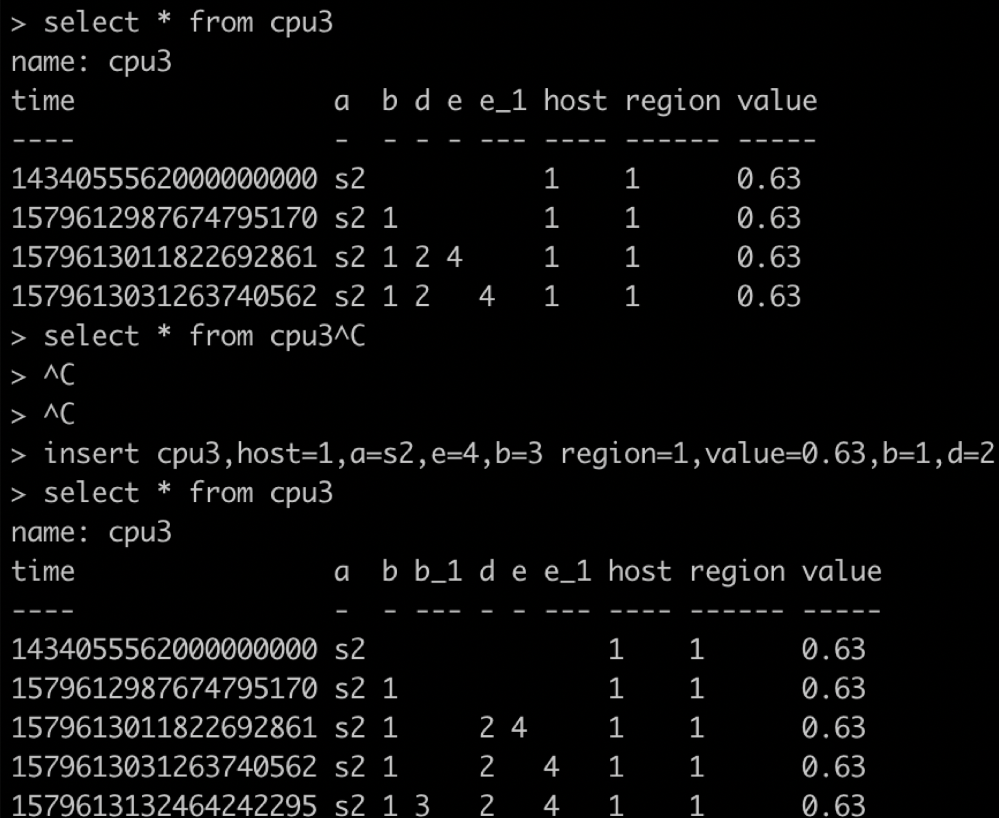

> InfluxDB是一个开源的时序数据库，使用GO语言开发，特别适合用于处理和分析资源监控数据这种时序相关数据。而InfluxDB自带的各种特殊函数如求标准差，随机取样数据，统计数据变化比等，使数据统计和实时分析变得十分方便。

influxdb的单机版是开源的，而集群版是商业版，influxdb被设计运行在SSD上，如果使用机器或者网络磁盘作为存储介质，会导致性能下降至少一个数量级。influxdb支持restful api，同时也支持https，为了保证安全性，非局域网建议使用https与Influxdb进行通信。

### influxdb基础

infludb中存储的是时间序列数据，比如说某个时间点系统负载、服务耗时等信息，时间序列数据可以包含多个值。关于什么是时间序列数据，简单来来说就是数据是和一个时间点关联的，结合mysql中的记录与id关系来看就是时间序列数据的主键就是时间点（`timestrap`）。

infludb中的一条数据至少包括`measurement`（对应mysql中表概念）、`timestamp`、至少`一个k-v结构的field`，再加上0个或者多个k-v结构的tag。对比mysql来看，measurement就是一张表，其主键是timestamp时间戳，tag和field对应就是表中列，tag和field都是k-v接口，k对应列的名字，v对应该列存储的值，tag和field不同的是，tag是有索引的而field没有（如果查询条件为tag则会扫描所有查询到的数据），对于mysql表的有索引列和无索引列。注意mysql中的表需要提前定义结构，而influxdb中的measurement无需提前定义，其null值也不会被存储。

influxdb中measurement无需定义，即无模式设计，开发者可以在任意添加measurement，tags和fields，不过针对同一个field，第二次和第一次写入的数据类型不匹配，influxdb会报错（由于默认tag的v都是字符串类型，所有不存在这个问题，不管输入是什么数据都当做字符串来处理）。

### 数据读写

influxdb数据写入需满足如下格式：

```sql
insert <measurement>[,<tag-key>=<tag-value>...] <field-key>=<field-value>[,<field2-key>=<field2-value>...] [unix-nano-timestamp] 
```

> 注意：measurement和至少一个fileld的k-v是必须的，tag和timestrap时间戳是可选的。

说实话，这个写入格式还是有点小严格的，因为它要求measurement和可能的0个或多个tag之间必须是紧挨着的，中间不能有空格；同时多个filed之间也是不能有空格，tag和field的k，tag的v都是字符串类型；时间戳不是必须的，如果为空则使用服务端的本地时间作为时间戳。相同时间戳的数据第二次写入会覆盖第一次写入的数据，相当于更新操作。

> 为什么至少有一个filed是必须的，而tag是可选的呢？

这是influxdb的存储模型决定的，`measurement+tag set+field key`作为key，field value作为value，如果没有field则没有了对应的value了。

> 插入数据的tag key和field key能一样么？

数据插入没问题，这是由于infludb底层存储tag和field是在不同地方的，只不过为了区分会加上`_序号`而已，如下图：



当在use某个db之后，就可以执行数据读写操作，比如下面往名字为cpu的`MEASUREMENT（对应mysql中的表概念）`中写入如下数据：

```sql
insert cpu,host=s01,region=hangzhou value=0.64 1520052020000000000
命令说明：
- 插入数据对应的MEASUREMENT名字为cpu；
- 数据tag分别是host和region，field是value；
- 数据的最后一项是时间戳（1520052020000000000），时间戳不是必须的，如果不传则使用influxdb服务端本地时间戳，注意时间戳都是UTC时间
```

### 数据保留策略

Influxdb可支持每秒十万级别的数据量，如果长时间保存会对存储造成很大压力，因此和一般数据存储系统一样有一个数据保留策略，同时针对大流量量数据可采样保存，小流量数据可全量保存。influxdb通过保留策略（RP，Retention Policy）来管理过期数据，使用连续查询（`CR，Continuous Queries`）来进行数据采样。

- RP：数据保留策略，过期数据会被清除，每个数据库可拥有多种RP策略；
- CQ：数据连续查询，定时跑的一个查询语句，比如周期性统计某个数据指标，查询语句需要在select语句中使用并且包含group by time子句（这里有点类似Flink中流数据处理的按时间窗口统计功能）。

默认写数据不指定保留策略（RP，Retention Policy）时，默认使用influxdb默认的RP，名字叫做autogen的RP会永久保留数据。如果使用命令 `create retention policy "default2" on "db2" duration 2h replication 1 default`，执行该命令后default2会取代默认的autugen作为db2数据库的默认RP，默认influxdb会间隔半个小时执行一次RP操作。

> 比如有一个服务请求日志measurement的名字为log（RP策略是2小时，数据库是db2），其中数据有服务耗时（字段对应名字time），我们想统计每分钟平均服务耗时，然后将平均耗时数据写入到名字为log2的measurement（RP策略是2天），该如何做呢？

首先创建2小时和2天的RP策略：

```sql
create retention policy "tow_hour" on db2 duration 2h replication 1
# 对数据库db2创建一个名字叫"tow_hour"的RP策略，数据保存2小时，由于最后没有加default，所以数据读写如果没有执行RP仍然使用的是influxdb默认的RP
create retention policy "tow_day" on db2 duration 2d replication 1
# 对数据库db2创建一个名字叫"tow_day"的RP策略，注意对于单机版influxdb来说replication无意义
```

然后使用create continuous query创建CQ策略：

```sql
create continuous query "cq_avg_time" on db2 
begin 
    select mean("time") as "mean_time" into "tow_day"."log2" from log 
    group by time(1m) 
end
```

这样就创建了一个名字叫cq_avg_time的CQ作用于db2数据库，每1分钟一次计算measurement为log的time字段的平均值，然后写入到另一个measurement为log2中。