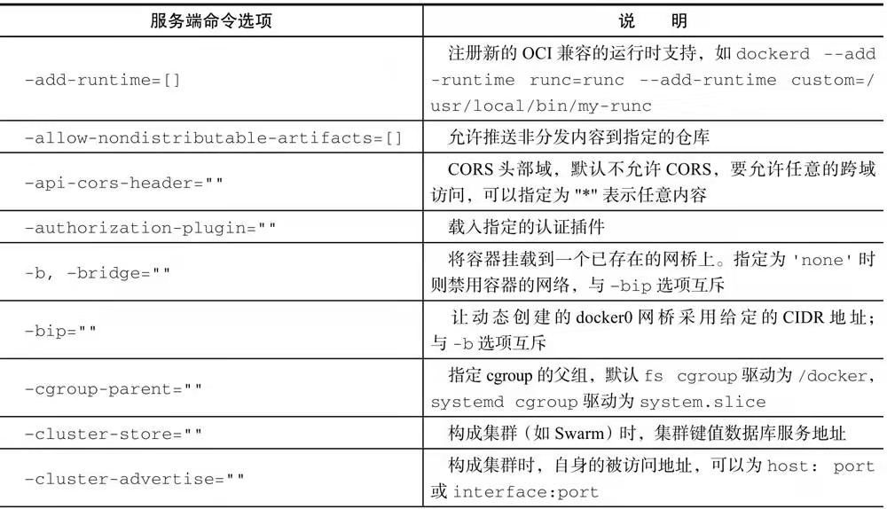
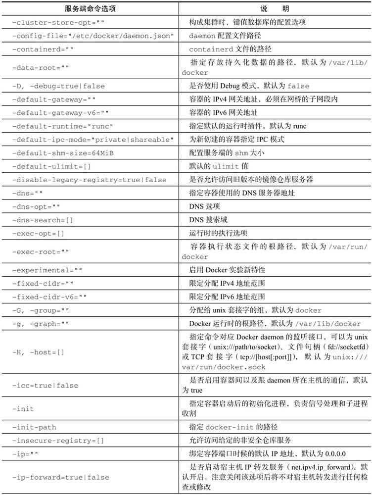
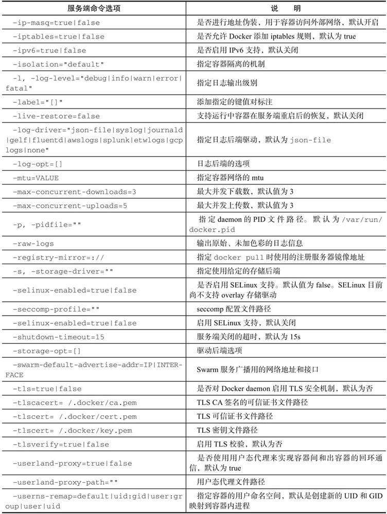
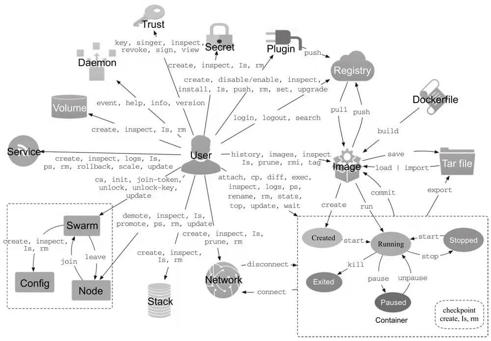

> 学习Docker，首先需要了解Docker基本概念，然后就开始“动手”了（也就是敲Docker命令）。Docker命令较多，这里笔者总结下常用的Docker命令，方便小伙伴们查阅。

Docker是基于go语言开发，底层技术（Linux下）主要基于cgroups、namespace以及联合文件技术实现的一种进程级别的轻量级虚拟化解决方案。由于Docker进程隔离独立于宿主机上其他进程，因此也称为容器，Docker在容器的基础上，进行了更进一步的封装，从文件系统、网络到进程隔离等，极大简化了容器的创建管理维护工作，降低了开发者使用门槛，因此才在近几年流行开来（毕竟Docker的底层技术在Docker出现之前就已经存在了）。

Docker命令有2大类，分别是服务端命令和客户端命令，前者是操作docker服务端（dockerd），后者也就是开发者常用的docker命令，更多Docker命令可以使用 `docker help` 查看。

- 客户端命令：基本命令格式为docker [OPTIONS] COMMAND [arg...]；
- 服务端命令：基本命令格式为dockerd [OPTIONS]。

### 客户端命令

centos下安装docker可使用命令`yum install docker`，mac下需要安装docker-for-mac，使用命令 `wget http://mirrors.aliyun.com/docker-toolbox/mac/docker-for-mac/stable/Docker.dmg`。安装完成之后可以使用如下命令使用Docker：

```bash
service docker start  启动docker服务
docker version/info   查看docker版本/信息
docker inspect  查看容器详细信息
docker inspect -f {{.State.Pid}} xxxx   查看容器对应的pid
docker logs 查看对应容器日志
```

Docker有两个基本概念：镜像和容器，前者是打包后可执行的容器文件，后者是运行中的Docker实例，二者关系类似 `可执行文件` 和 `进程` 的概念。

#### 镜像命令

镜像相关命令有搜索、查看、删除、存档和加载等，如下：

```bash
docker images  查看所有本地镜像，或者使用命令 docker image ls
docker search xxx   搜索官方仓库中的镜像
docker pull xxx:tag    下载镜像，也可以使用docker push 推送自己的镜像，docker run xxx命令会启动容器，当本地没有容器镜像是会从仓库中拉取
docker rmi imageName   删除本地一个或多个镜像，注意不要和docker rm删除容器命令混淆
docker rm xxx 删除一个或多个容器
docker history ubuntu:18.04  查看Ubuntu镜像的创建过程（各个层内容）
docker save -o ubuntu_18.04.tar ubuntu:18.04   导出镜像到本地文件ubuntu_18.04.tar
docker load -i ubuntu_18.04.tar  加载镜像，或者使用命令 docker < ubuntu_18.04.tar
```

#### 容器命令

围绕容器，Docker提供了十分丰富的操作命令，允许用户高效地管理容器的整个生命周期。可以使用`docker container help`命令查看Docker支持的容器操作子命令：

```bash
docker ps  列出所有运行中的容器
docker ps -a  列出所有容器，包括停止状态的
docker ps -a -q   列出所有镜像的id
docker rm containerId   删除某一个镜像
docker rm $(docker ps -a -q)  删除所有处于终止状态的容器，注意不能删除正在运行中的容器
docker run -it --rm ubuntu:14:04  bash       -it 这是两个参数，-t是开一个终端（伪终端绑定到容器的标准输入上），-i是交互式命令让容器的标准输入保持打开。--rm是容器退出后删除，默认情况下容器退出不会自动删除，方便排查问题。ubuntu:14:04使用的启动镜像。bash放在镜像后面的命令。执行exit命令从容器中退出时，容器会自动退出。有时候需要让容器已后台守护态运行，此时需要增加-d参数，比如docker urn -d ubuntu。
docker run ubuntu  echo "hello world"   在docker容器中运行命令输出hello world
docker start containerId   启动处于created状态的容器
docker resetart containerId   重启处于运行状态的容器
docker stop containerId   停止容器运行
docker logs xxx 查看容器xxx输出信息
docker pause  [container]  暂停容器，恢复使用命令docker unpause xxx
docker inspect [container] 查看容器的详细信息，创建时间、路径、状态配置等详细信息。
docker top  [container]   查看容器内进程信息。
docker stats   [container]   查看容器的CPU、内存、网络等统计信息，支持选项有：-a:输出所有统计信息，默认只输出运行中信息；-no-stream:不持续输出，默认会自动更新统计结果。
docker cp zzz.txt 26755872da4d:/tmp：将本地zzz.txt文件复制到容器26755872da4d的/tmp目录下，也可以使用命令将容器内文件复制到本地机器，docker cp 26755872da4d:/tmp/zzz.txt /tmp。
docker container  diff 26755872da4d：container diff命令查看容器内文件系统的变更。
docker container  port 26755872da4d：查看容器端口映射。
docker update --cpus 4 26755872da4d：限定容器使用CPU个数为4
```

**container update**命令可以更新容器的一些运行时配置，主要是一些资源限制份额。命令格式为docker [container] update [OPTIONS] CONTAINER [CONTAINER...]，支持的操作如下：

```bash
❑ -blkio-weight uint16：更新块IO限制，10～1000，默认值为0，代表着无限制；
❑ -cpu-period int：限制CPU调度器CFS（Completely Fair Scheduler）使用时间，单位为微秒，最小1000；
❑ -cpu-quota int：限制CPU调度器CFS配额，单位为微秒，最小1000；
❑ -cpu-rt-period int：限制CPU调度器的实时周期，单位为微秒；
❑ -cpu-rt-runtime int：限制CPU调度器的实时运行时，单位为微秒；
❑ -c, -cpu-shares int：限制CPU使用份额；
❑ -cpus decimal：限制CPU个数；
❑ -cpuset-cpus string：允许使用的CPU核，如0-3,0,1；
❑ -cpuset-mems string：允许使用的内存块，如0-3,0,1；
❑ -kernel-memory bytes：限制使用的内核内存；
❑ -m, -memory bytes：限制使用的内存；
❑ -memory-reservation bytes：内存软限制；
❑ -memory-swap bytes：内存加上缓存区的限制，-1表示为对缓冲区无限制；
❑ -restart string：容器退出后的重启策略。
```

#### docker run参数

docker run 启动容器，可以指定参数设置容器启动策略，如下：

```bash
-d  容器会在后台运行并不会把输出（STDOUT）打印到宿主机上
-t  让docker分配一个伪终端并绑定到容器的标准输入上
-i  让容器的标准输入保持打开
-p 映射本地端口和容器端口，格式为-p ip:hostPort:containerPort或者-p hostPort:containerPort。
-P 大写的P，使用 -P 标记时，Docker 会随机映射一个 49000~49900 的端口到内部容器开放的网络端口。
--rm   在容器执行完毕后将其删除，默认只能删除已停止的容器，如果想要删除正在运行中容器，可增加-f参数。
--name   xxx   执行容器的name
```

*注意，容器是否会长久运行，是和docker run指定的命令有关，和 -d 参数无关*。

#### 操作容器

**进入容器**

容器运行过程中，常常需要进入容器中执行操作场景，可使用如下命令进入容器：

```bash
attach：使用命令docker attach containerId/names进入容器，但是使用 attach 命令有时候并不方便。当多个窗口同时 attach 到同一个容器的时候，所有窗口都会同步显示。当某个窗口因命令阻塞时,其他窗口也无法执行操作了。注意，进入容器后，如果使用exit退出容器，那么容器也会停止运行，可以使用命令Ctrl+P+Q来退出但不关闭容器。
nsenter：nsenter 启动一个新的shell进程(默认是/bin/bash)，同时会把这个新进程切换到和目标(target)进程相同的命名空间，这样就相当于进入了容器内部。nsenter 要正常工作需要有 root 权限
exec：使用exec命令更加便捷，docker exec -it 775c7c9ee1e1 /bin/bash  ，很方便的进入容器
```

**导入/导出容器**

```bash
docker export -o test.tar [container]   将某个容器导出到本地
docker import test.tar  导入某个容器导出文件（容器导出为镜像文件，这里相当于加载镜像文件）。实际上，既可以使用docker load命令来导入镜像存储文件到本地镜像库，也可以使用docker[container] import命令来导入一个容器快照到本地镜像库。这两者的区别在于：容器快照文件将丢弃所有的历史记录和元数据信息（即仅保存容器当时的快照状态），而镜像存储文件将保存完整记录，体积更大。此外，从容器快照文件导入时可以重新指定标签等元数据信息。
```

**端口映射**

在启动容器的时候，如果不指定对应参数，在容器外部是无法通过网络来访问容器内的网络应用和服务的。当容器中运行一些网络应用，要让外部访问这些应用时，可以通过-P或-p参数来指定端口映射。当使用-P（大写的）标记时，Docker会随机映射一个49000～49900的端口到内部容器开放的网络端口。

```java
docker run -d -p 500:5000 xxxwebapp python app.py：启动容器并运行python app.py程序，映射本地500端口到容器5000端口。或者使用docker run -d -p 127.0.0.1:500:5000 xxxwebapp python app.py指定特定地址。
docker run -it --name zzz ubuntu bash
docker run -it --name zzz2 --link zzz:zzz ubuntu bash   zzz2容器和zzz容器建立互联关系。
    --link参数的格式为--link name:alias，其中name是要链接的容器的名称，alias是别名。
    Docker相当于在两个互联的容器之间创建了一个虚机通道，而且不用映射它们的端口到宿主主机上。
    在启动db容器的时候并没有使用-p和-P标记，从而避免了暴露数据库服务端口到外部网络上。
```

**数据管理**

Docker的数据管理主要分为2种：

- 数据卷：容器内数据直接映射到本地；
- 数据卷容器：特定容器维护数据卷。

数据卷（Data Volumes）是一个可供容器使用的特殊目录，它将主机操作系统目录直接映射进容器，类似于Linux中的mount行为。如果直接挂载一个文件到容器，使用文件编辑工具，包括vi或者sed --in-place的时候，可能会造成文件inode的改变。从Docker 1.1.0起，这会导致报错误信息。所以推荐的方式是直接挂载文件所在的目录到容器内。

### 服务端命令

dockerd命令负责启动服务端主进程，支持的命令选项如下表所示：







### Docker命令图谱

最后来一张Docker图谱作为结尾吧：


