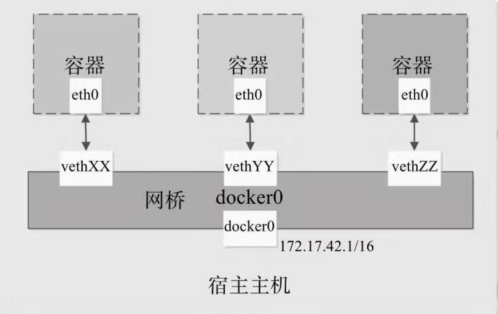

> Docker是基于go语言开发，Linux下的底层技术主要基于cgroups、namespace以及联合文件技术实现的一种进程级别的轻量级虚拟化解决方案。由于Docker进程隔离独立于宿主机上其他进程，因此也称为容器，Docker在容器的基础上，进行了更进一步的封装，从文件系统、网络到进程隔离等，极大简化了容器的创建管理维护工作，降低了开发者使用门槛，因此才在近几年流行开来（毕竟Docker的底层技术在Docker出现之前就已经存在了）。

Docker作为一种容器技术，在目前的分布式和微服务系统中被广泛使用，因为要在多个容器或机器间进行通信，因此Docker网络通信是一个重要的技术点。**从网络架构的角度来看，所有的容器实际上是通过本地主机的网桥接口（docker0）进行相互通信，就像物理机器通过物理交换机通信一样**。

Docker服务启动时会首先在主机上自动创建一个docker0虚拟网桥，实际上是一个Linux网桥。网桥可以理解为一个软件交换机，负责挂载其上的接口之间进行包转发。同时，Docker随机分配一个本地未占用的私有网段（在`RFC1918`中定义）中的一个地址给docker0接口。比如典型的`172.17.0.0/16`网段，掩码为`255.255.0.0`，此后启动的容器内的网口也会自动分配一个该网段的地址。

当创建一个Docker容器的时候，同时会创建了一对`veth pair`互联接口。当向任一个接口发送包时，另外一个接口自动收到相同的包。互联接口的一端位于容器内，即eth0；另一端在本地并被挂载到docker0网桥，名称以veth开头。通过这种方式，主机可以与容器通信，容器之间也可以相互通信。如此一来，Docker就创建了在主机和所有容器之间一个虚拟共享网络：

默认情况下，Docker容器可以主动访问到外部网络的连接，但是外部网络无法访问到容器，可通过命令 `docker port container `查看对应容器的端口映射信息。Docker容器使用的是私有网络IP，那么容器访问外部流程是什么样的呢？

假设容器内部的网络地址为172.17.0.2，本地网络地址为10.0.2.2，容器要能访问外部网络，源地址不能为172.17.0.2，需要进行源地址映射（`Source NAT, SNAT`），修改为本地系统的IP地址10.0.2.2。映射是通过iptables的源地址伪装操作实现的。查看主机nat表上POSTROUTING链的规则。该链负责网包要离开主机前，改写其源地址。其中，上述规则将所有源地址在172.17.0.0/16网段，且不是从docker0接口发出的流量（即从容器中出来的流量），动态伪装为从系统网卡发出。MASQUERADE行动与传统SNAT行动相比，好处是能动态地从网卡获取地址。

知道了容器内部访问外部流程，如果外部想要访问内部该如何实现呢？容器允许外部访问，可以在docker [container] run时候通过-p或-P参数来启用容器内外端口的映射配置。不管用哪种办法，其实也是在本地的iptable的nat表中添加相应的规则，将访问外部IP地址的包进行目标地址DNAT，将目标地址修改为容器的IP地址。每次创建一个新容器的时候，Docker从可用的地址段中选择一个空闲的IP地址分配给容器的eth0端口，并且使用本地主机上docker0接口的IP作为容器的默认网关。目前docker不支持启动时配置ip地址。

上面所说的是docker容器的默认网络通信模式—bridge模式，容器拥有独立的网络命名空间和网络协议栈，如果容器启动过程中不添加`--net`参数配置，则默认采用这种网络通信默认。除了bridge模式之外，还可以配置host网络模式，直接使用容器宿主机的网络命名空间，该模式下容器不再拥有自己独立的网络环境，直接使用宿主机的IP和端口。当然用户也可自定义网络模式或者none模式等。