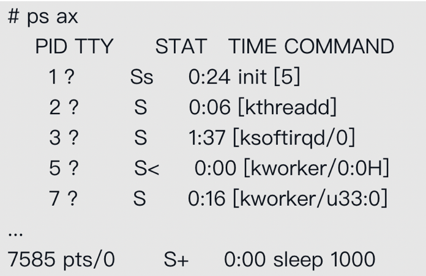

>  Namespace是将内核的全局资源做封装，使得每个Namespace都有一份独立的资源，因此不同的进程在各自的Namespace内对同一种资源的使用不会互相干扰。

目前Linux内核总共支持以下6种Namespace：

- IPC：隔离System V IPC和POSIX消息队列。
- Network：隔离网络资源。
- Mount：隔离文件系统挂载点。
- PID：隔离进程ID。
- UTS：隔离主机名和域名。
- User：隔离用户ID和组ID。

Linux对Namespace的操作，主要是通过clone、setns和unshare这3个系统调用来完成的，clone创建新进程时，接收一个叫flags的参数，这些flag包括`CLONE_NEWNS、CLONE_NEWIPC、CLONE_NEWUTS、CLONE_NEWNET（Mount namespace）、CLONE_NEWPID`和`CLONE_NEWUSER`，用于创建新的namespace，这样clone创建出来新进程之后就属于新的namespace了，后续新进程创建的进程默认属于同一namespace。

如果想要给已存在进程设置新的namespace，可通过unshare函数（`long unshare(unsigned long flags)`）完成设置，其入参flags表示新的namespace。当想要给已存在进程设置已存在的namespace，可通过setns函数（`int setns(int fd, int nstype)`）来完成设置，每个进程在procfs目录下存储其相关的namespace信息，可找到已存在的namesapce，然后通过setns设置即可：

```shell
[root@centos ~]# ls -l /proc/10401/ns
总用量 0
lrwxrwxrwx 1 root root 0 1月  12 11:36 ipc -> ipc:[4026531839]
lrwxrwxrwx 1 root root 0 1月  12 11:36 mnt -> mnt:[4026531840]
lrwxrwxrwx 1 root root 0 1月  12 11:36 net -> net:[4026531956]
lrwxrwxrwx 1 root root 0 1月  12 11:36 pid -> pid:[4026531836]
lrwxrwxrwx 1 root root 0 1月  12 11:36 user -> user:[4026531837]
lrwxrwxrwx 1 root root 0 1月  12 11:36 uts -> uts:[4026531838]
```

> 上述每个虚拟文件对应该进程所处的namespace，如果其他进程想进入该namespace，open该虚拟文件获取到fd，然后传给setns函数的fd入参即可，注意虚拟文件type和nstype要对应上。

**目前Linux内核总共支持以下6种Namespace，分别是IPC、Network、Mount、PID、UTS、User**：

## IPC

IPC也就是进程间通信，Linux下有多种进程间通信，比如socket、共享内存、Posix消息队列和SystemV IPC等，这里的IPC namespace针对的是SystemV IPC和Posix消息队列，其会用标识符表示不同的消息队列，进程间通过找到标识符对应的消息队列来完成通信，IPC namespace做的事情就是相同的标识符在不同namespace上对应不同的消息队列，这样不同namespace的进程无法完成进程间通信。

## Network

Network Namespace隔离网络资源，每个Network Namespace都有自己的网络设备、IP地址、路由表、/proc/net目录、端口号等。每个Network Namespace会有一个loopback设备（除此之外不会有任何其他网络设备）。因此用户需要在这里面做自己的网络配置。IP工具已经支持Network Namespace，可以通过它来为新的Network Namespace配置网络功能。

## Mount

Mount namesapce用户隔离文件系统挂载点，每个进程能看到的文件系统都记录在`/proc/$$/mounts`里。在创建了一个新的Mount Namespace后，进程系统对文件系统挂载/卸载的动作就不会影响到其他Namespace。

## PID

PID Namespace用于隔离进程PID号，这样一来，不同的Namespace里的进程PID号就可以是一样的了。当创建一个PID Namespace时，第一个进程的PID号是1，也就是init进程。init进程有一些特殊之处，例如init进程需要负责回收所有孤儿进程的资源。另外，发送给init进程的任何信号都会被屏蔽，即使发送的是SIGKILL信号，也就是说，在容器内无法“杀死”init进程。

> 注意，但是当用ps命令查看系统的进程时，会发现竟然可以看到host的所有进程：



> 这是因为ps命令是从procfs读取信息的，而procfs并没有得到隔离。虽然能看到这些进程，但由于它们其实是在另一个PID Namespace中，因此无法向这些进程发送信号。

## UTS

UTS Namespace用于对主机名和域名进行隔离，也就是uname系统调用使用的结构体structutsname里的nodename和domainname这两个字段，UTS这个名字也是由此而来的。为什么需要uts namespace呢，因为为主机名可以用来代替IP地址，比如局域网通过主机名访问机器。

## User

User Namespace用来隔离用户资源，比如一个进程在Namespace里的用户和组ID与它在host里的ID可以不一样，这样可以做到，一个host的普通用户可以在该容器（user namespace）下拥有root权限，但是它的特权被限定在容器内。（容器内的这类root用户，实际上还是有很多特权操作不能执行，基本上如果这个特权操作会影响到其他容器或者host，就不会被允许）

## 小结

一般namespace都是和cgroup结合来使用的，但是直接操作Namespace和Cgroup并不是很容易，因此docker的出现就显得有必要了，Docker通过Libcontainer来处理这些底层的事情。这样一来，Docker只需要简单地调用Libcontainer的API，就能将完整的容器搭建起来。而作为Docker的用户，就更不用操心这些事情了，只需要通过一两条简单的Docker命令启动容器即可。