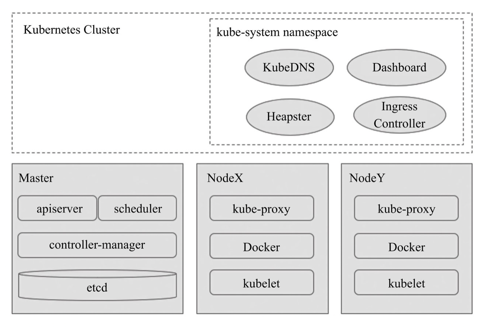

kubernetes（简称k8s）是一种用于在一组主机上运行和协同容器化应用程序的管理平台，皆在提供高可用、高扩展性和可预测性的方式来管理容器应用的生命周期。通过k8s，用户可以定义程序运行方式、部署升级策略、动态伸缩容，使得用户以一种更灵活可靠的方式来管理应用程序。

> 关于k8s，是一种对应用服务的打包、部署、监控等一整套生命周期的自动化管理平台，目前各大公司已在生产环境部署使用，同时k8s社区比较活跃，在未来一段时间内会越来越流行，可以说是以后服务部署的事实标准，对于Java开发者来说，你可以不直接使用它，但是不能不了解它。

总结来看，k8s特点如下：

- **自动装箱**：基于容器，结合调度策略将多种应用部署到同一节点上，提高资源利用率；
- **自我修复**：支持故障转移/重启，具有健康检查机制；
- **水平扩展**：通过命令手动执行扩容，可基于CPU等资源负载率来动态实现伸缩容；
- **服务发现/负载均衡**：通过KubeDNS（或CoreDNS）为系统内置了服务发现功能，为每个service配置DNS名称，service通过iptables或ipvs内建了负载均衡机制；
- **自动部署**：自动发布和回滚，支持灰度、增量发布等；
- **配置管理**：ConfigMap实现了配置数据与Docker镜像解耦，为开发部署提供了良好的灵活性；
- **批处理**：除了管理服务型应用之外，Kubernetes还支持批处理作业及CI（持续集成）。

> 从k8s的角度看，它把各个待管理的资源进行了抽象，比如针对服务器（物理机或者虚拟机）抽象出Node；对于容器不直接管理而是抽象出Pod来管理容器；对于集群内的服务调用，抽象出service来表示同类型的多个Pod，同时提供负载均衡策略等。

对于初学者来说，k8s的一些抽象资源和基本概念可能会造成一头雾水，本文就k8s的基础概念和组件进行简单分析，让初学者更快了解k8s概念，话不多说，let‘s go~

### k8s基础概念

k8s使用共享网络将多个物理机（或者虚拟机）汇集到一个集群中，该集群是配置k8s所有组件、功能和工作负载的物理平台。集群中一台服务器会作为master负责管理整个集群（为了master高可用一般会将master部署成多节点）。

Master是集群的网关和中枢，负责诸如为用户和客户端暴露API、跟踪其他服务器的健康状态、以最优方式调度工作负载，以及编排其他组件之间的通信等任务，它是用户/客户端与集群之间的核心联络点，并负责Kubernetes系统的大多数集中式管控逻辑。单个Master节点即可完成其所有的功能，但出于冗余及负载均衡等目的，生产环境中通常需要协同部署多个此类主机。Node是Kubernetes集群的工作节点，负责接收来自Master的工作指令并根据指令相应地创建或销毁Pod对象，以及调整网络规则以合理地路由和转发流量等。理论上讲，Node可以是任何形式的计算设备，不过Master会统一将其抽象为Node对象进行管理。

### 几种资源抽象

- **Pod**：k8s管理的最小调度单元，k8s不直接来管理容器，使用一个抽象的资源对象来封装一个或者多个容器，这个抽象即为Pod。同一Pod中的容器共享网络名称空间和存储资源，这些容器可经由本地回环接口lo直接通信，同时对于Mount、User及PID等资源也进行了隔离；
- **标签资源和标签选择器**：标签（Label）是将资源进行分类的标识符，k8s的Pod资源选择大都是基于标签来的，一个对象可以拥有多个标签，一个标签也可以附加于多个对象（通常是同一类对象）之上。标签选择器（Selector）全称为“Label Selector”，它是一种根据Label来过滤符合条件的资源对象的机制；
- **Controller**：Pod控制器，尽管Pod是k8s的最小调度单元，但用户通常并不会直接部署及管理Pod对象，而是要借助于另一类抽象——控制器（Controller）对其进行管理，k8s的控制器包括ReplicationController、ReplicaSet、Deployment、StatefulSet、Job等，每种controller都有对应的功能（比如Deployment是最常见的无状态应用的控制器，它支持应用的扩缩容、滚动更新等操作，为容器化应用赋予了极具弹性的功能）；
- **Service**：Service是建立在一组Pod对象之上的资源抽象，它通过标签选择器选定一组Pod对象，并为这组Pod对象定义一个统一的固定访问入口（通常是一个IP地址）；
- **存储卷**：一般是独立于容器文件系统之外的存储空间，常用于扩展容器的存储空间并为它提供持久存储能力，大体上可分为临时卷、本地卷和网络卷；
- **Name和Namespace**：名称是网络资源的唯一标识符，通常在一个命名空间内，名称标识是唯一的，名称空间通常用于实现租户或项目的资源隔离，从而形成逻辑分组；
- **Ingress**：k8s中将Pod进行了网络隔离，如果需要开放一些Pod供外部使用，则需要一个配置一个流量进入k8s集群内的通道，除了Service外，Ingress也是实现策略之一。

### k8s组件

一个典型的k8s集群由master节点、多个工作节点和ETCD组成，其中ETCD作为集群状态存储。master节点负责整个集群的管理工作，为集群提供管理API，并负责编排和监控各工作节点，各工作节点已Pod形式管理运行容器。master主要由apiserver、controller-manager和scheduler三个组件组成，同时负责与ETCD教育存储集群状态数据，而每个工作节点主要包含kubelet、kube-proxy及容器引擎（最常见的是Docker）等组件。各个组件整体如下图：

#### master节点

master包含组件如下：

- **API server**：对外提供restful api，k8s集群的网关；
- **Controller**：Pod控制器，k8s通过控制器来管理Pod资源，控制器包括ReplicationController、ReplicaSet、Deployment、StatefulSet、Job等，每种controller都有对应的功能（比如Deployment是最常见的无状态应用的控制器，它支持应用的扩缩容、滚动更新等操作，为容器化应用赋予了极具弹性的功能）；
- **Scheduler**：K8s调度器，K8s管理成千上万容器资源，api server接收到请求之后就由Scheduler按照对应调度策略进行在不同Node间的请求调度操作；
- **ETCD**：k8s集群状态都是存储在etcd中（通过API Server共享给集群的各组件及客户端），通过etcd的watch机制来进行k8s各组件的协同操作，一般etcd通过集群部署方式保证高可用。

#### node节点

node节点接受master的管理，负责管理各个Pod资源：

- **kubelet**：kubelet是node的守护进程，node接受master的管控，Kubelet会向api server注册当前node，定期向master会报node资源占用情况；
- **容器运行环境**：node会提供一个容器运行环境，负责下载并运行容器，k8s目前支持的容器运行环境包括Docker、RKT、cri-o和Fraki等；
- **kube-proxy**：每个node都需要一个kube-proxy进程，比如对service按需生成iptables或ipvs规则，控制流量访问。

#### 核心组件

k8s除了etcd、master、node这几个组件之外，还有一些核心组件，如下：

- **DNS服务**：目前k8s使用的是coreDNS，之前使用的是KubeDNS；
- **Kubernetes Dashboard**：k8s的管理web UI；
- **Heapster**：容器和节点的性能监控与分析系统，它收集并解析多种指标数据，如资源利用率、生命周期事件等。新版本的Kubernetes中，其功能会逐渐由Prometheus结合其他组件所取代。
- **Ingress Controller**:Service是一种工作于传统层的负载均衡器，而Ingress是在应用层实现的HTTP（s）负载均衡机制。不过，Ingress资源自身并不能进行“流量穿透”，它仅是一组路由规则的集合，这些规则需要通过Ingress控制器（Ingress Controller）发挥作用。目前，此类的可用项目有Nginx、Traefik、Envoy及HAProxy等。

