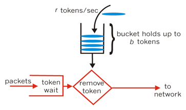
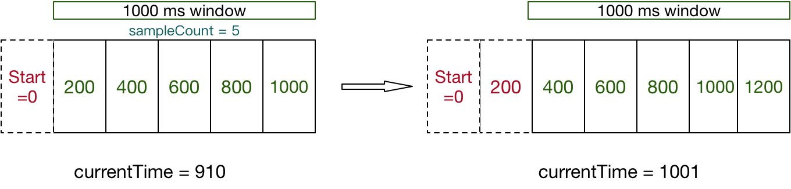

高并发系统设计的3个利器：缓存、限流、降级，本文就限流相关算法，分析其设计与实现。

从分布式角度来看，限流可分为**分布式限流**（比如基于Sentinel或者Redis的集群限流）和**单机限流**。从算法实现角度来看，限流算法可分为**漏桶算法**、**令牌桶算法**和**滑动时间窗口算法**。下面主要分析这3种限流算法和分布式限流实现方案。

### 漏桶算法

把请求比作是水，水来了都先放进桶里，并以恒定速度出水（处理请求），当水流量过大会导致桶溢出，即拒绝服务。请求的最大处理速度也就是水从漏桶流出的速度。


基于漏桶（桶+恒定处理速率），可以起到对请求整流效果。漏桶算法可基于线程池来实现，线程池使用固定容量的阻塞队列+固定个数的处理线程来实现；最简单且最常见的漏桶思想的实现就是基于SynchronousQueue的线程池，其相当于一个空桶+固定处理线程 : )。

>  注意：原生的漏桶算法以恒定速度出水（处理请求），但是实际场景中请求的处理耗时可能不相等，为了实现恒定速率，一般都是限定同时处理请求的最大线程数。

### 令牌桶算法

很多场景中，需要允许某种程度的突发请求，请求的最大速度也就是所有桶大小。这时候漏桶算法就不合适了，令牌桶算法更为适合。



令牌桶算法的原理是系统以恒定的速率产生令牌，然后把令牌放到令牌桶中，令牌桶有一个容量，当令牌桶满了的时候，再向其中放令牌，那么多余的令牌会被丢弃；当想要处理一个请求的时候，需要从令牌桶中取出一个令牌，如果此时令牌桶中没有令牌，那么则拒绝该请求。

令牌桶算法的一个实现方案是：起一个Timer线程以固定频率往桶中放令牌，桶满时令牌溢出，业务线程在获取令牌时直接从桶中获取即可。该方案容易理解，但是需要一个Timer线程，资源占用较重。

令牌桶算法还有一种实现方案不需要用Timer线程，这个经典实现就是`Guava`中的`RateLimiter`。`RateLimiter`实现原理如下：

1. `startTick`记录RateLimiter初始化时的时间戳（单位ns），后续`nowMicros`(当前时间点)都是取(System.nanoTime()-startTick)/1000；
2. `nextFreeTicketMicros`记录下次可获取令牌的开始时间点，在RateLimiter初始化和获取到令牌之后会进行更新；
3. 如果nowMicros大于等于nextFreeTicketMicros，表示可以获取令牌；如果nowMicros大于nextFreeTicketMicros，会计算二者差值并除以放一个令牌的周期，然后赋值给`storedPermits`字段（表示当前桶中令牌数，注意不能超过桶容量）；
4. 然后storedPermits减去当前需要令牌数，如果此时要获取令牌数大于storedPermits，那么会将nextFreeTicketMicros再往后推进` (要获取令牌 - storedPermits) * 放一个令牌的周期` 的时间。

更具体的步骤及代码实现可参考RateLimiter源码，这里不再赘述。

> 从步骤4可以看出，初始化一个RateLimiter.create(100)，是可以执行rateLimiter.tryAcquire(200)的，只不多会将nextFreeTicketMicros再往后推进而已。

### 滑动时间窗口算法

滑动时间窗口算法就是根据当前时间获取对应的时间窗口，时间窗口保存有流量相关的统计值，根据该统计值判断是否触发流控。



一般来说，时间窗口可以循环复用，在复用时重新初始化即可，具体实现可参考sentinel的滑动窗口实现。滑动时间窗口能够支持的瞬时流量最大可为该窗口上限，而令牌桶算法能够支持的瞬时流量最大为桶大小；注意，滑动时间窗口算法中获取token数量一次最大不能超过窗口上限，而RateLimiter实现的令牌桶可以支持一次获取超过桶大小的token。

**分布式限流**

上述所说的几种限流都是单台机器上的限流算法，有些场景下我们还需要分布式限流，一种是基于Redis做分布式限流，另一种类似于Sentinel分布式限流。

**Sentinel**

Sentinel分布式限流是启动一个token server服务器，其他sentinel client端就是token client端，当做限流操作时，从token server获取token，获取成功表示未触发限流；否则表示触发了限流；通信出现异常，可配置降级走本地Sentinel限流机制。分布式限流文档：[Sentinel集群流控](https://github.com/alibaba/Sentinel/wiki/集群流控)

sentinel的分布式限流是token client调用以下方法到服务端获取token，相当于是每次都会获取acquireCount个token：

```java
//获取令牌Token， 参数规则Id，获取令牌数，优先级 
TokenResult requestToken(Long ruleId, int acquireCount, boolean prioritized); 
```

**基于Redis限流**

基于Redis做限流操作，使用lua脚本保证命令原子性，比如qps设置为10，如果key不存在，就设置key过期时间1s，value=1；如果value小于10，则自增value；value达到10触发流控。示例lua代码如下：

```lua
local key = "rate.limit:" .. KEYS[1]
local limit = tonumber(ARGV[1])
local expire_time = ARGV[2]

local is_exists = redis.call("EXISTS", key)
if is_exists == 1 then
    if redis.call("INCR", key) > limit then
        return 0
    else
        return 1
    end
else
    redis.call("SET", key, 1)
    redis.call("EXPIRE", key, expire_time)
    return 1
end
```

常用的限流算法有漏桶、令牌桶和滑动窗口，根据具体场景可选择不同限流算法；如果需要集群限流，可选用Sentinel或者基于Redis做分布式限流。

>  关于Sentinel，估计挺多小伙伴还不知道Sentinel是个什么东东，Sentinel是一个以流量为切入点，从流量控制、熔断降级、系统负载保护等多个维度保护服务的稳定性的框架。github地址为：https://github.com/alibaba/Sentinel。
>
> 笔者整理了一份《Sentinel不完全指南》，需要的小伙伴可以关注「TopCoder」公众号发送 `sentinel`来获取，《Sentinel不完全指南》和Sentinel官方文档，二者互为补充，结合起来学习Sentinel效果更好呦 : )