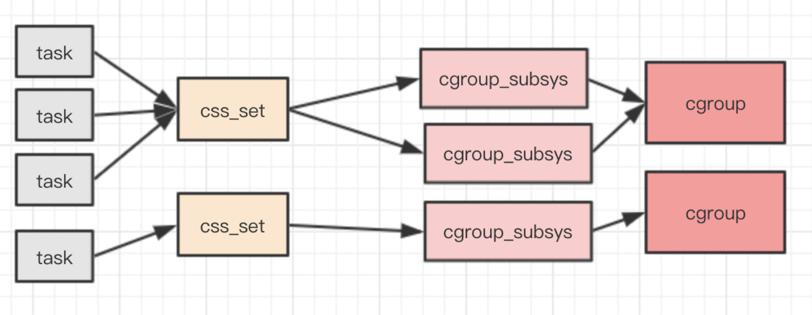

> cgroup从2.6.4引入linux内核主线，目前默认已启用该特性。在cgroup出现之前，只能对一个进程做资源限制，比如通过sched_setaffinity设置进程cpu亲和性，使用ulimit限制进程打开文件上限、栈大小等。

cgroups是Linux下控制一个（或一组）进程的资源限制机制，全称是control groups，可以对cpu、内存等资源做精细化控制，比如目前很多的Docker在Linux下就是基于cgroups提供的资源限制机制来实现资源控制的；除此之外，开发者也可以指直接基于cgroups来进行进程资源控制，比如8核的机器上部署了一个web服务和一个计算服务，可以让web服务仅可使用其中6个核，把剩下的两个核留给计算服务。cgroups cpu限制除了可以限制使用多少/哪几个核心之外，还可以设置cpu占用比（注意占用比是各自都跑满情况下的使用比例，如果一个cgroup空闲而另一个繁忙，那么繁忙的cgroup是有可能占满整个cpu核心的）。

> 本文主要讨论下cgroups概念及原理，然后分析下cgroups文件系统概念，最后对cgroups做个总结，关于cgroups的使用实践可以参考网上资料，这里不再赘述。

## cgroups概念

从实现角度来看，cgroups实现了一个通用的进程分组框架，不同资源的具体管理工作由各cgroup子系统来实现，当需要多个限制策略比如同时针对cpu和内存进行限制，则同时关联多个cgroup子系统即可。

#### cgroups子系统

cgroups为每种资源定义了一个子系统，典型的子系统如下：

- **cpu 子系统**，主要限制进程的 cpu 使用率。
- **cpuacct 子系统**，可以统计 cgroups 中的进程的 cpu 使用报告。
- **cpuset 子系统**，可以为 cgroups 中的进程分配单独的 cpu 节点或者内存节点。
- **memory 子系统**，可以限制进程的 memory 使用量。
- **blkio 子系统**，可以限制进程的块设备 io。
- **devices 子系统**，可以控制进程能够访问某些设备。
- **net_cls 子系统**，可以标记 cgroups 中进程的网络数据包，然后可以使用 tc 模块（traffic control）对数据包进行控制。
- **freezer 子系统**，可以挂起或者恢复 cgroups 中的进程。
- **ns 子系统**，可以使不同 cgroups 下面的进程使用不同的 namespace。

每个子系统都是定义了一套限制策略，它们需要与内核的其他模块配合来完成资源限制功能，比如对 cpu 资源的限制是通过进程调度模块根据 cpu 子系统的配置来完成的；对内存资源的限制则是内存模块根据 memory 子系统的配置来完成的，而对网络数据包的控制则需要 Traffic Control 子系统来配合完成。

## cgroups原理

关于cgroups原理，可以从进程角度来剖析相关数据结构之间关系，Linux 下管理进程的数据结构是 task_struct，其中与cgrups相关属性如下：

```c
// task_struct代码
#ifdef CONFIG_CGROUPS 
/* Control Group info protected by css_set_lock */ 
struct css_set *cgroups; 
/* cg_list protected by css_set_lock and tsk->alloc_lock */ 
struct list_head cg_list; 
#endif
```

每个进程对应一个css_set结构，css_set存储了与进程相关的cgropus信息。cg_list是一个嵌入的 list_head 结构，用于将连到同一个 css_set 的进程组织成一个链表。进程和css_set的关系是多对一关系，tasks表示关联的多个进程。

```c
struct css_set { 
	atomic_t refcount;
	struct hlist_node hlist; 
	struct list_head tasks; 
	struct list_head cg_links; 
	struct cgroup_subsys_state *subsys[CGROUP_SUBSYS_COUNT]; 
	struct rcu_head rcu_head; 
};
```

subsys 是一个指针数组，存储一组指向 cgroup_subsys_state 的指针，通过这个指针进程可以获取到对应的cgroups信息，一个 cgroup_subsys_state 就是进程与一个特定子系统相关的信息，cgroup_subsys_state结构体如下：

```c
struct cgroup_subsys_state {
	struct cgroup *cgroup;
	atomic_t refcnt;
	unsigned long flags;
	struct css_id *id;
};
```

cgroup 指针指向了一个 cgroup 结构，也就是进程属于的 cgroup，进程受到子系统控制就是加入到特定的cgroup来实现的，就是对应这里的cgroup，由此看出进程和cgroup的关系是多对多关系。

```c
struct cgroup {
	unsigned long flags; 
	atomic_t count; 
	struct list_head sibling; 
	struct list_head children; 
	struct cgroup *parent; 
	struct dentry *dentry; 
	struct cgroup_subsys_state *subsys[CGROUP_SUBSYS_COUNT]; 
	struct cgroupfs_root *root;
	struct cgroup *top_cgroup; 
	struct list_head css_sets; 
	struct list_head release_list; 
	struct list_head pidlists;
	struct mutex pidlist_mutex; 
	struct rcu_head rcu_head; 
	struct list_head event_list; 
	spinlock_t event_list_lock; 
};
```

sibling、children 和 parent 三个嵌入的 list_head 负责将统一层级的 cgroup 连接成一棵 cgroup 树。subsys 是一个指针数组，存储一组指向 cgroup_subsys_state 的指针。这组指针指向了此 cgroup 跟各个子系统相关的信息，也就是说一个cgroup可以关联多个子系统，二者关系是多对多关系。

Linux下的cgroups的数据结构图示如下：



#### cgroups 层级结构

在cgrups中一个task任务就是一个进程，一个进程可以加入到某个cgroup，也从一个进程组迁移到另一个cgroup。一个进程组的进程可以使用 cgroups 以控制族群为单位分配的资源，同时受到 cgroups 以控制族群为单位设定的限制。多个cgroup形成一个层级结构（树形结构），cgroup树上的子节点cgroup是父节点cgroup的孩子，继承父cgroup的特定的属性。注意：cgroups层级只会关联某个子系统之后才能进行对应的资源控制，一个子系统附加到某个层级以后，这个层级上的所有cgroup都受到这个子系统的控制。cgroup典型应用架构图如下：


## cgroups文件系统

Linux 使用了多种数据结构在内核中实现了 cgroups 的配置，关联了进程和 cgroups 节点，那么 Linux 又是如何让用户态的进程使用到 cgroups 的功能呢？ Linux内核有一个很强大的模块叫 VFS (Virtual File System)。 VFS 能够把具体文件系统的细节隐藏起来，给用户态进程提供一个统一的文件系统 API 接口。 cgroups 也是通过 VFS 把功能暴露给用户态的，cgroups 与 VFS 之间的衔接部分称之为 cgroups 文件系统。通过cgroups适配VFS，用户可以使用VFS接口来操作cgroup功能。

> VFS 是一个内核抽象层（通用文件模型），能够隐藏具体文件系统的实现细节，从而给用户态进程提供一套统一的 API 接口。VFS 使用了一种通用文件系统的设计，具体的文件系统只要实现了 VFS 的设计接口，就能够注册到 VFS 中，从而使内核可以读写这种文件系统。 这很像面向对象设计中的抽象类与子类之间的关系，抽象类负责对外接口的设计，子类负责具体的实现。其实，VFS本身就是用 c 语言实现的一套面向对象的接口。

## 小结

cgroups是Linux下控制一个（或一组）进程的资源限制机制，cgroup通过关联单个/多个子系统定义了一套限制策略来限制CPU/内存等资源，子系统上限制策略相当于一套配置，需要内核中对应模块配合来完成资源限制功能，比如对 cpu 资源的限制是通过进程调度模块根据 cpu 子系统的配置来完成的等。

注意cgroups资源限制是针对cgroup为单位的，不管cgroup下是有一个进程还是多个进程。Docker下的容器内所有进程就是属于同一组cgroup管理之下的，比如限制CPU使用，限制内存大小等。

参考资料：

1、https://www.ibm.com/developerworks/cn/linux/1506_cgroup/index.html

2、https://tech.meituan.com/2015/03/31/cgroups.html