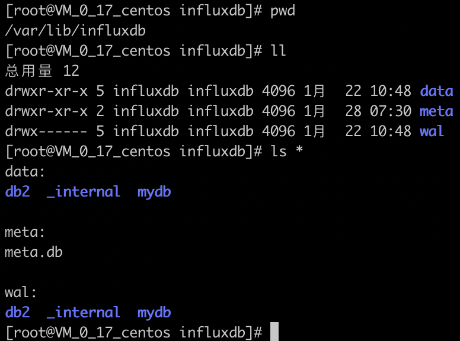
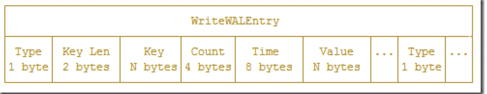
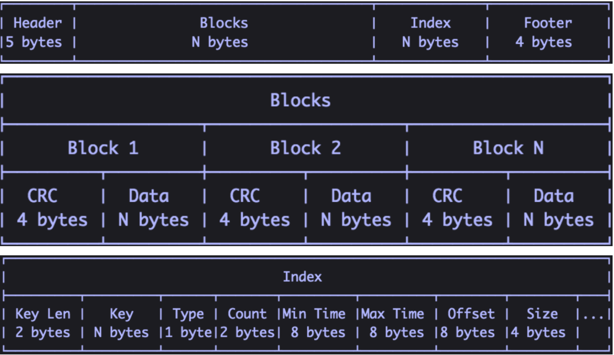
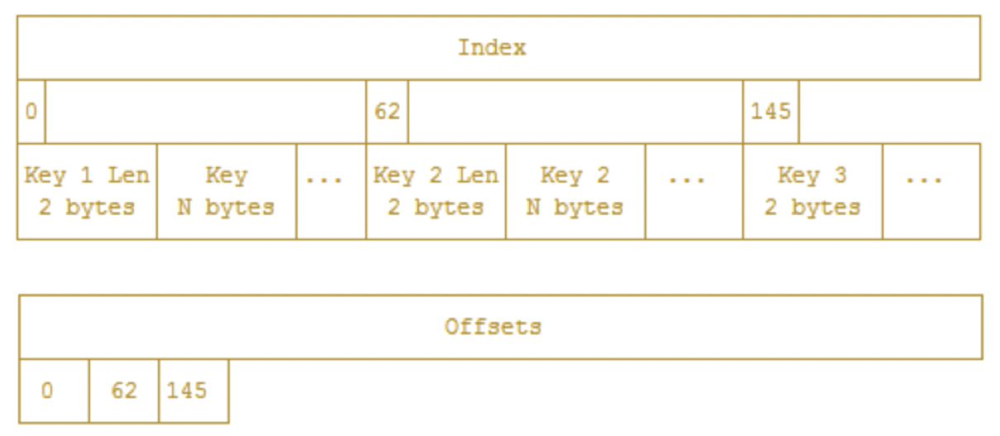

InfluxDB是一个开源的时序数据库，使用GO语言开发，特别适合用于处理和分析资源监控数据这种时序相关数据。而InfluxDB自带的各种特殊函数如求标准差，随机取样数据，统计数据变化比等，使数据统计和实时分析变得十分方便。

在目前的APM和后续的IoT场景中，InfluxDB会发挥越来越重要的作用，那么InfluxDB是如何保存数据并且高性能对外提供存取服务的呢？下面就一起来看下InfluxDB原理的那些事 ~

centos下influxdb默认配置路径为` /etc/influxdb/influxdb.conf`，influxdb数据存储主要有3个目录，分别是`meta、wal和data`。meta主要存放元数据，该目录下有一个meta.db文件；wal目录存放预写日志，以.wal结尾；data目录存放TSM文件，以.tsm文件结尾。



在同一个database中，retention policy、measurement、tag sets 完全相同的数据同属于一个 **series**，从Index数据排列来看，同一个 series 的数据在物理上会按照时间顺序排列存储在一起，series 的 key 为 measurement + tags set 序列化字符串，series代码中结构如下：

```sql
type Series struct {
    mu          sync.RWMutex
    Key         string              // series key
    Tags        map[string]string   // tags
    id          uint64              // id
    measurement *Measurement        // measurement
}
```

WAL就是一种写优化且固定格式的预写文件，允许写入持久化但是不易查询，对WAL的写入就是append操作。influxdb的WAL就是一系列格式为 _00xxx.wal 的文件，文件号单调递增，默认当超过10M时就会新写一个WAL文件，每个WAL文件都会存储经过压缩的数据。当一个新的Point数据被写入时，首先经过压缩写入到WAL中，在返回之前会写入到内存的索引中，这意味着数据写入后立马可通过索引可见，同时批量写入意味着更高效率。当WAL日志对应的数据被写入到TSM中后，WAL日志就可以删除了。WAL具体数据格式如下：



Cache就是WAL的内存表示，它在运行时可被查询并且与TSM中保存的文件进行合并。当缓存大小超过 cache-snapshot-memory-size 时会触发缓存数据写入到TSM文件，并删除对应的WAL段文件；当缓存大小超过 cache-max-memory-size 时会导致cache拒绝新的写入，避免数据流量过大影响服务稳定性。除了内存的阈值限制之外，缓存还会在 cache-snapshot-write-cold-duration 配置的时间间隔定期将缓存数据写入到TSM文件。通过重读所有WAL文件，Influxdb可以在启动时重建缓存。

我们知道Cache就是WAL的内存表示，相当于LSM中的memtable，在内存中它就是一个map结构，其key就是 series key+fieldName，当然key也包含有分隔符（目前是#!~#），entry就是一个按照时间戳排序的数据容器：

```go
type Cache struct {
    commit  sync.Mutex
    mu      sync.RWMutex
    store   map[string]*entry
    size    uint64              // 当前使用内存的大小
    maxSize uint64              // 缓存最大值

    // snapshots are the cache objects that are currently being written to tsm files
    // they're kept in memory while flushing so they can be queried along with the cache.
    // they are read only and should never be modified
    // memtable 快照，用于写入 tsm 文件，只读
    snapshot     *Cache
    snapshotSize uint64
    snapshotting bool

    // This number is the number of pending or failed WriteSnaphot attempts since the last successful one.
    snapshotAttempts int

    stats        *CacheStatistics
    lastSnapshot time.Time
}
```

插入数据就是往WAL和Cache写数据，当influxdb启动时，会遍历所有WAL文件构建Cache，这样保证系统出现故障也不会造成数据丢失。

TSM文件是influxdb数据存储的一系列只读文件集合，这些文件结构类似于leveldb中的SSTable，一个TSM文件格式如下：



- **Header**：头部信息，4位magic字段+1位version字段；
- **Blocks**：CRC+数据存储字段，数据的长度在index字段存储；
- **Index**：索引顺序按照先key后时间戳来，如果key相同则按照时间戳排序，key包括measurement+tag set+一个filed，如果一个point包含多个field，则包含多个索引条目；每个索引条目以key len和key开始，标准的TLV格式，然后是block类型（float，int，bool，string）以及该block的条目数，之后是block的最小、最大时间戳，最后是block所在的文件偏移量以及block大小 --- 也就是说，包含该key的TSM文件中每个block都有一个索引block条目；
- **footer**：存储了索引开头的offset。

从TSM文件结构来看，解析TSM需要读取footer来确定Index和Blocks分界点，然后读取Index信息来提取对应的Block，才能组成一个完整的TSM索引+数据信息。Block对应的数据也是经过压缩的，以便减少存储空间，block包含时间戳、series和field值，每个block都有1个字节的header，之后是压缩过的时间戳和值：


针对不同类型数据采用不同压缩编码，比如时间戳、整形、浮点数和字符串等，字符串使用Snappy压缩进行编码，每个字符串连续打包然后压缩成一个较大的块。

> 数据删除通过向WAL写入删除条目然后更新Cache来完成删除操作，同时Influxdb会为包含相关数据的TSM文件写入一个tombstone文件，这些tombstone文件被用于在启动时忽略相应的block，以及在compaction时期移除已删除的数据，换句话说，数据删除在influxdb中是一个低效率操作，特别是针对大数据量删除来说，并且只有等待数据合并时才会真正删除数据。

如果直接读取TSM中的Index进行索引查询无疑是低效的，因此会在内存中构建方便二分查询，结构如下：



由于Index中各个key长度不定，因此使用offsets字段进行二分搜索，offsets数组中储存的是对应Index中key数据偏移量。TSM中的Index字段也是定长的，也是可以执行二分查找，找到要查询的数据的 BlockIndex 的内容，然后根据偏移量以及 block 长度就可以从 tsm 文件中快速读取出一个 block 数据。

通过上面的Index+offsets数据和TSM文件的Index数据，可以通过某个key（measurement+tag set+一个filed）来进行数据查询，但是我们一般的查询都是通过某个tag的值来查找的，比如以下查询代码：

```sql
select * FROM cpu WHERE host='s01' AND time > now() - 10h
```

那么该如何使用上面所说的索引查找流程呢？是不是存在一个单个tag value和key的映射关系呢，对，确实存在这样的结构：

```go
type Measurement struct {
    Name       string `json:"name,omitempty"`
    fieldNames map[string]struct{}      // 此 measurement 中的所有 filedNames

    // 内存中的索引信息
    // id 以及其对应的 series 信息，主要是为了在 seriesByTagKeyValue 中存储Id节约内存
    seriesByID          map[uint64]*Series              // lookup table for series by their id

    // 根据 tagk 和 tagv 的双重索引，保存排好序的 SeriesID 数组
    // 这个 map 用于在查询操作时，可以根据 tags 来快速过滤出要查询的所有 SeriesID，之后根据 SeriesKey 以及时间范围从文件中读取相应内容
    seriesByTagKeyValue map[string]map[string]SeriesIDs // map from tag key to value to sorted set of series ids

    // 此 measurement 中所有 series 的 id，按照 id 排序
    seriesIDs           SeriesIDs                       // sorted list of series IDs in this measurement
}
```

以命令 select * FROM cpu WHERE host='s01' AND time > now() - 10h 为例，通过 seriesByTagKeyValue['host']['s01'] 获取到所有匹配的 series 的 ID值，然后再通过map结构seriesByID根据series id获取到series对象，注意匹配到的某个tag value的可能不止一个series。这样，我们就可以在O(1)时间复杂度内找到tag value对应的 series key，然后根据查询请求的时间范围，从不同shard中获取每一个series在指定时间段内的数据，后续的查询则和 tsm file 中的 Index 的在内存中的缓存相关了。

参考资料：

1、https://www.linuxdaxue.com/influxdb-principle.html

2、https://jasper-zhang1.gitbooks.io/influxdb/content/Concepts/storage_engine.html