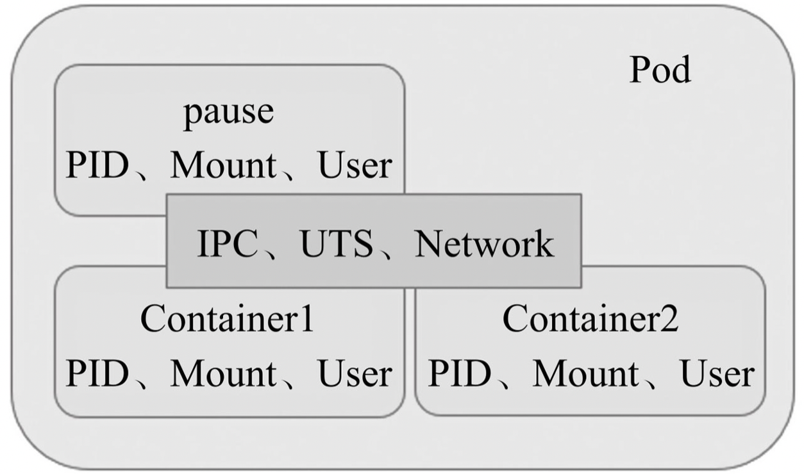
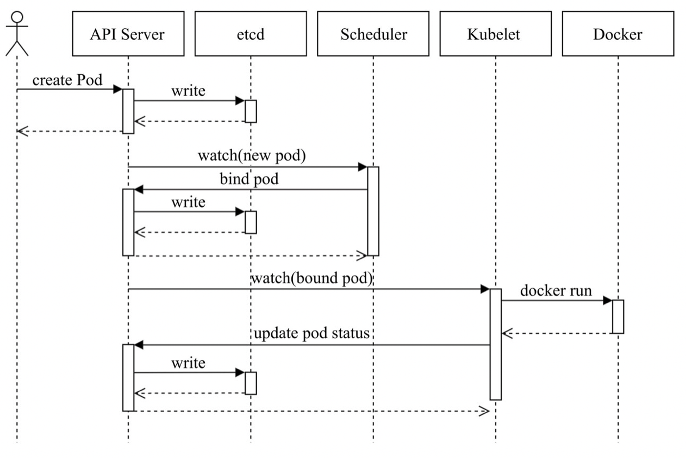

Pod是kubernetes中最小的资源管理组件，Pod也是最小化运行容器化应用的资源对象。kubernetes中其他大多数组件都是围绕着Pod来进行支撑和扩展Pod功能的，例如，用于管理Pod运行的StatefulSet和Deployment等控制器对象，用于暴露Pod应用的Service和Ingress对象，为Pod提供存储的PersistentVolume存储资源对象等。

### Pod资源基础

Pod对象是一组容器的集合，这些容器共享Network、UTS及IPC名称空间，因此具有相同的域名、主机名和网络接口，并可通过IPC直接通信。注意，一个Pod下的容器必须运行于同一节点上。现代容器技术建议一个容器只运行一个进程，该进程在容器中PID名称空间中的进程号为1，可直接接收并处理信号，进程终止时容器生命周期也就结束了。若想在容器内运行多个进程，需要有一个类似Linux操作系统init进程的管控类进程，以树状结构完成多进程的生命周期管理。运行于各自容器内的进程无法直接完成网络通信，这是由于容器间的隔离机制导致，k8s中的Pod资源抽象正式解决此类问题，Pod对象是一组容器的集合，这些容器共享Network、UTS及IPC名称空间，因此具有相同的域名、主机名和网络接口，并可通过IPC直接通信。

Pod资源中针对各容器提供网络名称空间等共享机制的是底层基础容器pause，基础容器（也可称为父容器）pause就是为了管理Pod容器间的共享操作，这个父容器需要能够准确地知道如何去创建共享运行环境的容器，还能管理这些容器的生命周期。为了实现这个父容器的构想，kubernetes中，用pause容器来作为一个pod中所有容器的父容器。这个pause容器有两个核心的功能，一是它提供整个pod的Linux命名空间的基础。二来启用PID命名空间，它在每个pod中都作为PID为1进程，并回收僵尸进程。如下图：

> 虽然Pod可以包含多个容器，但是一般都是单个容器或者具有强关联互补的多个容器组成一个Pod，比如后端服务+sideCar这种组合组成Pod对象。

### Pod管理

Pod的核心是运行容器，必须指定容器引擎，比如Docker，启动容器时，需要获取镜像，k8s的镜像获取策略可以由用户指定，比如，Always：镜像标签为“latest”或镜像不存在时总是从指定的仓库中获取镜像；IfNotPresent：仅当本地缺失时才从仓库中获取；Never：仅使用本地镜像。注意：对于标签为“latest”的镜像文件，其默认的镜像获取策略即为“Always”，而对于其他标签的镜像，其默认策略则为“IfNotPresent”。

标签选择器用于表达标签的查询条件或选择标准，k8s目前支持两种选择器：等值选择和基于集合关系。例如，env=production和env!=qa是基于等值关系的选择器，而tier in (frontend, backend)则是基于集合关系的选择器。标签赋予了Kubernetes灵活操作资源对象的能力，它也是Service和Deployment等核心资源类型得以实现的基本前提。

> 除了标签（label）之外，Pod与其他各种资源还能使用资源注解（annotation）。与标签类似，注解也是“键值”类型的数据，不过它不能用于标签选择Kubernetes对象，仅可用于为资源提供“元数据”信息。另外，注解中的元数据不受字符数量的限制，它可大可小，可以为结构化或非结构化形式，也支持使用在标签中禁止使用的其他字符。资源注解可由用户手动添加，也可由工具程序自动附加并使用它们，比如容器应用程序使用的启动参数或者配置。

### 节点选择器nodeSelector

节点选择器是标签及标签选择器的一种应用，它能够让Pod对象基于集群中工作节点的标签来挑选倾向运行的目标节点。Kubernetes的kube-scheduler守护进程负责在各工作节点中基于系统资源的可用性等标签挑选一个来运行待创建的Pod对象，默认的调度器是default-scheduler。

> Kubernetes可将所有工作节点上的各系统资源抽象成资源池统一分配使用，因此用户无须关心Pod对象的具体运行位置也能良好工作。不过，事情总有例外，比如仅有部分节点拥有被Pod对象依赖到的特殊硬件设备的情况，如GPU和SSD等。即便如此，用户也不应该静态指定Pod对象的运行位置，而是让scheduler基于标签和标签选择器及对应的Pod资源调度策略来为Pod挑选匹配的工作节点。

### Pod生命周期

Pod是Kubernetes的基础单元，Pod启动典型创建过程如下：

- 1）用户通过kubectl或其他API客户端提交Pod Spec给API Server。
- 2）API Server尝试着将Pod对象的相关信息存入etcd中，待写入操作执行完成，API Server即会返回确认信息至客户端。
- 3）API Server开始反映etcd中的状态变化。
- 4）所有的Kubernetes组件均使用“watch”机制来跟踪检查API Server上的相关的变动。
- 5）kube-scheduler（调度器）通过其“watcher”觉察到API Server创建了新的Pod对象但尚未绑定至任何工作节点。
- 6）kube-scheduler为Pod对象挑选一个工作节点并将结果信息更新至API Server。
- 7）调度结果信息由API Server更新至etcd存储系统，而且API Server也开始反映此Pod对象的调度结果。
- 8）Pod被调度到的目标工作节点上的kubelet尝试在当前节点上调用Docker启动容器，并将容器的结果状态回送至API Server。
- 9）API Server将Pod状态信息存入etcd系统中。
- 10）在etcd确认写入操作成功完成后，API Server将确认信息发送至相关的kubelet，事件将通过它被接受。

> 注意：scheduler、kubelet等同时通过使用api server接口来与etcd进行交互的。

Pod生命周期中的重要行为除了创建之外，还包括：

- **初始化容器**：启动容器之前的初始化操作，比如等待其他关联组件可用、从配置中心获取配置；

- **生命周期钩子函数**：钩子函数是常见的启动或者停止回调方法，Kubernetes为容器提供了两种生命周期钩子，postStart（容器创建完成之后立即运行的钩子处理器）和preStop（容器终止操作之前立即同步运行的钩子处理器）；

- **容器探测**：kubelet对容器周期性执行的健康状态诊断，诊断操作由容器的处理器（handler）进行定义，Kubernetes支持三种处理器用于Pod探测（每一种探测结果都存在3种结果，成功、失败、未知，只有成功才认为OK）：

- - **ExecAction**：在容器中执行一个命令，并根据其返回的状态码进行诊断的操作称为Exec探测，状态码为0表示成功，否则即为不健康状态；
  - **TCPSocketAction**：通过与容器的某TCP端口尝试建立连接进行诊断，端口能够成功打开即为正常，否则为不健康状态；
  - **HTTPGetAction**：通过向容器IP地址的某指定端口的指定path发起HTTP GET请求进行诊断，响应码为2xx或3xx时即为成功，否则为失败。
  - kubelet可在活动容器上执行两种类型的检测：**存活性检测**（livenessProbe）和**就绪性检测**（readinessProbe），如果存活性检测不通过，kubelet将杀死容器并根据其restartPolicy决定是否将其重启。就绪型校验用于判断容器是否准备就绪并开始对外提供服务，未校验通过表示尚未准备就绪此时不会让该容器对外提供服务。

- **容器重启**：当程序崩溃或者资源不足导致Pod对象终止时，会根据重启策略restartPolicy进行重启操作，restartPolicy操作类型有，Always：默认的，Pod终止立即重启；OnFailure：仅在Pod出现错误时才将其重启；Never：从不重启。注意：一但Pod对象分配给某个节点后，那么该Pod对象就不会再被绑定到其他节点上，它要么被重启，要么终止，直到节点发生故障或被删除。触发重启的Pod对象，首次会理解重启，后续重启操作有时间间隔限制，延迟时长依次为10秒、20秒、40秒、80秒、160秒和300秒，300秒是最大延迟时长。

- **容器终止**：当用户提交Pod终止请求时，系统就会进行强制删除操作的宽限期倒计时（默认30s可自定义），并将TERM信息发送给Pod对象的每个容器中的主进程。宽限期倒计时结束后，这些进程将收到强制终止的KILL信号，Pod对象随即也将由API Server删除。如果这一期间发生容器重启，那么系统会重新设定一个满额的宽限期倒计时。

