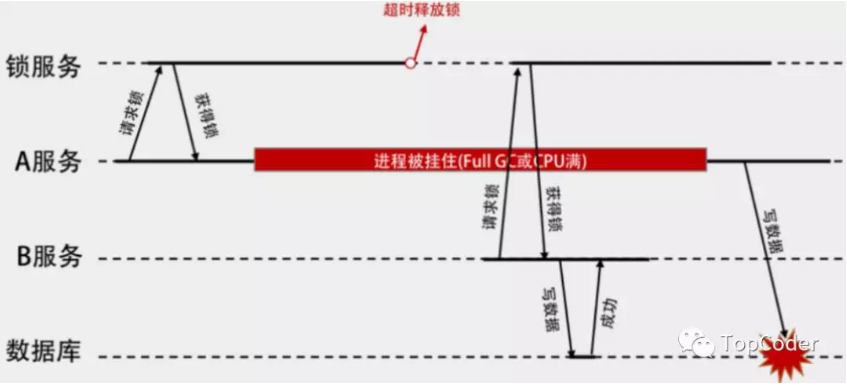

> 多线程情况下对共享资源的操作需要加锁，避免数据被写乱，在分布式系统中，这个问题也是存在的，此时就需要一个分布式锁服务。常见的分布式锁实现一般是基于DB、Redis、zookeeper。下面笔者会按照顺序分析下这3种分布式锁的设计与实现，想直接看分布式锁总结的小伙伴可直接翻到文档末尾处。

分布式锁的实现由多种方式，但是不管怎样，分布式锁一般要有以下特点：
* **排他性**：任意时刻，只能有一个client能获取到锁
* **容错性**：分布式锁服务一般要满足AP，也就是说，只要分布式锁服务集群节点大部分存活，client就可以进行加锁解锁操作
* **避免死锁**：分布式锁一定能得到释放，即使client在释放之前崩溃或者网络不可达

除了以上特点之外，分布式锁最好也能满足可重入、高性能、阻塞锁特性（AQS这种，能够及时从阻塞状态唤醒）等，下面就话不多说，赶紧上车~

## DB锁

在数据库新建一张表用于控制并发控制，表结构可以如下所示：
```sql
CREATE TABLE `lock_table` (
  `id` int(11) unsigned NOT NULL COMMENT '主键',
  `key_id` bigint(20) NOT NULL COMMENT '分布式key',
  `memo` varchar(43) NOT NULL DEFAULT '' COMMENT '可记录操作内容',
  `update_time` datetime NOT NULL COMMENT '更新时间',
  PRIMARY KEY (`id`,`key_id`),
  UNIQUE KEY `key_id` (`key_id`) USING BTREE
) ENGINE=InnoDB DEFAULT CHARSET=utf8;
```
key_id作为分布式key用来并发控制，memo可用来记录一些操作内容（比如memo可用来支持重入特性，标记下当前加锁的client和加锁次数）。将key_id设置为唯一索引，保证了针对同一个key_id只有一个加锁（数据插入）能成功。此时lock和unlock伪代码如下：
```
def lock ：
    exec sql: insert into lock_table(key_id, memo, update_time) values (key_id, memo, NOW())
    if result == true :
        return true
    else :
        return false

def unlock ：
    exec sql: delete from lock_table where key_id = 'key_id' and memo = 'memo'
```
注意，伪代码中的lock操作是非阻塞锁，也就是tryLock，如果想实现阻塞（或者阻塞超时）加锁，只修反复执行lock伪代码直到加锁成功为止即可。基于DB的分布式锁其实有一个问题，那就是如果加锁成功后，client端宕机或者由于网络原因导致没有解锁，那么其他client就无法对该key_id进行加锁并且无法释放了。为了能够让锁失效，需要在应用层加上定时任务，去删除过期还未解锁的记录，比如删除2分钟前未解锁的伪代码如下：
```
def clear_timeout_lock :
    exec sql : delete from lock_table where update_time <  ADDTIME(NOW(),'-00:02:00')
```
因为单实例DB的TPS一般为几百，所以基于DB的分布式性能上限一般也是1k以下，一般在并发量不大的场景下该分布式锁是满足需求的，不会出现性能问题。不过DB作为分布式锁服务需要考虑单点问题，对于分布式系统来说是不允许出现单点的，一般通过数据库的同步复制，以及使用vip切换Master就能解决这个问题。

以上DB分布式锁是通过insert来实现的，如果加锁的数据已经在数据库中存在，那么用`select xxx where key_id = xxx for udpate`方式来做也是可以的。

## Redis锁

Redis锁是通过以下命令对资源进行加锁：
```
set key_id key_value NX PX expireTime
```
其中，set nx命令只会在key不存在时给key进行赋值，px用来设置key过期时间，key_value一般是随机值，用来保证释放锁的安全性（释放时会判断是否是之前设置过的随机值，只有是才释放锁）。由于资源设置了过期时间，一定时间后锁会自动释放。

`set nx`保证并发加锁时只有一个client能设置成功（Redis内部是单线程，并且数据存在内存中，也就是说redis内部执行命令是不会有多线程同步问题的），此时的lock/unlock伪代码如下：
```
def lock:
    if (redis.call('set', KEYS[1], ARGV[1], 'ex', ARGV[2], 'nx')) then
      return true
    end
      return false
      
def unlock:
    if (redis.call('get', KEYS[1]) == ARGV[1]) then
      redis.call('del', KEYS[1])
      return true
    end
      return false
```

### Redis锁续约问题

如果一个获取到锁的client因为某种原因导致没能及时释放锁，并且redis因为超时释放了锁，另外一个client获取到了锁，此时情况如下图所示：


那么如何解决这个问题呢，一种方案是引入锁续约机制，也就是获取锁之后，释放锁之前，会定时进行锁续约，比如以锁超时时间的1/3为间隔周期进行锁续约。

关于开源的redis的分布式锁实现有很多，比较出名的有[redisson](https://github.com/redisson/redisson)、百度的[dlock](https://github.com/baidu/dlock)，关于分布式锁，笔者也写了一个简易版的分布式锁redis-lock，主要是增加了锁续约和可同时针对多个key加锁的机制。

对于高可用性，一般可以通过集群或者master-slave来解决，redis锁优势是性能出色，劣势就是由于数据在内存中，一旦缓存服务宕机，锁数据就丢失了。像redis自带复制功能，可以对数据可靠性有一定的保证，但是由于复制也是异步完成的，因此依然可能出现master节点写入锁数据而未同步到slave节点的时候宕机，锁数据丢失问题。

## zookeeper分布式锁

ZooKeeper是一个高可用的分布式协调服务，由雅虎创建，是Google Chubby的开源实现。ZooKeeper提供了一项基本的服务：分布式锁服务。zookeeper重要的3个特征是：zab协议、node存储模型和watcher机制。通过zab协议保证数据一致性，zookeeper集群部署保证可用性，node存储在内存中，提高了数据操作性能，使用watcher机制，实现了通知机制（比如加锁成功的client释放锁时可以通知到其他client）。

zookeeper node模型支持临时节点特性，即client写入的数据时临时数据，当客户端宕机时临时数据会被删除，这样就不需要给锁增加超时释放机制了。当针对同一个path并发多个创建请求时，只有一个client能创建成功，这个特性用来实现分布式锁。注意：如果client端没有宕机，由于网络原因导致zookeeper服务与client心跳失败，那么zookeeper也会把临时数据给删除掉的，这时如果client还在操作共享数据，是有一定风险的。

基于zookeeper实现分布式锁，相对于基于redis和DB的实现来说，使用上更容易，效率与稳定性较好。curator封装了对zookeeper的api操作，同时也封装了一些高级特性，如：Cache事件监听、选举、分布式锁、分布式计数器、分布式Barrier等，使用curator进行分布式加锁示例如下：
```xml
<!--引入依赖-->
<!--对zookeeper的底层api的一些封装-->
<dependency>
    <groupId>org.apache.curator</groupId>
    <artifactId>curator-framework</artifactId>
    <version>2.12.0</version>
</dependency>
 
<!--封装了一些高级特性，如：Cache事件监听、选举、分布式锁、分布式计数器、分布式Barrier等-->
<dependency>
    <groupId>org.apache.curator</groupId>
    <artifactId>curator-recipes</artifactId>
    <version>2.12.0</version>
</dependency>
```
```java
public static void main(String[] args) throws Exception {
    String lockPath = "/curator_recipes_lock_path";
    CuratorFramework client = CuratorFrameworkFactory.builder().connectString("192.168.193.128:2181")
            .retryPolicy(new ExponentialBackoffRetry(1000, 3)).build();

    client.start();
    InterProcessMutex lock = new InterProcessMutex(client, lockPath);

    Runnable task = () -> {
        try {
            lock.acquire();
            try {
                System.out.println("zookeeper acquire success: " + Thread.currentThread().getName());
                Thread.sleep(1000);
            } catch (Exception e) {
                e.printStackTrace();
            } finally {
                lock.release();
            }
        } catch (Exception ex) {
            ex.printStackTrace();
        }
    };

    ExecutorService executor = Executors.newFixedThreadPool(10);
    for (int i = 0; i < 1000; i++) {
        executor.execute(task);
    }

    LockSupport.park();
}
```

## 总结

从上面介绍的3种分布式锁的设计与实现中，我们可以看出每种实现都有各自的特点，针对潜在的问题有不同的解决方案，归纳如下：
* 性能：redis > zookeeper > db。
* 避免死锁：DB通过应用层设置定时任务来删除过期还未释放的锁，redis通过设置超时时间来解决，而zookeeper是通过临时节点来解决。
* 可用性：DB可通过数据库同步复制，vip切换master来解决，redis可通过集群或者master-slave方式来解决，zookeeper本身自己是通过zab协议集群部署来解决的。注意，DB和redis的复制一般都是异步的，也就是说某些时刻分布式锁发生故障可能存在数据不一致问题，而zookeeper本身通过zab协议保证集群内(至少n/2+1个)节点数据一致性。
* 锁唤醒：DB和redis分布式锁一般不支持唤醒机制（也可以通过应用层自己做轮询检测锁是否空闲，空闲就唤醒内部加锁线程），zookeeper可通过本身的watcher/notify机制来做。

使用分布式锁，安全性上和多线程（同一个进程内）加锁是没法比的，可能由于网络原因，分布式锁服务（因为超时或者认为client挂了）将加锁资源给删除了，如果client端继续操作共享资源，此时是有隐患的。因此，对于分布式锁，一个是尽量提高分布式锁服务的可用性，另一个就是要部署同一内网，尽量降低网络问题发生几率。这样来看，貌似分布式锁服务不是“完美”的（PS：技术貌似也不好做到十全十美 :( ），那么开发人员该如何选择分布式锁呢？最好是结合自己的业务实际场景，来选择不同的分布式锁实现，一般来说，基于redis的分布式锁服务应用较多。

参考资料：
1. [聊一聊分布式锁的设计](http://weizijun.cn/2016/03/17/%E8%81%8A%E4%B8%80%E8%81%8A%E5%88%86%E5%B8%83%E5%BC%8F%E9%94%81%E7%9A%84%E8%AE%BE%E8%AE%A1/)
1. https://github.com/luoxn28/redis-lock