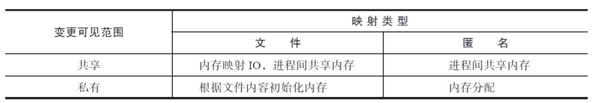
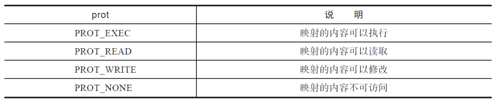

mmap系统调用的作用是在调用进程的虚拟地址空间中创建一个新的内存映射。根据内存背后有无实体文件与之关联，映射可以分成以下两种：

- 文件映射：内存映射区域有实体文件与之关联。mmap系统调用将普通文件的一部分内容直接映射到调用进程的虚拟地址空间。一旦完成映射，就可以通过在相应的内存区域中操作字节来访问文件内容。这种映射也被称为基于文件的映射。
- 匿名映射：匿名映射没有对应的文件。这种映射的内存区域会被初始化成0。

内存映射根据有无文件关联，分成文件与匿名；根据映射是否在进程间共享，分成私有（fork之后mmap对应内存会进行写时复制）和共享。这两个维度两两组合，内存映射共分成4种类型：



mmap函数定义如下：

```c
void *mmap(void *addr, size_t length, int prot, int flags, int fd, off_t offset)
```

参数addr用于指定将文件对应的内容映射到进程地址空间的起始地址，一般为了可以执行不建议自行指定地址，而是传NULL让系统自己决定起始地址。参数prot用于设置对内存映射区域的保护，取值如下：



> 其中fd、offset和length这三个参数指定了内存映射的源，即将fd对应的文件，从offset位置起，将长度为length的内容映射到进程的地址空间。对于文件映射，调用mmap之前需要调用open取到对应文件的文件描述符。

需要注意的是mmap系统调用的操作单元是页，参数addr和offset都必须按页对齐，即必须是页面大小的整数倍。如果length参数不是页的整数倍会被向上取整。如果不再需要对应的内存映射了，可以调用munmap函数，解除该内存映射：

```c
int munmap(void *addr, size_t length)
```

其中addr是mmap返回的内存映射的起始地址，length是内存映射区域的大小。执行过munmap后，如果继续访问内存映射范围内的地址，那么进程会收到SIGSEGV信号，引发段错误。需要注意的是，关闭对应文件的文件描述符并不会引发munmap。

### mmap回写策略

说了这么多mmap的东东，那么如果是mmap文件映射，什么时候进行回写呢？

- 内存不足
- 进程crash
- 调用 msync 或者 munmap
- 不设置 MAP_NOSYNC 情况下 30s-60s(仅限FreeBSD)

