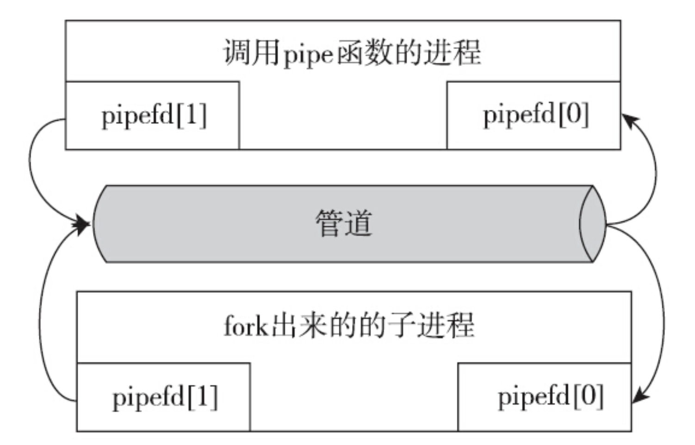

管道是最早出现的进程间通信的手段，在shell中执行命令，经常会将上一个命令的输出作为下一个命令的输入，由多个命令配合完成一件事情。管道的作用是在有亲缘关系的进程之间传递消息，因为共同主先进程调用过pipe函数，打开的管道文件就会在fork之后，被各个后代进程所共享，打开的管道可以由其中一个进程写入数据，然后另一个具有亲属关系的进程读取。

> 严格来说，家族里面的多个进程都可以往同一个秘密场所里面扔消息，也可以都从同一个秘密场所里面取消息，但是真的这么做的话又会存在风险。管道实质是一个字节流，并非前面提到的消息，没有消息的边界。如果多个进程发送的字节流混在一起，则无法辨认出各自的内容。所以一般是两个有亲缘关系的进程用管道来通信。

一般来讲，进程中数据流是单向的，并且是阅后即焚的。管道是一种文件，可以调用read、write和close等操作文件的接口来操作管道。另一方面管道又不是一种普通的文件，它属于一种独特的文件系统：pipefs。管道的本质是内核维护了一块缓冲区与管道文件相关联，对管道文件的操作，被内核转换成对这块缓冲区内存的操作。

Linux下创建管道函数：

```c
int pipe(int pipefd[2])
```

成功调用pipe函数之后，会返回两个打开的文件描述符，一个是管道的读取端描述符pipefd[0]，另一个是管道的写入端描述符pipefd[1]。管道没有文件名与之关联，因此程序没有选择，只能通过文件描述符来访问管道，只有那些能看到这两个文件描述符的进程才能够使用管道。如果进程执行了fork操作，那么管道就变成如下所示：



一般来说管道是单向使用，所以fork之后，新老进程一个会关闭write fd，另一个会关闭read fd，避免读取读写混淆。在shell中执行管道命令就是这种情景，只是略有特殊之处，其特殊的地方是管道描述符占用了标准输入和标准输出两个文件描述符。

> 单向使用管道，也就是说，如果没有用到管道的进程应该尽早释放管道文件fd，这么做不仅仅是为了让数据的流向更加清晰，也不仅仅是为了节省文件描述符，更重要的原因是：关闭未使用的管道文件描述符对管道的正确使用影响重大。

管道有如下3个特性：

- 只有当所有的写入端描述符都已关闭，且管道中的数据都被读出，对读取端描述符调用read函数才会返回0（即读到EOF标志）。
- 如果所有读取端描述符都已关闭，此时进程再次往管道里面写入数据，写操作会失败，errno被设置为EPIPE，同时内核会向写入进程发送一个SIGPIPE的信号。
- 当所有的读取端和写入端都关闭后，管道才能被销毁。

管道的本质是一片内存区域，默认大小是65536字节，不过可以调用fcntl来获取和修改这个值的大小。因此在使用管道的过程中要注意写入数据是否能及时消费的问题，一旦管道满了，写入就会被阻塞；对于读取端，要及时地读取，防止管道被写满，造成写入阻塞。

上面说的都是常见的管道形式，也就是匿名管道，因为没有实体文件与之关联，所以只能在具有亲属关系的进程间使用。因此就出现了另一种管道形式，命名管道，其最大的差别就是有实体文件与之关联。由于存在实体文件，不相关的没有亲缘关系的进程也可以通过使用FIFO来实现进程之间的通信。

创建命名管道函数如下：

```c
int mkfifo(const char *pathname, modt_t mode)
```

命名管道支持的管道操作和匿名管道是一样的，只不过它多了一个关联文件，有文件名，这样任何进程通过文件名来使用它而已。
