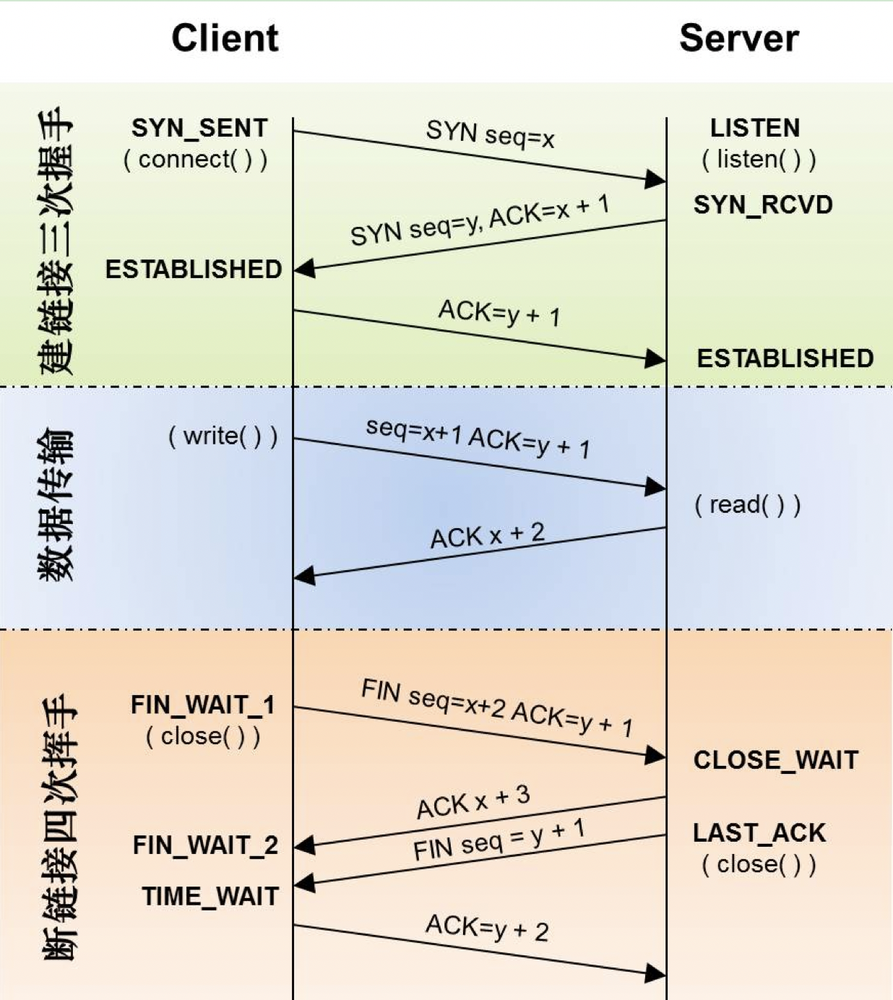
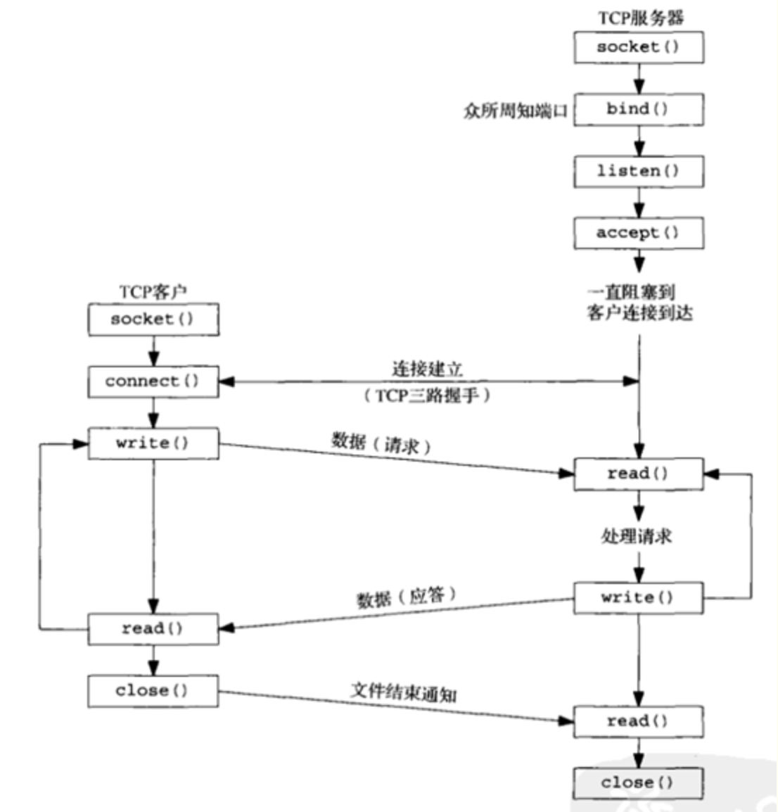

> 说了网络通信，大家肯定都不会陌生，比如各种分布式系统、大数据框架等等都要涉及到网络通信，由于大多数通信都是基于TCP协议来的，因此本文就以TCP为例，结合socket api来分析Linux下的网络通信流程。

TCP协议是基于IP协议之上的面向流并且可靠传输的通信协议，同时TCP也拥有流量控制和拥塞控制机制。说起TCP，就绕不开的TCP的3次握手和4次挥手，因此先看下握手和挥手流程：



### socket api

常用的网络通信socket api有socket、bind、listen、accept和connect等。

为了进行网络通信，进程需要首先调用socket函数获取一个socket fd，可以指定通信协议类型：

```c
// family指定协议族，type指定套接字类型，protocol指定某个协议类型常值，或者设为0。
int socket(int family, int type, int protocol);
```

bind函数把一个本地协议地址赋予一个套接字，至于协议地址的含义则取决于协议本身，对于TCP，调用bind函数可以指定一个端口号。

```c
int bind(int sockfd, const struct sockaddr *myaddr, socklen_t addrlen); // 返回：成功为0，出错-1
```

> bind函数绑定特定的IP地址必须属于其所在主机的网络接口之一，服务器在启动时绑定它们众所周知的端口，如果一个TCP客户端或服务端未曾调用bind绑定一个端口，当调用connect或listen时，内核就要为响应的套接字选择一个临时端口。让内核选择临时端口对于TCP客户端来说是正常的额，然后对于TCP服务端来说确实罕见的，因为服务端通过他们众所周知的端口被大家认识的。

socket创建一个套接字时，它被假设为一个主动套接字，也就是说，它是一个将调用connect发起连接的一个客户套接字。listen函数把一个未连接的套接字转换为一个被动套接字，指示内核应接受指向该套接字的连接请求，调用listen函数将导致套接字从CLOSEE状态转换到LISTEN状态。

```c
int listen(int sockfd, int backlog); // 返回：成功返回0，出错-1
```

> backlog表示某个给定套接字上内核为之排队的最大已完成连接数，也就是3次握手中已完成队列的大小。

accept函数由服务器调用，用于从已完成队列中获取下一个已完成连接，如果已完成队列为空，则进程被投入睡眠（如果该套接字为阻塞方式的话）。如果accept成功，那么其返回值是由内核自动生成的一个全新套接字，代表与返回客户的TCP连接，函数的第一个参数为监听套接字，返回值为已连接套接字。

```c
int accept(int sockfd, struct sockaddr *cliaddr, socklen_t *addrlen); //  返回：成功返回已连接描述符(非负)，出错-1
```

连接建立完成之后就可以进行读写操作了，对应read/write等方法。



连接读写完成之后就可以进行关闭连接操作了，close一个TCP套接字的默认行为是把该套接字标记为已关闭，然后立即返回到调用进程。注意，close实质把该套接字引用值减1，如果该引用值大于0，则对应的套接字不会被真正关掉。

```c
int close(int sockfd); // 若成功返回0，出错-1
```

