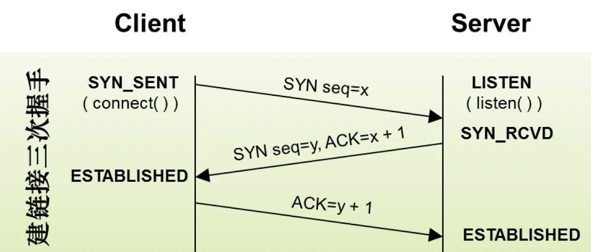
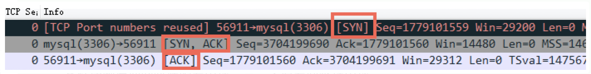
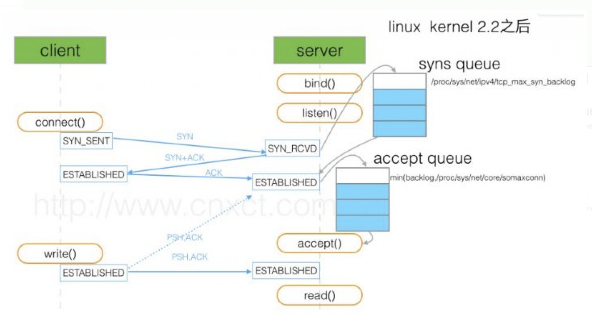

> 说起TCP的三次握手，大多数小伙伴多少都听说过一些，因此本文不再赘述三次握手的详细流程，而是重点关注三次握手中半连接队列和全连接队列流程，以及二者队列满了时的处理机制，最后分析下常见的三次握手的问题，这些问题大都也是和半连接队列和全连接队列相关的。

### 三次握手

TCP三次握手大致流程如下：

1. client 发送 syn 到server 发起握手；
2. server 收到 syn后回复syn+ack给client；
3. client 收到syn+ack后，回复server一个ack表示收到了server的syn+ack，这时表示连接建立完成。

三次握手对应抓包如下：

### 半连接队列/全连接队列

上面说的TCP三次握手并没有提到半连接队列和全连接队列，其实三次握手流程中还涉及到半连接和全连接队列之间的流转动作，对应的流程如下：

1. client 发送 syn 到server 发起握手；
2. server 收到 syn后回复syn+ack给client，同时server端会将连接放到半连接队列；
3. client 收到syn+ack后，回复server一个ack表示收到了server的syn+ack，这时表示连接建立完成，此时server端会将连接放到全连接队列（这时连接已经建立OK了，只不过进程还无感知，进程需要主动调用accept之后拿到该连接信息，并分配对应fd之后就可以进行IO读写操作了）。

> 如上图所示，这里有两个队列：syns queue(半连接队列）；accept queue（全连接队列）。

### 队列满时处理机制

半连接队列和全连接队列满时有以下3种场景：

- **半连接满了，全连接未满**：当半连接满了时，默认处理机制是，TCP忽略请求，也不发送RST，为什么要这么处理呢？因为这样做是暂时的，客户端将重新发送SYN，期望不久就能得到服务。假如服务端响应一个RST，客户端的connect就会返回错误，而不是让重传机制来处理，这样客户无法区分SYN的RST是因为**"该端口没有在监听"还是"该端口在监听，只不过它的队列满了"**。
- **半连接未满，全连接满了**：当全连接队列满了时，再往全连接队列塞时操作系统会按照 `tcp_abort_on_overflow` 的指示执行，默认为0表示扔掉client发过来的ack（在server端认为连接还没建立起来），为1表示发送一个reset包给client。
- **半连接和全连接都满了**：相当于集中了以上所述的2种场景的最差场景，新连接默认不处理让TCP重传机制进行重试，往全连接队列塞时默认按照 `tcp_abort_on_overflow` 指示来执行。

半连接/全连接队列的大小到底是多少呢？

> 准确来说，全连接队列的大小取决于：min(backlog, somaxconn) . backlog是在socket创建的时候传入的，somaxconn是一个os级别的系统参数，也就是/proc/sys/net/core/somaxconn的大小。半连接队列的大小取决于：max(64, /proc/sys/net/ipv4/tcp_max_syn_backlog)。 不同版本的os会有些差异。

### 常见问题分析

- 网站服务中常见的syn floods攻击，就是针对半连接队列攻击的，攻击客户端不停地新建连接，但是它只、不会处理接收到的第二步的响应结果，导致server端半连接队列满了而无法处理正常进来的建立连接请求。
- 压测场景中可能存在的连接建立不上问题，可能是默认的backlog较小导致，这样很容易导致队列满了，然后忽略该请求报文，客户端迟迟建立不上连接。
- 全连接队列攻击，攻击客户端只连接而不进行发送数据的一种攻击方式，如果服务端使用的是一个线程一个连接的处理方式，会白白占用很多线程资源；如果是NIO处理方式，虽然不用多占用线程资源，但是也是会白白占用fd资源的。

**最后我们想一下，TCP为什么需要3次握手呢？**

一句话总结就是：3次握手保证了连接的可靠性与效率。3次握手过程中，会交换各自的一些信息，比如窗口大小、初始报文序号等，如果只有2次握手，不能保证客户端一定能收到服务端的响应报文（SYN+ACK）。

**参考资料**：

1、https://zhuanlan.zhihu.com/p/53374516