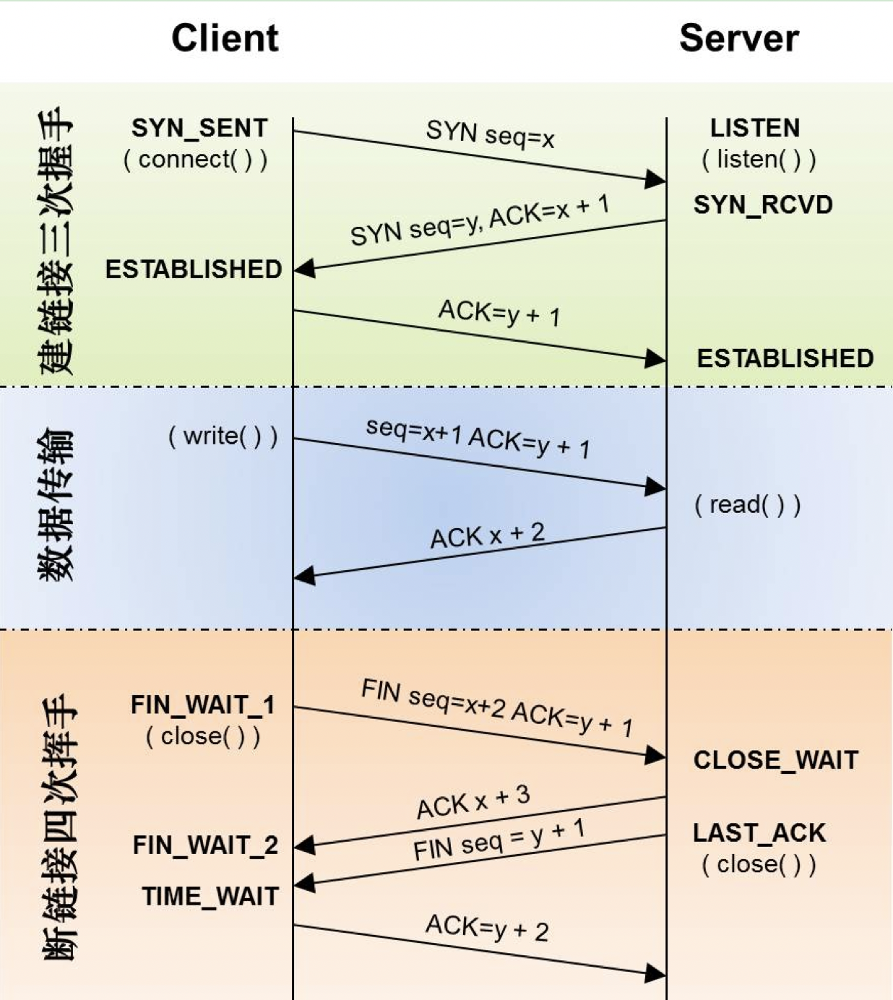

TCP是全双工传输协议，也就是说双方都可进行读写操作，当一方不需要写数据时，会通过发送FIN报文告知对方，我要关闭连接了，对方接受到并返回ACK报文，这就表示一方的连接已经关闭，此时另一方的连接还是OK的，也就是说另一方还是可以继续写数据的，等到另一方也发完数据之后就可以发送FIN报文。

> 注意，接收到FIN报文时系统只能返回一个ACK，它无法发出FIN报文，因此FIN报文的发出是由业务层来触发的。

### 4次挥手流程

TCP建立连接到4次挥手流程如下：



注意，4次挥手流程有一个TIME_WAIT阶段（TIME_WAIT的作用是保证关闭连接后这个连接在网络中的所有数据包都过期，否则的话可能存在这样的问题，连接关闭了但是网络中还残留旧连接的报文，这样如果以同样的TCP 4元组新建的连接可能会接收到该旧报文，会以为是新连接的报文而导致问题），更详细的4次挥手流程如下：


### 4次挥手中的问题分析

从4次挥手的流程来看，可能存在问题的地方有，主动断开连接端的FIN_WAIT_2和TIME_WAIT阶段，被动断开连接端的CLOSE_WAIT阶段：

#### CLOSE_WAIT阶段

正常情况下CLOSE_WAIT存在的时间很短，因为稍后被动关闭端会发出FIN报文，然后进到 LAST_ACK 状态。如果系统中存在较多的CLOSE_WAIT 状态的连接，说明是本端服务没有处理好，比如：

- **本身程序问题**：应用层忘记进行close，或者close不及时，再或者应用没有及时对端发送来的FIN报文响应close动作；
- **新建连接太多问题**：比如存在（3次握手中的）已连接队列中的连接未被应用及时accept导致客户端已经close了，此时连接就处于CLOSE_WAIT阶段了。

出现了CLOSE_WAIT 状态连接过多，只要确定了是什么原因，就可以对症解决了，这里不再赘述。

#### FIN_WAIT_2阶段

正常情况下FIN_WAIT_2阶段的存在时间也很短，因为对端会很快发出FIN报文，如果发现处于FIN_WAIT_2状态的连接过多，说明是对端没有及时发出FIN报文，这个是对端的原因，本端无法控制，不过本端可以设置FIN_WAIT_2的超时时间，对于配置项为 `net.ipv4.tcp_fin_timeout ` ，来避免该问题。

### TIME_WAIT阶段

当 TCP 连接主动关闭时，都会经过 TIME_WAIT 状态，TIME_WAIT存在的意义是保证关闭连接后这个连接在网络中的所有数据包都过期，否则的话可能存在这样的问题，连接关闭了但是网络中还残留旧连接的报文，这样如果以同样的TCP 4元组新建的连接可能会接收到该旧报文，会以为是新连接的报文而导致问题，因此TIME_WAIT 的存在是为了保证网络中迷失的数据包正常过期。

说到过期时间，就不得不提 最大分段寿命（MSL, Maximum Segment Lifetime），它表示一个 TCP 分段可以存在于互联网系统中的最大时间，由 TCP 的实现，超出这个寿命的分片都会被丢弃。

> MSL 的时长被 RFC 定义为 2分钟，但在不同的 unix 实现上，这个值不并确定，我们常用的 centOS 上，它被定义为 30s，我们可以通过 /proc/sys/net/ipv4/tcp_fin_timeout 这个文件查看和修改这个值。

TIME_WAIT阶段存在的问题是 TIME_WAIT 状态连接过多，会占用过多的句柄资源，严重时系统无法发起新的连接。可以通过配置来设定超时时间、TIME_WAIT连接重用等机制：

```shell
net.ipv4.tcp_tw_reuse = 1 表示开启重用。允许将TIME-WAIT sockets重新用于新的TCP连接，默认为0，表示关闭；
net.ipv4.tcp_tw_recycle = 1 表示开启TCP连接中TIME-WAIT sockets的快速回收，默认为0，表示关闭。
net.ipv4.tcp_fin_timeout 修改系默认的 TIMEOUT 时间
```

