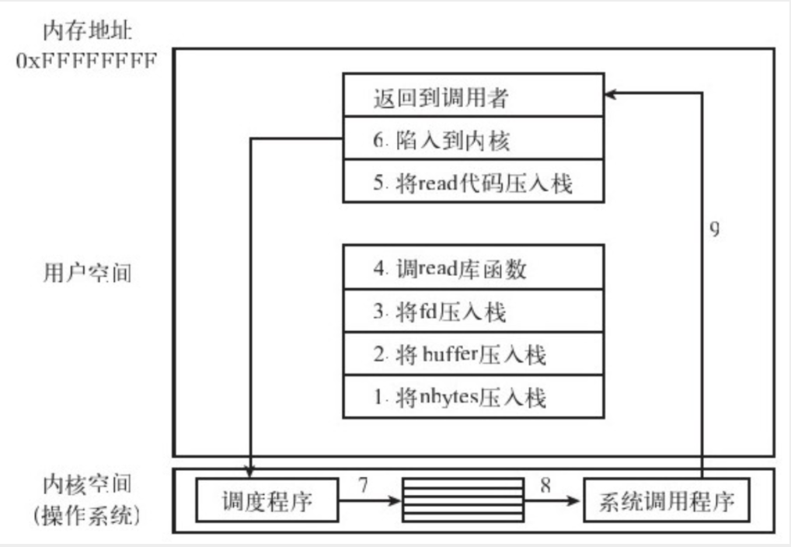

### 内核态与用户态

内核态和用户是程序执行的两个状态，二者执行时的权限不同，内核态可以访问计算机所有资源，因此对于内核态程序的安全性要求较高。

> 一般来说，如果一个程序能够运行于用户态，就应该让它运行在用户态。只在迫不得已的情况下，才让程序运行于内核态。凡是牵扯到计算机本体根本运行的事情都应该在内核态下执行，只与用户数据和应用相关的东西则放在用户态执行。另外，对时序要求特别高的操作，也应该在内核态完成。

操作系统怎么知道一个程序是在内核态还是用户态的呢？操作系统通过处理器的一个状态位作为标志来区分的。内核态是特权态，用户态是非特权态，我们都知道对资源的限制访问，是通过对程序执行的每一条指令进行检查判断的，这个检查就是地址翻译时完成的。内核态程序可以绕过地址翻译的检查直接执行指令，这样就不会进行资源限制。

> 注意用户态程序操作的地址都是虚拟内存地址，只有内核态程序才能够操作物理内存地址。

### 系统调用

系统调用要经过3个阶段：**参数准备、系统调用识别、系统调用执行**。

以 `read(fd, buffer, nbytes)` 为例，在参数准备阶段，需要使用系统服务的程序将系统调用所需要的参数，如上述例子中的fd、buffer、nbytes，压入栈中或者存放到对应寄存器中，然后调用read库函数，然后将read系统调用的代码放在一个约定好的寄存器里，通过陷入（trap，一种中断方式）将控制交给操作系统，后续会进行内核态执行。操作系统获得控制权后，将系统调用代码从寄存器里取出，与操作系统维护的一张系统调用表进行比较，获得read系统调用的程序体所在的内存地址。然后开始执行系统调用函数，执行完毕返回给用户程序，如下图。

> 系统调用中参数传递有可能不是通过栈来传递的，比如x86下，系统调用函数中参数由寄存器传递，只有超过8个参数时，超过的部分参数才通过栈来传递。