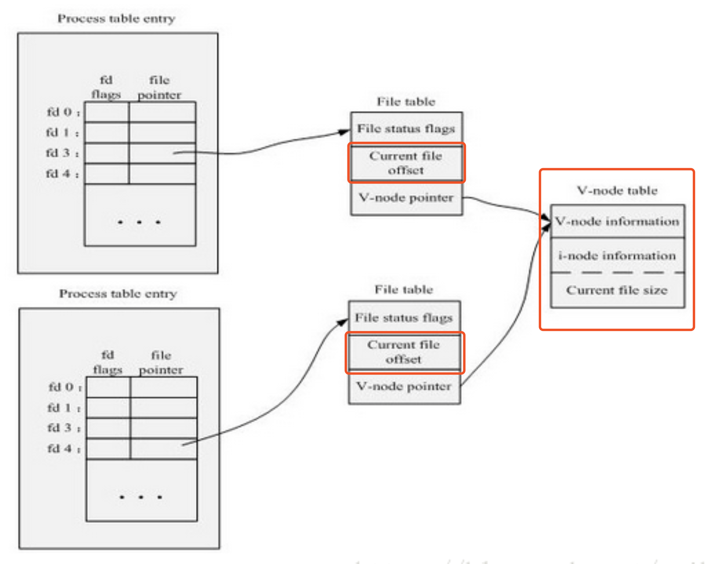

基本概念：

- IOPS：每秒输入输出量（读写次数）。
- 吞吐量：单位时间内成功传输的数据量。

### VFS（虚拟文件系统层）

VFS是虚拟文件系统层（进程与文件系统之间的抽象层），与它相关的数据结构只存在于物理内存当中。其目的是屏蔽下层具体文件系统操作的差异，为上层的操作提供一个统一接口，正式由于VFS的存在，Linux中允许多个不同的文件系统共存。

VFS中包含着向物理文件系统转换的一系列数据结构，如VFS超级块、VFS的Inode、各种操作函数的转换入口等。Linux中VFS依靠四个主要的数据结构来描述其结构信息，分别为超级块、索引结点、目录项和文件对象，这些数据结构大都会与磁盘上的对应上。

- **超级块（Super Block）**：超级块对象表示一个文件系统。它存储一个已安装的文件系统的控制信息，包括文件系统名称（比如Ext2）、文件系统的大小和状态、块设备的引用和元数据信息（比如空闲列表等等）。超级块与磁盘上文件系统的超级块对应。
- **索引结点（Inode）**：索引结点对象存储了文件的相关元数据信息，例如：文件大小、设备标识符、用户标识符、用户组标识符等等。Inode分为两种：一种是VFS的Inode，一种是具体文件系统的Inode。前者在内存中，后者在磁盘中。所以每次其实是将磁盘中的Inode调进填充内存中的Inode，这样才是算使用了磁盘文件Inode。当创建一个文件的时候，就给文件分配了一个Inode。一个Inode只对应一个实际文件，一个文件也会只有一个Inode（Unix/Linux系统中目录也是一种文件，打开目录实际上就是打开目录文件。目录文件的结构非常简单，就是一系列目录项（dirent）的列表。每个目录项，由两部分组成：所包含文件的文件名，以及该文件名对应的inode号码）。
- **目录项（Dentry）**：引入目录项对象的概念主要是出于方便查找文件的目的。不同于前面的两个对象，目录项对象只存在于内存中，实际对应的是磁盘的目录innode对象。VFS在查找的时候，根据一层一层的目录项找到对应的每个目录项的Inode，那么沿着目录项进行操作就可以找到最终的文件。
- **文件对象（File）**：文件对象描述的是进程已经打开的文件。因为一个文件可以被多个进程打开，所以一个文件可以存在多个文件对象，但多个文件对象其对应的索引节点和目录项对象肯定是惟一的，关系如下图：

> 由于进程中File对象有独立的文件偏移量（current file offset），因此多个进程可以读写文件的不同位置的数据，但是一般不建议这样玩，因此系统不保证该情况下的写的原子性，多进程可以通过文件锁实现对文件内容的写保护。

### PageCache

Page cache是通过将磁盘中的数据缓存到内存中，从而减少磁盘I/O操作，从而提高性能。此外，还要确保在page cache中的数据更改时能够被同步到磁盘上，后者被称为page回写（page writeback）。一个inode对应一个page cache对象，一个page cache对象包含多个物理page。

当内核发起一个读请求时（例如进程发起read()请求），首先会检查请求的数据是否缓存到了page cache中，如果有，那么直接从内存中读取，不需要访问磁盘，这被称为cache命中（cache hit）。如果cache中没有请求的数据，即cache未命中（cache miss），就必须从磁盘中读取数据。然后内核将读取的数据缓存到cache中，这样后续的读请求就可以命中cache了。page可以只缓存一个文件部分的内容，不需要把整个文件都缓存进来。

当内核发起一个写请求时（例如进程发起write()请求），同样是直接往cache中写入，此时不会立即同步到磁盘，而是将写入的page设置为脏页，并将其加入dirty list中，内核会负责定期同步到磁盘保持二者一执行。

page cache另一个主要工作是回收page释放内存空间，此时会选择合适的page进行释放，如果是脏页会先同步到磁盘然后释放。此时是如何选择cache页的呢？Linux使用的策略是基于LRU改进的Two-List策略：

> Two-List策略维护了两个list，active list 和 inactive list。在active list上的page被认为是hot的，不能释放。只有inactive list上的page可以被释放的。首次缓存的数据的page会被加入到inactive list中，已经在inactive list中的page如果再次被访问，就会移入active list中。两个链表都使用了伪LRU算法维护，新的page从尾部加入，移除时从头部移除，就像队列一样。如果active list中page的数量远大于inactive list，那么active list头部的页面会被移入inactive list中，从而位置两个表的平衡。

触发脏页回写到磁盘时机如下：

- 用户进程调用sync() 和 fsync()系统调用；
- 空闲内存低于特定的阈值（threshold）；
- Dirty数据在内存中驻留的时间超过一个特定的阈值。

### 追加写

一个良好的写性能优化策略是使用追加写，因为追加写是顺序的，拥有良好的写操作性能。但是该方式下，针对数据更新操作的读操作会多花费一些时间，需要多扫描一些数据找到对应数据，比如LSM等。追加写比较适合数据更新不频繁但是读较频繁场景，比如：

- **数据被整体访问，HDFS**：HDFS建立在一次写多次读的模型之上。在HDFS中就是采用了追加写并且设计为高数据吞吐量；高吞吐量必然以高延迟为代价，所以HDFS并不适用于对数据访问要求低延迟的场景；由于采用是的追加写，也并不适用于任意修改文件的场景。HDFS设计为流式访问大文件，使用大数据块并且采用流式数据访问来保证数据被整体访问，同时最小化硬盘的寻址开销，只需要一次寻址即可，这时寻址时间相比于传输时延可忽略，从而也拥有良好的读性能。HDFS不适合存储小文件，原因之一是由于NameNode内存不足问题，还有就是因为访问大量小文件需要执行大量的寻址操作，并且需要不断的从一个datanode跳到另一个datanode，这样会大大降低数据访问性能。
- **消息的追加写，Kafka**：在Kafka中，采用消息追加的方式来写入每个消息，每个消息读写时都会利用Page Cache的预读和后写特性，同时partition中都使用顺序读写，以此来提高I/O性能。虽然Kafka能够根据偏移量查找到具体的某个消息，但是查找过程是顺序查找，因此如果数据很大的话，查找效率就很低。所以Kafka中采用了分段和索引的方式来解决查找效率问题。Kafka把一个patition大文件又分成了多个小文件段，每个小文件段以偏移量命名，通过多个小文件段，不仅可以使用二分搜索法很快定位消息，同时也容易定期清除或删除已经消费完的文件，减少磁盘占用。为了进一步提高查找效率，Kafka为每个分段后的数据建立了索引文件，并通过索引文件稀疏存储来降低元数据占用大小。

在面对更复杂的读场景（比如按key）时，如何来保证读操作的性能呢？简单的方式是像Kafka那样，将文件数据有序保存，使用二分查找来优化效率；或者通过建索引的方式来进行优化；也可以采用hash的方式将数据分割为不同的桶。以上的方法都能增加读操作的性能，但是由于在数据上强加了数据结构，又会降低写操作的性能。比如如果采用索引的方式来优化读操作，那么在更新索引时就需要更新B-tree中的特定部分，这时候的写操作就是随机写。那么有没有一种办法在保证写性能不损失的同时也提供较好的读性能呢？一个好的选择就是使用LSM-tree。LSM-tree与B-tree相比，LSM-tree牺牲了部分读操作，以此大幅提高写性能。

> 日志结构的合并树LSM（The Log-Structured Merge-Tree）是HBase，LevelDB等NoSQL数据库的存储引擎。Log-Structured的思想是将整个磁盘看做一个日志，在日志中存放永久性数据及其索引，每次都添加到日志的末尾。并且通过将很多小文件的存取转换为连续的大批量传输，使得对于文件系统的大多数存取都是顺序的，从而提高磁盘I/O。LSM-tree就是这样一种采用追加写、数据有序以及将随机I/O转换为顺序I/O的延迟更新，批量写入硬盘的数据结构。LSM-tree将数据的修改增量先保存在内存中，达到指定的大小限制后再将这些修改操作批量写入磁盘。因此比较旧的文件不会被更新，重复的纪录只会通过创建新的纪录来覆盖，这也就产生了一些冗余的数据。所以系统会周期性的合并一些数据，移除重复的更新或者删除纪录，同时也会删除上述的冗余。在进行读操作时，如果内存中没有找到相应的key，那么就是倒序从一个个磁盘文件中查找。如果文件越来越多那么读性能就会越来越低，目前的解决方案是采用页缓存来减少查询次数，周期合并文件也有助于提高读性能。在文件越来越多时，可通过布隆过滤器来避免大量的读文件操作。LSM-tree牺牲了部分读性能，以此来换取写入的最大化性能，特别适用于读需求低，会产生大量插入操作的应用环境。

### 小文件优化策略

目前的大多数文件系统，如XFS/Ext4、GFS、HDFS，在元数据管理、缓存管理等实现策略上都侧重大文件。常见文件系统在海量小文件应用下性能表现不佳的根本原因是磁盘最适合顺序的大文件I/O读写模式，而非常不适合随机的小文件I/O读写模式。主要原因体现在元数据管理低效和数据布局低效：

- 元数据管理低效：由于小文件数据内容较少，因此元数据的访问性能对小文件访问性能影响巨大。Ext2文件系统中Inode和Data Block分别保存在不同的物理位置上，一次读操作需要至少经过两次的独立访问。在海量小文件应用下，Inode的频繁访问，使得原本的并发访问转变为了海量的随机访问，大大降低了性能。另外，大量的小文件会快速耗尽Inode资源，导致磁盘尽管有大量Data Block剩余也无法存储文件，会浪费磁盘空间。
- 数据布局低效：Ext2在Inode中使用多级指针来索引数据块。对于大文件，数据块的分配会尽量连续，这样会具有比较好的空间局部性。但是对于小文件，数据块可能零散分布在磁盘上的不同位置，并且会造成大量的磁盘碎片，不仅造成访问性能下降，还大量浪费了磁盘空间。数据块一般为1KB、2KB或4KB，对于小于4KB的小文件，Inode与数据的分开存储破坏了空间局部性，同时也造成了大量的随机I/O。

> 对于海量小文件应用，常见的I/O流程复杂也是造成磁盘性能不佳的原因。对于小文件，磁盘的读写所占用的时间较少，而用于文件的open()操作占用了绝大部分系统时间，导致磁盘有效服务时间非常低，磁盘性能低下。针对于问题的根源，优化的思路大体上分为：

1. 针对数据布局低效，采用小文件合并策略，将小文件合并为大文件。
2. 针对元数据管理低效，优化元数据的存储和管理。针对这两种优化方式，业内也出现了许多优秀的开源软件。

**小文件合并 **小文件合并为大文件后，首先减少了大量元数据，提高了元数据的检索和查询效率，降低了文件读写的I/O操作延时。其次将可能连续访问的小文件一同合并存储，增加了文件之间的局部性，将原本小文件间的随机访问变为了顺序访问，大大提高了性能。同时，合并存储能够有效的减少小文件存储时所产生的磁盘碎片问题，提高了磁盘的利用率。

> 合并之后小文件的访问流程也有了很大的变化，由原来许多的open操作转变为了seek操作，定位到大文件具体的位置即可。如何寻址这个大文件中的小文件呢？其实就是利用一个旁路数据库来记录每个小文件在这个大文件中的偏移量和长度等信息。其实小文件合并的策略本质上就是通过分层的思想来存储元数据。中控节点存储一级元数据，也就是大文件与底层块的对应关系；数据节点存放二级元数据，也就是最终的用户文件在这些一级大块中的存储位置对应关系，经过两级寻址来读写数据。比如阿里的TFS就采用了小文件合并存储的策略，TFS中默认Block大小为64M，每个块中会存储许多不同的小文件，但是这个块只占用一个Inode。

**元数据管理优化** 一般来说元数据信息包括名称、文件大小、设备标识符、用户标识符、用户组标识符等等，在小文件系统中可以对元数据信息进行精简，仅保存足够的信息即可。元数据精简可以减少元数据通信延时，同时相同容量的Cache能存储更多的元数据，从而提高元数据使用效率。另外可以在文件名中就包含元数据信息，从而减少一个元数据的查询操作。最后针对特别小的一些文件，可以采取元数据和数据并存的策略，将数据直接存储在元数据之中，通过减少一次寻址操作从而大大提高性能。

> TFS中文件命名就隐含了位置信息等部分元数据，从而减少了一个元数据的查询操作。

**参考资料**：

1、https://tech.meituan.com/2017/05/19/about-desk-io.html

2、https://www.linuxidc.com/Linux/2018-12/156117.htm

3、https://www.ruanyifeng.com/blog/2011/12/inode.html