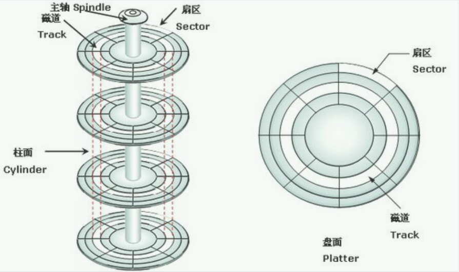

> 磁盘作为计算机的底层存储，重要性不言而喻，操作系统的启动程序就是存在在磁盘的开始位置上的。

磁盘是由多个盘片组成的，每个盘边两面都是可以存储数据。每个盘边对应一个读写磁头，所有读写磁头都是在同一个磁臂上，盘片则以每分钟3500转到10000转速率运转，即大约每6毫秒到17毫秒旋转一圈。该磁头由少量的空气垫层浮起，悬浮在盘面上方约几个微米的高度，磁头在盘面上的移动操作由一个伺服机构（`ser-vomechanism`）负责控制，注意不管是有多少个磁头，同一时间点只能有一个磁头处于活跃状态进行数据读写操作。

磁盘结构图如下：

**一个磁道上可以有多个扇区，一般扇区大小是512字节，扇区也是磁盘IO的最小单位**。也就是说，磁盘读写的时候都是以扇区为最小寻址单位的，不可能往某个扇区的前半部分写入一部分数据。一个扇区的大小是512B，每次磁头连续读写的时候，只能以扇区为单位，即使一次只写了一个字节的数据，那么下一次新的文件写操作就不能再向这个扇区剩余的部分接着写入，而是要寻找一个空扇区来写。

磁道按照从外到圆心进行0、1...N的序号编号，不同盘面上相同编号则组成了一个柱面。注意磁盘读写都是按照柱面进行的，即磁头读写数据时首先在同一柱面内从0磁头开始进行操作，依次向下在同一柱面的不同盘面( 即磁头上)进行操作，只有在同一柱面所有的磁头全部读写完毕后磁头才转移到下一柱面，因为选取磁头只需通过电子切换即可 ，而选取柱面则必须通过机械切换。电子切换比从在机械上磁头向邻近磁道移动快得多。因此，数据的读写按柱面进行，而不按盘面进行。 读写数据都是按照这种方式进行，尽可能提高了硬盘读写效率。

## 磁盘读写耗时

在了解了磁盘的结构之后，可以看出来磁盘读写耗时主要如下：
- 寻道时间：磁头移动到指定磁道所需要的时间。
- 旋转时间：磁头在某个磁道上时，扇区移动到磁头下的时间。
- 传输时间：传输时间是磁头从删除进行数据读写的时间。
> 磁盘读写耗时主要是花费在寻道和旋转时间上了，而从扇区读写数据通常较快，这也是预读能大幅提高性能的原因所在。

## 磁盘调度算法

磁盘读写耗时主要是花费在寻道和旋转时间上（前2个是机械运动），且这2个机械运动中瓶颈在于寻道时间，为了提高磁盘的读写效率，需要降低磁盘的寻道时间，实现的手段则是磁盘调度。因此调度算法有如下几种：
- 先来先服务FCFS（First Come,First Serve）：先到先得，很公平，但是效率较低。
- 短任务优先STF（Shortest Task First）：读写数据较少的先执行，但是由于磁盘读写主要是花在寻道和旋转因此该方案收益不大。
- 短寻道优先SSF（Shortest Seek First）：考虑当前磁头离谁的数据最近，谁就优先，此种策略似乎正中要害，能够缩短磁盘访问时间，但是如果在极端场景下反而不太好，比如来回的闪电型走位。
- 电梯调度ES（Elevator Scheduling）：先满足一个方向的所有请求，再满足所有反方向的请求，这样循环往复。
- 提前查看电梯调度ESLA（Elevator Scheduling with Look Ahead）：ES的简单优化，如果一个方向上不再有任务，提前反转运行，不用"撞到南墙"再返回。
- 单向电梯调度OWES（One Way Elevator Scheduling）：ESLA的不同版本，每次都是朝着同一方向运行，一个方向上不再有任务时回到原地再朝着原来同一方向执行一遍。

**参考资料**：

1、[磁盘存放数据原理](https://www.cnblogs.com/xiangsikai/p/9629243.html)

2、《操作系统之哲学原理》