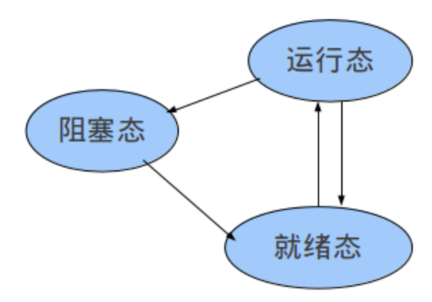
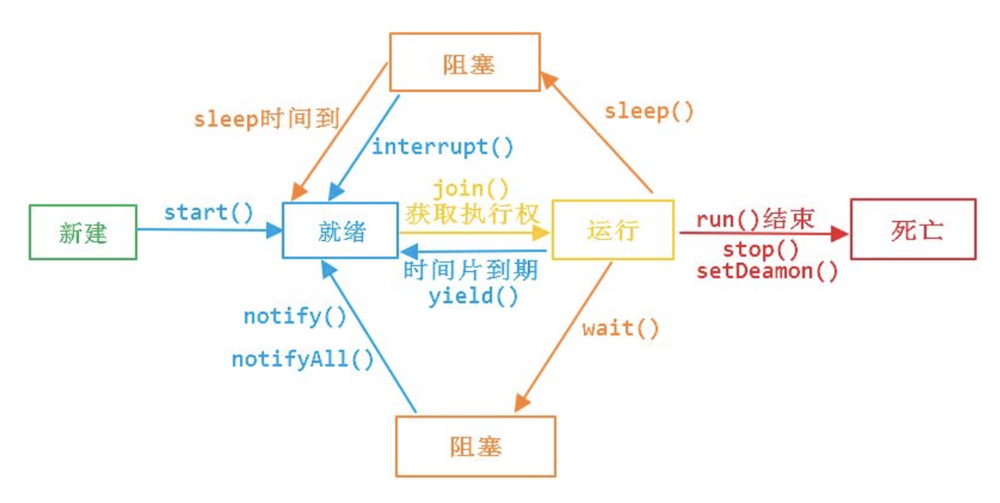

> 操作系统运行过程中，CPU都忙于在不同进程（或线程）间执行指令，这就涉及到进程调度，进程调度是到底执行了哪些操作呢？

首先是将当前进程的上下文状态信息予以保护，以便将来能够重新恢复执行，然后将要执行的进程所需的环境准备好，包括设置寄存器、栈指针、状态字等操作。最后跳转到选中的进程，也就是设置或恢复其程序计数器，开始执行进程指令。

### 进程调度

操作系统选择进程调度的大致流程如下：

- 因时序或外部中断或进程挂起而导致操作系统获得CPU控制权；
- 操作系统在所有**就绪**的进程中按照某种算法选择进程；
- 操作系统将当前进程（中断或挂起的进程）状态予以保护便于后续恢复执行；
- 将选中的进程的环境布置好（设置寄存器、栈指针、状态字等）；
- 跳到选中进程开始执行指令。

进程调度的目标就是增大系统吞吐量、减少进程响应时间，同时提供某种程度的公平机制。常见的进程调度算法有FCFS（先来先到 First Come First Serve）、时间片轮转、短任务优先、优先级调度策略等，由于每种调度算法都有其优缺点，为了取长补短，一般会使用组合调度策略，比如带优先级的时间片调度策略，就是将所有进程分成不同的大类，每个大类为一个优先级。如果两个进程处于不同的大类，则处于高优先级大类的进程优先执行；如果两个进程处于同一个大类，则采用时间片轮转来执行。

### 进程状态流转

操作系统为了跟踪和管理进程，会定义多种进程状态及对应的流转策略，以此控制进程执行。不同的操作系统可能定义的进程状态不太一致，不过基本的状态都包含如下3中：

- 运行态：进程占用CPU，并在CPU上运行；
- 就绪态：进程已经具备运行条件，但是CPU还没有分配过来；
- 阻塞态：进程因等待某件事发生而暂时不能运行。

这3种状态的流转如下：

更详细一点的进程状态流转如下（已时间片轮转调度的进程状态转换）：

挂起和睡眠是主动的，挂起恢复需要主动完成，睡眠恢复则是自动完成的，因为睡眠有一个睡眠时间，睡眠时间到则恢复到就绪态。而阻塞是被动的，是在等待某种事件或者资源的表现，一旦获得所需资源或者事件信息就自动回到就绪态。

> 注意，睡眠和挂起是两种行为，阻塞则是一种状态。进程sleep时，运行状态流转到阻塞状态，进程释放了CPU，也就是不会占用CPU资源，等到定时器时间到时会唤醒该进程，此时状态变为就绪状态。

参考资料：

1、https://www.zhihu.com/question/42962803

2、https://blog.csdn.net/yusiguyuan/article/details/47805091