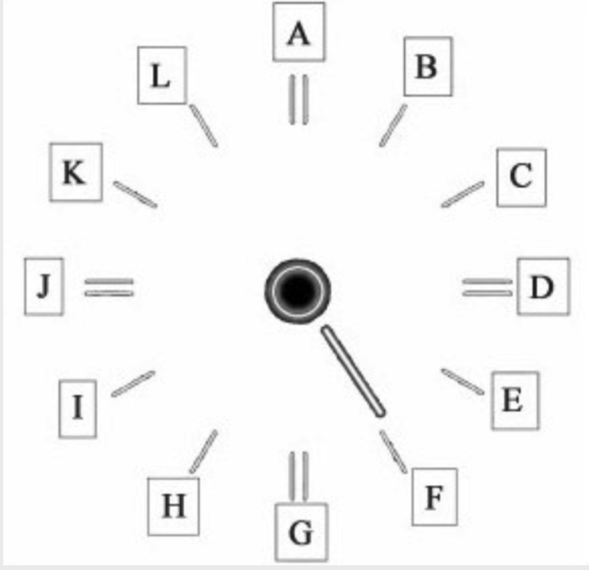
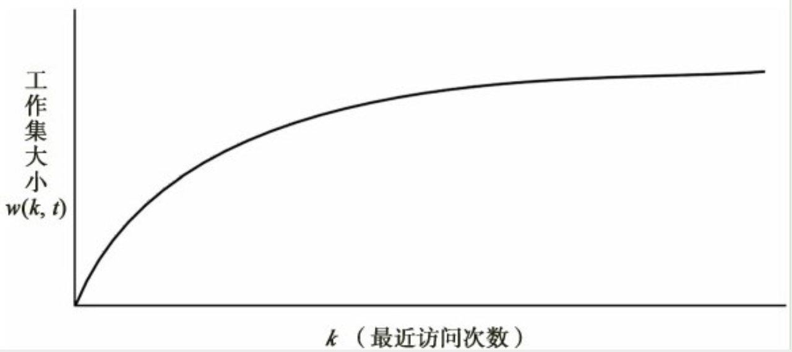

> 为什么需要页面更换呢，因为物理内存不够，不可能同时加载所需的所有数据页，因此只能加载正在或最近要使用的内存页。页面更换的目标是，尽量替换掉不再使用或者一段时间内不再使用的内存页，要不然会很容易触发缺页中断，该操作代价较大，涉及到从磁盘加载，因此页面更换不是随便的事情。

为了达到降低随后发生缺页中断的次数或者概率，人们设计出了各种各样的页面替换算法，这些算法大致可分为公平算法和非公平算法。
- 公平算法：随机算法、FIFO算法、时钟算法。
- 非公平算法：NRU算法、LRU算法、工作集算法。

### 随机算法

这种就是简单的随机选择进行页替换，无需多言，简单粗暴。

### FIFO算法

这种就是先来后到，可以使用链表记录页分配的先后顺序，淘汰时按照顺序淘汰即可，也是非常的简单除暴。

### 时钟算法

使用中的页按照时钟的逻辑形状，淘汰页是按照时钟顺序检查，如果页未访问到（访问位0），则直接替换；如果访问过则设置访问位为0，方便下次淘汰。时钟逻辑图如下：

### NRU算法

最近未使用算法，将最近一段时间没有访问过的页面进行替换，作出这种选择是基于程序访问的时空局域性。依据时空局域性，一个最近没有访问过的页面，在随后的时间内也不太可能被访问，而NRU的实现就是利用页面的访问和修改位来实现的。

### LRU算法

LRU是对NRU算法的改进，其考虑的是最近使用的频率而不是最近是否使用过。LRU算法的实现必须以某种方式记录每个页面被访问的次数，简单的办法就是在页表的记录项里面增加一个计数域，一个页面被访问一次，则这个计数器的值加1。或者使用链表结构，每访问一次就讲该页移动到链表头。

### 工作集算法

考虑到LRU算法实现，其需要对每个页面保持某种记录，并在每次页面访问时或周期性对这些记录更新，造成时间空间成本高。工作集概念来源于程序访问的时空局域性，在一段时间内，程序访问的页面将局限在一组页面集合上。

例如，最近K次访问均发生在某m个页面上，那么m就是参数为k时的工作集。用w(k, t)表示时间t时k次访问所涉及的页面数量。显然随着k的增长，w(k, t)的值将随之增长，在k增长至某个数值后，w(k, t)值增长将及其缓慢甚至接近停滞，并维持一段时间。

工作集算法就是操作系统局限性的一种体现，一段时间内，CPU操作的数据大都集中在少量数据上，因此可以应用工作集算法来进行页的替换操作。