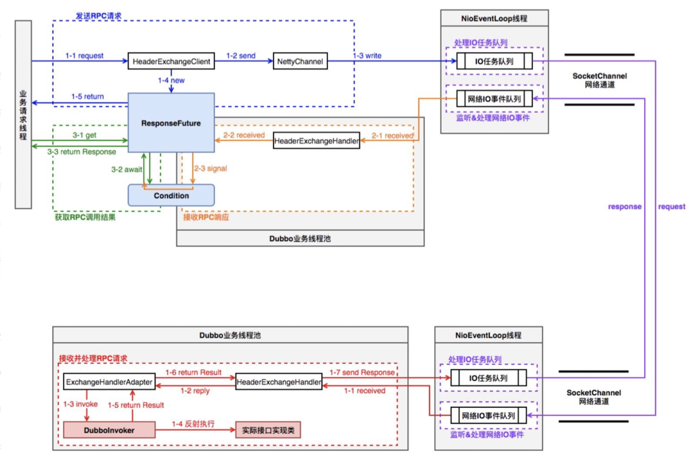

> Dubbo作为一款高性能Java RPC框架，RPC是其最重要的流程之一。Dubbo RPC涉及到consumer端和provider端的流程，本文主要分析consumer端的RPC流程实现，包括集群容错、dubbo路由、负载均衡、Filter处理链、DubboInvoker和RPC结果返回等流程。

在分析dubbo consumer端的RPC实现之前，首先来看下dubbo的整体架构，有个整体概念。

## dubbo架构

dubbo架构图如下：


- 注册中心负责服务地址的注册与查找，相当于目录服务，服务提供者和消费者只在启动时与注册中心交互，注册中心不转发请求，压力较小；
- 监控中心负责统计各服务调用次数，调用时间等，统计先在内存汇总后每分钟一次发送到监控中心服务器，并以报表展示；
- 服务提供者向注册中心注册其提供的服务，并汇报调用时间到监控中心，此时间不包含网络开销；
- 服务消费者向注册中心获取服务提供者地址列表，并根据负载算法直接调用提供者，同时汇报调用时间到监控中心，此时间包含网络开销；
- 注册中心，服务提供者，服务消费者三者之间均为长连接（默认情况下分别只有1个长连接，因为consume和provider网络连接都使用了IO复用，性能上还是OK的），监控中心除外；
- 注册中心通过长连接感知服务提供者的存在，服务提供者宕机，注册中心将立即推送事件通知消费者（这里dubbo和spring cloud是不一样的，(spring cloud) eureka中consumer是有一个刷新线程来定时从eureka注册中心拉取服务信息，因为eureka没有通知机制，而dubbo中的zookeeper有Watcher通知机制）；
- 注册中心和监控中心全部宕机，不影响已运行的提供者和消费者，消费者在本地缓存了提供者列表；
- 注册中心和监控中心都是可选的，服务消费者可以直连服务提供者；

> 注意，dubbo服务调用连接是长连接，dubbo服务调用是小数据量的通信，针对每一次RPC通信，都会生成一个唯一的id来标识，这样就能区分出一次RPC请求对应的RPC响应了。

## RPC流程

由于RPC流程涉及consumer和provider端，先来看一下在二者之间RPC流程的线程模型图，有个初步认识：



>consumer端的Dubbo业务线程池，可以是cached或者fixed类型的线程池，该线程的业务逻辑主要是读取返回结果，然后响应对应defaultFuture，默认是cached类型线程池。线程池配置可以通过SPI方式来配置。provider端的Dubbo业务线程池，默认是fixed类型线程池。

## RPC流程图


以如下consumer端代码为例开始进行讲解：

```java
DemoService demoService = (DemoService) context.getBean("demoService"); // get remote service proxy
while (true) {
    try {
        String hello = demoService.sayHello("world"); // call remote method
        System.out.println(hello); // get result
        System.in.read();
    } catch (Throwable throwable) {
        throwable.printStackTrace();
    }
}
```

当consumer端调用一个`@Reference`的RPC服务，在consumer端的cluster层首先从`Driectory`中获取invocation对应的invokerList，经过`Router`过滤符合路由策略的invokerList，然后执行`LoadBalance`，选择出某个Invoker，最后进行RPC调用操作。


调用某个Invoker（经过cluter之后）进行RPC时，依次会经过Filter、DubboInvoker、HeaderExchangeClient，将RPC消息类RPCInvocation传递到netty channel.eventLoop中。

>  最后由netty Channel经过Serializer之后将RPC请求发送给provider端。

### 集群容错

从上面的RPC执行流程看出，一个重要的流程是集群容错`Cluster`，Dubbo提供了多种容错方案，默认模式为Failover Cluster，也就是失败重试。目前dubbo支持的集群容错策略如下：

- Failover Cluster：失败重试，当服务消费方调用服务提供者失败后，会自动切换到其他服务提供者服务器进行重试，这通常用于读操作或者具有幂等的写操作。dubbo默认重试2次，可通过配置retries属性来设置重试次数，retries支持接口和方法级别配置。
- Failfast Cluster：快速失败，当服务消费方调用服务提供者失败后，立即报错，也就是只调用一次。通常，这种模式用于非幂等性的写操作。
-  Failsafe Cluster：安全失败，当服务消费者调用服务出现异常时，直接忽略异常，异常返回null。这种模式通常用于写入审计日志等操作。
- Failback Cluster：失败自动恢复，当服务消费端调用服务出现异常后，在后台记录失败的请求，并按照一定的策略后期再进行重试。这种模式通常用于消息通知操作。
-  Forking Cluster：并行调用，当消费方调用一个接口方法后，Dubbo Client会并行调用多个服务提供者的服务，只要其中有一个成功即返回。这种模式通常用于实时性要求较高的读操作，但需要浪费更多服务资源。可以通过forks设置并行数，注意这种很容易造成写放大，对服务端性能要求较高。
- Broadcast Cluster：广播调用，当消费者调用一个接口方法后，Dubbo Client会逐个调用所有服务提供者，任意一台服务器调用异常则这次调用就标志失败。这种模式通常用于通知所有提供者更新缓存或日志等本地资源信息。

### Directory

Directory是RPC服务类的目录服务，一个服务接口对应一个Directory实例，比如`com.xxx.xx.dubbo.api.HelloService`就是一个服务接口。

```java
public interface Directory<T> extends Node {
    Class<T> getInterface();
    List<Invoker<T>> list(Invocation invocation) throws RpcException;
}
```

Directory有2个实现类，一个是`StaticDirectory`，一个是`RegistryDirectory`。前者是静态类型，其内部的Invocation在初始化时就已确定`(public StaticDirectory(URL url, List<Invoker<T>> invokers, List<Router> routers)`，运行过程中不再变化；后者是动态类型，实现了接口NotifyListener，notify时动态更新invokers。Directory的重点在于`list(invocation)和notify`更新机制，`list(invocation)`就是获取invokerList过程。

### Router

Router是RPC的路由策略，通过Directory获取到`invokerList`之后，会执行对应的路由策略。Dubbo的默认路由策略是MockInvokersSelector。Dubbo路由策略接口是Router，其有3个实现类，Router的作用就是根据invocation和invokerList，选择出符合路由策略的invokerList。


### LoadBalance

LoadBalance是RPC的负载均衡策略，通过Directory获取到invokerList并且执行对应的路由策略之后，就会执行LoadBalance（负载均衡）了。

```java
@SPI(RandomLoadBalance.NAME)
public interface LoadBalance {
    /**
     * select one invoker in list.
     */
    @Adaptive("loadbalance")
    <T> Invoker<T> select(List<Invoker<T>> invokers, URL url, Invocation invocation) throws RpcException;
}
```


- **RandomLoadBalance**：随机选择，Dubbo的默认策略，如果Invoker的weiget都一样，则就是标准的随机策略；如果不一样，那就是按照权重比例的随机策略。
- **RoundRobinLoadBalance**：轮询策略，如果Invoker的weiget都一样，则就是标准的轮询策略；如果不一样，那就是按照权重比例的轮询策略，这里的处理机制和有权重的RandomLoadBalance是类似的。比如有2个Invoker，第一个weight为1，第二个weight为2，则一个轮询周期内，第一个会轮询1次，第二个会轮询2次。
- **LeastActiveLoadBalance**：最少活跃数，最少活跃数策略使慢的提供者收到更少请求，因为越慢的提供者的调用前后计数差会越大。初始时针对一次RPC调用（具体是到method）各个Invoker的active都为0，这时随机选择。对某个Invoker进行RPC时，其对应的active+1，当RPC结束时其对应的active-1。当各个Invoker的active不一致时，选择最少的那个Invoker进行调用。当各个Invoker的active一致时，也就是随机策略，如果weight不一致，则按照权重比例的随机策略。
- **ConsistentHashLoadBalance**：一致性hash，相同参数的请求总是发到同一提供者。当某一台提供者挂时，原本发往该提供者的请求，基于虚拟节点（默认虚拟节点160个），平摊到其它提供者，不会引起剧烈变动。算法参见：http://en.wikipedia.org/wiki/Consistent_hashing，缺省只对第一个参数 Hash，如果要修改，可自行配置。

### Filter处理

filter处理机制使用的是调用链模式，启动流程中会初始化该filter链，对应逻辑是`ProtocolFilterWrapper.buildInvokerChain()`方法，filter链默认包括几个filter，依次是ConsumerContextFilter（设置上下文信息）、FutureFilter（执行某些hook方法）和MonitorFilter（monitor RPC统计信息）等。

### DubboInvoker

DubboInvoker的主要逻辑就是从provider的长连接中选择某个连接，然后根据不同的策略（同步/异步/单向）来进行操作。

```java
// DubboInvoker
protected Result doInvoke(final Invocation invocation) throws Throwable {
    RpcInvocation inv = (RpcInvocation) invocation;
    final String methodName = RpcUtils.getMethodName(invocation);
    inv.setAttachment(Constants.PATH_KEY, getUrl().getPath());
    inv.setAttachment(Constants.VERSION_KEY, version);

    ExchangeClient currentClient;
    if (clients.length == 1) {
        // consumer和provider默认保持一个长连接
        currentClient = clients[0];
    } else { // 如果有多个长连接，则使用轮训方式选择某个连接
        currentClient = clients[index.getAndIncrement() % clients.length];
    }
    try {
        // 默认isAsync为false，isOneWay为false
        boolean isAsync = RpcUtils.isAsync(getUrl(), invocation);
        boolean isAsyncFuture = RpcUtils.isReturnTypeFuture(inv);
        boolean isOneway = RpcUtils.isOneway(getUrl(), invocation);
        int timeout = getUrl().getMethodParameter(methodName, Constants.TIMEOUT_KEY, Constants.DEFAULT_TIMEOUT);
        if (isOneway) {
            // 单向发送，不管结果，在日志收集中可能会用到该模式
            boolean isSent = getUrl().getMethodParameter(methodName, Constants.SENT_KEY, false);
            currentClient.send(inv, isSent);
            RpcContext.getContext().setFuture(null);
            return new RpcResult();
        } else if (isAsync) {
            // 异步模式，真正的RPC结果处理在ResponseCallback中来做，
            // ResponseCallback在FutureAdapter中设置
            ResponseFuture future = currentClient.request(inv, timeout);
            // For compatibility
            FutureAdapter<Object> futureAdapter = new FutureAdapter<>(future);
            RpcContext.getContext().setFuture(futureAdapter);

            Result result;
            if (isAsyncFuture) {
                // register resultCallback, sometimes we need the async result being processed by the filter chain.
                result = new AsyncRpcResult(futureAdapter, futureAdapter.getResultFuture(), false);
            } else {
                result = new SimpleAsyncRpcResult(futureAdapter, futureAdapter.getResultFuture(), false);
            }
            return result;
        } else {
            // 同步模式，带超时时间，默认1s
            RpcContext.getContext().setFuture(null);
            return (Result) currentClient.request(inv, timeout).get();
        }
    } catch (TimeoutException e) {
    } catch (RemotingException e) {
    }
}
```

> 注意，dubbo 2.7版本的DubboInvoker.doInvoke流程已和上述流程不太一样了，不过实现思路是类似的。

最后会调用channel.writeAndFlush，之后的流程就是netty channel内部的处理流程了，这部分暂可不关注，只需要知道后续流程会走到我们设定的NettyHandler中对应的方法中，比如channel.write就会走到NettyHandler.writeRequested方法中逻辑，也就是针对RPC请求数据进行序列化操作。

数据序列化操作是由netty ChannelHandler来处理的，对应的初始化逻辑如下：

```java
bootstrap.handler(new ChannelInitializer() {
    @Override
    protected void initChannel(Channel ch) throws Exception {
        NettyCodecAdapter adapter = new NettyCodecAdapter(getCodec(), getUrl(), NettyClient.this);
        ch.pipeline()//.addLast("logging",new LoggingHandler(LogLevel.INFO))//for debug
                .addLast("decoder", adapter.getDecoder())
                .addLast("encoder", adapter.getEncoder()) // encoder编码
                    .addLast("handler", nettyClientHandler);
    }
});
```

> 在consumer与provider建立连接之后，initChannel是会添加对应的encoder、decoder。

### RPC结果处理

接收到provider端返回的RPC结果进行反序列化之后，就该将结果数据提交到consuemr端dubbo业务线程池了，如下所示：

```java
// NettyClientHandler msg是Response类型
public void channelRead(ChannelHandlerContext ctx, Object msg) throws Exception {
	NettyChannel channel = NettyChannel.getOrAddChannel(ctx.channel(), url, handler);
	try {
		handler.received(channel, msg);
	} finally {
		NettyChannel.removeChannelIfDisconnected(ctx.channel());
	}
}

// .. -> AllChannelHandler
public void received(Channel channel, Object message) throws RemotingException {
	// 响应结果反序列化后，就会提交任务给DubboClientHandler线程池（cexecutor.execute(new ChannelEventRunnable(channel, handler, ChannelState.DISCONNECTED))），
	// 进行后续的结果处理操作
	ExecutorService cexecutor = getExecutorService();
	cexecutor.execute(new ChannelEventRunnable(channel, handler, ChannelState.RECEIVED, message));
}
```

DubboClientHandler线程池里的逻辑比较简单，首先根据response.getId()获取从FUTURES（Map<Long, DefaultFuture>）中获取该次通信对应的DefaultFuture，将response设置到DefaultFuture中并唤醒等待的线程。

```java
// HeaderExchangeHandler
public static void received(Channel channel, Response response) {
	try {
		DefaultFuture future = FUTURES.remove(response.getId());
		if (future != null) {
			future.doReceived(response);
		}
	} finally {
		CHANNELS.remove(response.getId());
	}
}
```

当唤醒在DefaultFuture阻塞的线程（也就是业务线程）之后，也就是以下代码返回了：

```java
DubboInvoker.doInvoke return (Result) currentClient.request(inv, timeout).get();
```

获取到Response之后，就获取到了provider返回结果，也就是整个RPC的consumer端流程结束了。

## 小结

dubbo RPC流程基本上可以说是比较完备了，比如集群容错、请求路由、负载均衡、序列化等等，这些能力其实就是微服务调用的通用能力，比如SpringCloud中也是需要这一套能力的。这种通用能力能否下放，让业务应用更加纯粹的专注于业务呢？

解决方案是有的，那就是近两年比较流行的service mesh概念，其增加了SideCar代理，将服务调用中涉及到的通用服务治理能力放到SideCar代理中完成，让开发者更加专注于业务逻辑试下，而非dubbo或者SpringCloud这种框架级实现的服务治理。