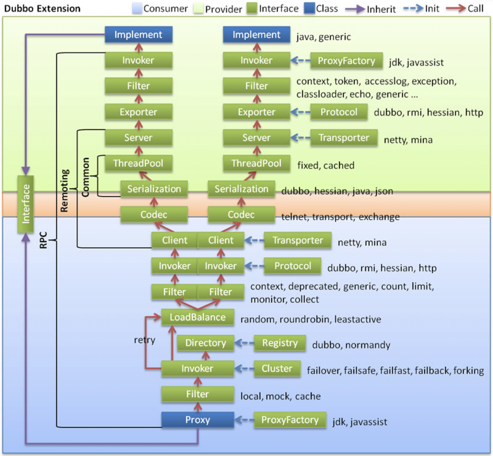

dubbo RCP请求到达provider后，首先经过数据接收、解码（NettyWokerThread/NioEventLoop），然后传递到RPC后续流程（DubboServerHandler），即filter、service invoke过程，service invoke过程也就是执行真正服务的逻辑，执行完毕后再经过编码作为响应返回给RPC调用者。

在分析之前，首先来看一下整体的RPC流程：



## 处理流程

`NettyServerHandler` 是dubbo在netty设置的`ChannelHandler`，`NettyServerHandler`的处理逻辑是将请求message提交给`DubboServerHandler`线程池。

```java
// MultiMessageHandler
public void received(Channel channel, Object message) throws RemotingException {
	if (message instanceof MultiMessage) {
		MultiMessage list = (MultiMessage) message;
		for (Object obj : list) {
			handler.received(channel, obj);
		}
	} else {
		handler.received(channel, message);
	}
}

// AllChannelHandler
public void received(Channel channel, Object message) throws RemotingException {
	// 提交给DubboServerHandler线程池
	ExecutorService cexecutor = getExecutorService();
	cexecutor.execute(new ChannelEventRunnable(channel, handler, ChannelState.RECEIVED, message));
}
```

ChannelEventRunnable 事件的处理逻辑是`org.apache.dubbo.remoting.transport.dispatcher.ChannelEventRunnable#run`，事件类型包括连接、断开、发送、异常等：

```java
public enum ChannelState {
    CONNECTED,
    DISCONNECTED,
    SENT,
    RECEIVED,
    CAUGHT
}
```

### RPC执行

下面是调用HelloServiceImpl的一个调用栈信息：


### Filter执行

进入DubboServerHandler线程池的流程首先就是dubbo中各个filter，`EchoFilter、ClassLoaderFilter、ContextFilter、TraceFilter、TimeoutFilter、MonitorFilter`。

```java
// EchoFilter
public Result invoke(Invoker<?> invoker, Invocation inv) throws RpcException {
	if (inv.getMethodName().equals(Constants.$ECHO) && inv.getArguments() != null && inv.getArguments().length == 1) {
		// 是否是echo
		return new RpcResult(inv.getArguments()[0]);
	}
	return invoker.invoke(inv);
}

// ClassLoaderFilter
public Result invoke(Invoker<?> invoker, Invocation invocation) throws RpcException {
	ClassLoader ocl = Thread.currentThread().getContextClassLoader();
	Thread.currentThread().setContextClassLoader(invoker.getInterface().getClassLoader());
	try {
		return invoker.invoke(invocation);
	} finally {
		Thread.currentThread().setContextClassLoader(ocl);
	}
}

// GenericFilter
public Result invoke(Invoker<?> invoker, Invocation inv) throws RpcException {
	return invoker.invoke(inv);
}

// ContextFilter
public Result invoke(Invoker<?> invoker, Invocation invocation) throws RpcException {
	Map<String, String> attachments = invocation.getAttachments();
	RpcContext.getContext()
			.setInvoker(invoker)
			.setInvocation(invocation)
			.setLocalAddress(invoker.getUrl().getHost(),
					invoker.getUrl().getPort());

	// merged from dubbox
	// we may already added some attachments into RpcContext before this filter (e.g. in rest protocol)
	if (attachments != null) {
		if (RpcContext.getContext().getAttachments() != null) {
			RpcContext.getContext().getAttachments().putAll(attachments);
		} else {
			RpcContext.getContext().setAttachments(attachments);
		}
	}

	if (invocation instanceof RpcInvocation) {
		((RpcInvocation) invocation).setInvoker(invoker);
	}
	try {
		return invoker.invoke(invocation);
	} finally {
		// IMPORTANT! For async scenario, we must remove context from current thread, so we always create a new RpcContext for the next invoke for the same thread.
		RpcContext.removeContext();
		RpcContext.removeServerContext();
	}
}
```

Filter的包装类如下所示，它会将各个filter依次串起来：

```java
new Invoker<T>() {
    @Override
    public Class<T> getInterface() {
        return invoker.getInterface();
    }
    @Override
    public URL getUrl() {
        return invoker.getUrl();
    }
    @Override
    public boolean isAvailable() {
        return invoker.isAvailable();
    }
    @Override
    public Result invoke(Invocation invocation) throws RpcException {
        // 调用各个filter，filter组成了一个filter链，最后一个会调用服务的方法
        return filter.invoke(next, invocation);
    }
    @Override
    public void destroy() {
        invoker.destroy();
    }
    @Override
    public String toString() {
        return invoker.toString();
    }
};
```

### RPC反射调用

RPC反射调用流程：

```java
// AbstractProxyInvoker
public Result invoke(Invocation invocation) throws RpcException {
    try {
        Object value = doInvoke(proxy, invocation.getMethodName(), invocation.getParameterTypes(), invocation.getArguments());
        CompletableFuture<Object> future = wrapWithFuture(value, invocation);
        CompletableFuture<AppResponse> appResponseFuture = future.handle((obj, t) -> {
            AppResponse result = new AppResponse();
            if (t != null) {
                if (t instanceof CompletionException) {
                    result.setException(t.getCause());
                } else {
                    result.setException(t);
                }
            } else {
                result.setValue(obj);
            }
            return result;
        });
        return new AsyncRpcResult(appResponseFuture, invocation);
    } catch (InvocationTargetException e) {
    } catch (Throwable e) {
    }
}
 
// JavassistProxyFactory
public <T> Invoker<T> getInvoker(T proxy, Class<T> type, URL url) {
    // TODO Wrapper cannot handle this scenario correctly: the classname contains '$'
    final Wrapper wrapper = Wrapper.getWrapper(proxy.getClass().getName().indexOf('$') < 0 ? proxy.getClass() : type);
    return new AbstractProxyInvoker<T>(proxy, type, url) {
        @Override
        protected Object doInvoke(T proxy, String methodName,
                                  Class<?>[] parameterTypes,
                                  Object[] arguments) throws Throwable {
            return wrapper.invokeMethod(proxy, methodName, parameterTypes, arguments);
        }
    };
}
 
// provider服务类
public class DemoServiceImpl implements DemoService {
    @Override
    public String sayHello(String name) {
        System.out.println("[" + new SimpleDateFormat("HH:mm:ss").format(new Date()) + "] Hello " + name + ", request from consumer: " + RpcContext.getContext().getRemoteAddress());
        return "Hello " + name + ", response from provider: " + RpcContext.getContext().getLocalAddress();
    }
}
```

通过反射执行，就到达了业务处理逻辑，获取到返回结果之后，会组装 AppResponse 结果返回给客户端。

## Filter链初始化

Filter链的初始化是在初始化线程模型之前就已完成的：

```java
public NettyServer(URL url, ChannelHandler handler) throws RemotingException {
    super(ExecutorUtil.setThreadName(url, SERVER_THREAD_POOL_NAME), ChannelHandlers.wrap(handler, url));
}

// ChannelHandlers
public static ChannelHandler wrap(ChannelHandler handler, URL url) {
    return ChannelHandlers.getInstance().wrapInternal(handler, url);
}
protected ChannelHandler wrapInternal(ChannelHandler handler, URL url) {
    return new MultiMessageHandler(new HeartbeatHandler(ExtensionLoader.getExtensionLoader(Dispatcher.class)
            .getAdaptiveExtension().dispatch(handler, url)));
}
```

从上述代码来看，handler已经在初始化NettyServer时构建完成了，继续往上跟，代码如下：

```java
public RemotingServer bind(URL url, ChannelHandler listener) throws RemotingException {
    return new NettyServer(url, listener);
}
public ExchangeServer bind(URL url, ExchangeHandler handler) throws RemotingException {
    // DecodeHandler -> HeaderExchangeHandler -> 责任链handler
    return new HeaderExchangeServer(Transporters.bind(url, new DecodeHandler(new HeaderExchangeHandler(handler))));
}
// DubboProtocol
private ProtocolServer createServer(URL url) {
    url = URLBuilder.from(url)
            // send readonly event when server closes, it's enabled by default
            .addParameterIfAbsent(CHANNEL_READONLYEVENT_SENT_KEY, Boolean.TRUE.toString())
            // enable heartbeat by default
            .addParameterIfAbsent(HEARTBEAT_KEY, String.valueOf(DEFAULT_HEARTBEAT))
            .addParameter(CODEC_KEY, DubboCodec.NAME)
            .build();
    String str = url.getParameter(SERVER_KEY, DEFAULT_REMOTING_SERVER);

    ExchangeServer server = Exchangers.bind(url, requestHandler);
    return new DubboProtocolServer(server);
}
```

requestHandler对应的是org.apache.dubbo.rpc.protocol.dubbo.DubboProtocol#requestHandler，其实现了ChannelHandler接口（可处理各种事件），针对请求来说，对应代码如下：

```java
public CompletableFuture<Object> reply(ExchangeChannel channel, Object message) throws RemotingException {
    Invocation inv = (Invocation) message;
    // 获取invocation对应的处理链
    Invoker<?> invoker = getInvoker(channel, inv);
    
    RpcContext.getContext().setRemoteAddress(channel.getRemoteAddress());
    Result result = invoker.invoke(inv);
    return result.thenApply(Function.identity());
}

Invoker<?> getInvoker(Channel channel, Invocation inv) throws RemotingException {
    boolean isStubServiceInvoke = false;
    int port = channel.getLocalAddress().getPort();
    String path = inv.getAttachments().get(PATH_KEY);

    // 根据服务dubbo key（name+version等）获取对应的处理链
    String serviceKey = serviceKey(port, path, inv.getAttachments().get(VERSION_KEY), inv.getAttachments().get(GROUP_KEY));
    DubboExporter<?> exporter = (DubboExporter<?>) exporterMap.get(serviceKey);
    return exporter.getInvoker();
}
```

也就是说，处理链的获取是从provider端服务列表-处理链 仓库中获取的，该仓库是在dubbo provider启动流程中初始化的，关于这块不是本文的分析重点，因此不再赘述。