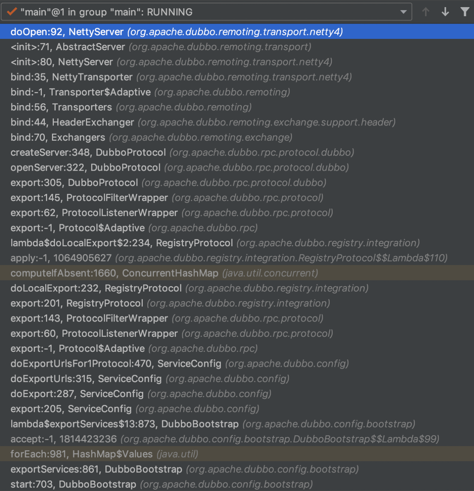

provider端的Filter链构建是在初始化流程中构建的，我们知道初始化流程肯定会走到方法`org.apache.dubbo.remoting.transport.netty4.NettyServer#doOpen`中，可以在该方法打个断点，然后启动provider服务，调用栈信息如下：



从调用栈中方法 `org.apache.dubbo.rpc.protocol.ProtocolFilterWrapper#export` 代码来看，buildInvokerChain会构建provider的Filter链：

```java
public <T> Exporter<T> export(Invoker<T> invoker) throws RpcException {
    if (UrlUtils.isRegistry(invoker.getUrl())) {
        return protocol.export(invoker);
    }
    // invoker就是直接调用对应方法的代码，JavassistProxyFactory
    return protocol.export(buildInvokerChain(invoker, SERVICE_FILTER_KEY, CommonConstants.PROVIDER));
}
```

从上述代码来看，buildInvokerChain就是构建Filter链的逻辑，通过SPI方式进行加载，FIlter配置路径为`META-INF/dubbo/internal/org.apache.dubbo.rpc.Filter`，配置内容如下：

```shell
echo=org.apache.dubbo.rpc.filter.EchoFilter
generic=org.apache.dubbo.rpc.filter.GenericFilter
genericimpl=org.apache.dubbo.rpc.filter.GenericImplFilter
token=org.apache.dubbo.rpc.filter.TokenFilter
accesslog=org.apache.dubbo.rpc.filter.AccessLogFilter
activelimit=org.apache.dubbo.rpc.filter.ActiveLimitFilter
classloader=org.apache.dubbo.rpc.filter.ClassLoaderFilter
context=org.apache.dubbo.rpc.filter.ContextFilter
consumercontext=org.apache.dubbo.rpc.filter.ConsumerContextFilter
exception=org.apache.dubbo.rpc.filter.ExceptionFilter
executelimit=org.apache.dubbo.rpc.filter.ExecuteLimitFilter
deprecated=org.apache.dubbo.rpc.filter.DeprecatedFilter
compatible=org.apache.dubbo.rpc.filter.CompatibleFilter
timeout=org.apache.dubbo.rpc.filter.TimeoutFilter
```

注意，上述配置的Filter是包括Consumer和Provider的，初始化provider只会用到provider侧的Filter配置，具体Filter实现类会通过group来区分PROVIDER或者CONSUMER，对应的buildInvokerChain逻辑如下：

```java
private static <T> Invoker<T> buildInvokerChain(final Invoker<T> invoker, String key, String group) {
    Invoker<T> last = invoker;
    List<Filter> filters = ExtensionLoader.getExtensionLoader(Filter.class).getActivateExtension(invoker.getUrl(), key, group);

    if (!filters.isEmpty()) {
        for (int i = filters.size() - 1; i >= 0; i--) {
            final Filter filter = filters.get(i);
            final Invoker<T> next = last;
            last = new Invoker<T>() {
                @Override
                public Result invoke(Invocation invocation) throws RpcException {
                    return filter.invoke(next, invocation);
                }
            };
        }
    }
    return last;
}
```

buildInvokerChain逻辑会按照顺序进行构建Filter过滤链，由于FIlter实现类未设置@Activate注解的顺序，因此Filter过滤链的前后顺序就是在`META-INF/dubbo/internal/org.apache.dubbo.rpc.Filter`文件配置的顺序，这点要注意。