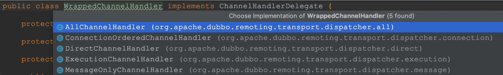

> Dubbo中线程池的应用还是比较广泛的，按照consumer端到provider的RPC的方向来看，consumer端的应用业务线程到netty线程、consuemr端dubbo业务线程池，到provider端的netty boss线程、worker线程和dubbo业务线程池等。这些线程各司其职相互配合，共同完成dubbo RPC服务调用，理解dubbo线程模型对于学习Dubbo原理很有帮助。

dubbo线程模型包括线程模型策略和dubbo线程池策略两个方面，下面就依次进行分析。

## dubbo线程模型

Dubbo默认的底层网络通信使用的是Netty，服务提供方NettyServer使用两级线程池，其中`EventLoopGroup（boss）`主要用来接收客户端的链接请求，并把完成TCP三次握手的连接分发给`EventLoopGroup（worker）`来处理，注意把boss和worker线程组称为I/O线程，前者处理IO连接事件，后者处理IO读写事件。

设想下，dubbo provider端的netty IO线程是如何处理业务逻辑呢？如果处理逻辑较为简单，并且不会发起新的I/O请求，那么直接在I/O线程上处理会更快，因为这样减少了线程池调度与上下文切换的开销，毕竟线程切换还是有一定成本的。如果逻辑较为复杂，或者需要发起网络通信，比如查询数据库，则I/O线程必须派发请求到新的线程池进行处理，否则I/O线程会被阻塞，导致处理IO请求效率降低。

> 那Dubbo是如何做的呢？

Dubbo中根据请求的消息类是直接被I/O线程处理还是被业务线程池处理，Dubbo提供了下面几种线程模型：



- **all（AllDispatcher类）**：所有消息都派发到业务线程池，这些消息包括请求、响应、连接事件、断开事件等，响应消息会优先使用对于请求所使用的线程池。
- **direct（DirectDispatcher类）**：所有消息都不派发到业务线程池，全部在IO线程上直接执行。
- **message（MessageOnlyDispatcher类）**：只有请求响应消息派发到业务线程池，其他消息如连接事件、断开事件、心跳事件等，直接在I/O线程上执行。
- **execution（ExecutionDispatcher类）**：只把请求类消息派发到业务线程池处理，但是响应、连接事件、断开事件、心跳事件等消息直接在I/O线程上执行。
- **connection（ConnectionOrderedDispatcher类）**：在I/O线程上将连接事件、断开事件放入队列，有序地逐个执行，其他消息派发到业务线程池处理。

dubbo线程池可选模型较多，下面以DirectDispatcher类进行分析，其他流程类似就不在赘述。

```java
public class DirectChannelHandler extends WrappedChannelHandler {
    @Override
    public void received(Channel channel, Object message) throws RemotingException {
        ExecutorService executor = getPreferredExecutorService(message);
        if (executor instanceof ThreadlessExecutor) {
            try {
                executor.execute(new ChannelEventRunnable(channel, handler, ChannelState.RECEIVED, message));
            } catch (Throwable t) {
                throw new ExecutionException(message, channel, getClass() + " error when process received event .", t);
            }
        } else {
            handler.received(channel, message);
        }
    }
}
```

DirectDispatcher类重写了received方法，注意 ThreadlessExecutor 被应用在调用 future.get() 之前，先调用 ThreadlessExecutor.wait()，wait 会使业务线程在一个阻塞队列上等待，直到队列中被加入元素。很明显，provider侧调用`getPreferredExecutorService(message)`返回的不是ThreadlessExecutor，所以会在当前IO线程执行执行。

> 其他事件，比如连接、异常、断开等，都是在WrappedChannelHandler中默认实现：执行在当前IO线程中执行的，代码如下：

```java
@Override
public void connected(Channel channel) throws RemotingException {
    handler.connected(channel);
}
@Override
public void disconnected(Channel channel) throws RemotingException {
    handler.disconnected(channel);
}
@Override
public void sent(Channel channel, Object message) throws RemotingException {
    handler.sent(channel, message);
}
@Override
public void caught(Channel channel, Throwable exception) throws RemotingException {
    handler.caught(channel, exception);
}
```

### dubbo线程模型策略

了解了dubbo线程模型之后，小伙伴是不是该问：

> 既然有那么多的线程模型策略，dubbo线程模型具体使用的是什么策略呢？

从netty启动流程来看，初始化NettyServer时会进行加载具体的线程模型，代码如下：

```java
public NettyServer(URL url, ChannelHandler handler) throws RemotingException {
    super(ExecutorUtil.setThreadName(url, SERVER_THREAD_POOL_NAME), ChannelHandlers.wrap(handler, url));
}
public static ChannelHandler wrap(ChannelHandler handler, URL url) {
    return ChannelHandlers.getInstance().wrapInternal(handler, url);
}
protected ChannelHandler wrapInternal(ChannelHandler handler, URL url) {
    return new MultiMessageHandler(new HeartbeatHandler(ExtensionLoader.getExtensionLoader(Dispatcher.class)
            .getAdaptiveExtension().dispatch(handler, url)));
}
```

这里根据URL里的线程模型来选择具体的Dispatcher实现类。在此，我们再提一下Dubbo提供的Dispatcher实现类，其默认的实现类是all，也就是AllDispatcher类。既然Dispatcher是通过SPI方式加载的，也就是用户可以自定义自己的线程模型，只需实现Dispatcher类然后配置选择使用自定义的Dispatcher类即可。

## dubbo线程池策略

dubbo处理流程，为了尽量早地释放Netty的I/O线程，某些线程模型会把请求投递到线程池进行异步处理，那么这里所谓的线程池是什么样的线程池呢？

> 其实这里的线程池ThreadPool也是一个扩展接口SPI，Dubbo提供了该扩展接口的一些实现，具体如下：

- **FixedThreadPool**：创建一个具有固定个数线程的线程池。
- **LimitedThreadPool**：创建一个线程池，这个线程池中的线程个数随着需要量动态增加，但是数量不超过配置的阈值。另外，空闲线程不会被回收，会一直存在。
- **EagerThreadPool**：创建一个线程池，在这个线程池中，当所有核心线程都处于忙碌状态时，将创建新的线程来执行新任务，而不是把任务放入线程池阻塞队列。
- **CachedThreadPool**：创建一个自适应线程池，当线程空闲1分钟时，线程会被回收；当有新请求到来时，会创建新线程。

**知道了这些线程池之后，那么是什么时候进行SPI加载对应的线程池实现呢**？具体是在dubbo 线程模型获取对应线程池时进行SPI加载的，具体逻辑在方法 `org.apache.dubbo.common.threadpool.manager.DefaultExecutorRepository#createExecutor `中：

```java
private ExecutorService createExecutor(URL url) {
    return (ExecutorService) ExtensionLoader.getExtensionLoader(ThreadPool.class).getAdaptiveExtension().getExecutor(url);
}
@SPI("fixed")
public interface ThreadPool {
    @Adaptive({THREADPOOL_KEY})
    Executor getExecutor(URL url);
}
```

从代码来看，默认的线程池策略是fixed模式的线程池，其coreSize默认为200，队列大小为0，其代码如下：

```java
public class FixedThreadPool implements ThreadPool {
    @Override
    public Executor getExecutor(URL url) {
        String name = url.getParameter(THREAD_NAME_KEY, DEFAULT_THREAD_NAME);
        int threads = url.getParameter(THREADS_KEY, DEFAULT_THREADS);
        int queues = url.getParameter(QUEUES_KEY, DEFAULT_QUEUES);
        return new ThreadPoolExecutor(threads, threads, 0, TimeUnit.MILLISECONDS,
                queues == 0 ? new SynchronousQueue<Runnable>() :
                        (queues < 0 ? new LinkedBlockingQueue<Runnable>()
                                : new LinkedBlockingQueue<Runnable>(queues)),
                new NamedInternalThreadFactory(name, true), new AbortPolicyWithReport(name, url));
    }
}
```

> 注：其他线程池策略和FixedThreadPool类似，只不过线程池参数不同而已，这里不再赘述。

## 小结

从dubbo提供的几种线程模型和线程池策略来看，基本上能满足绝大多数场景的需求了，由于dubbo线程模型和线程池策略都是通过SPI的方式进行加载的，因此如果业务上需要，我们完全可以自定义对应的线程模型和线程池策略，只需要配置下即可。