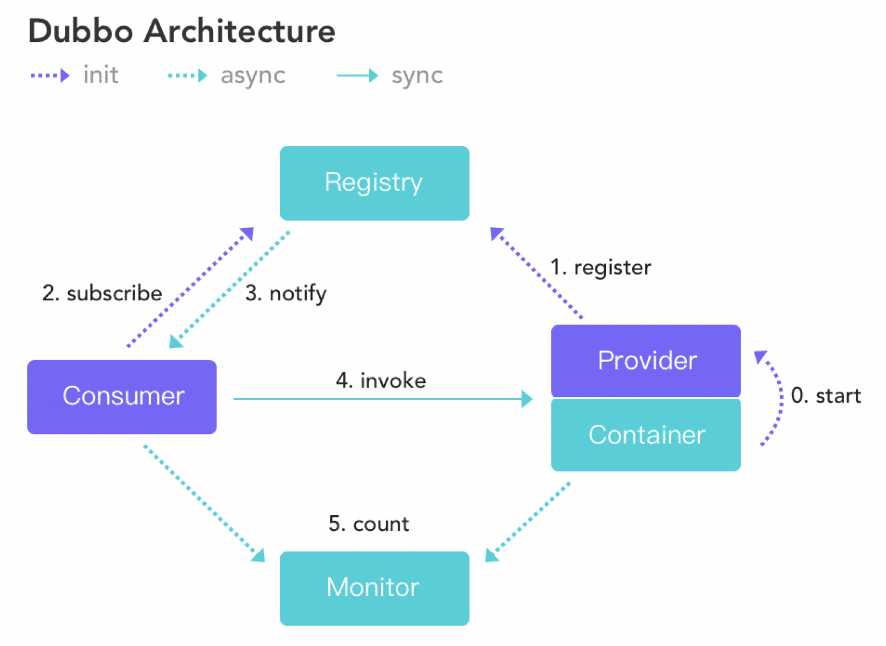
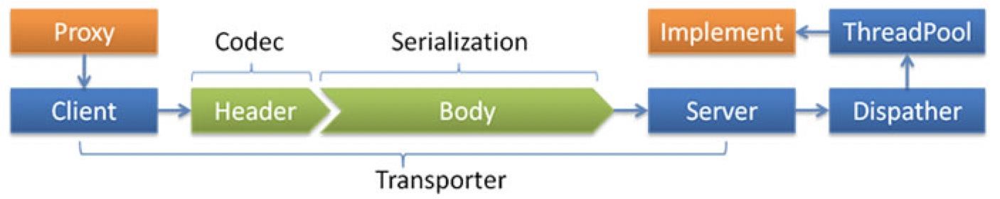

关于dubbo连通性，也就是dubbo各组件之间通信、privider和consumer连接、以及通信方式这些功能点。话不多说，让我们一起揭开dubob连通性的面纱吧。

## dubbo架构

在开始之前，先来看一下dubbo整体架构图，有助于从整体把握dubbo框架：

- 注册中心负责服务地址的注册与查找，相当于目录服务，服务提供者和消费者只在启动时与注册中心交互，注册中心不转发请求，压力较小；
- 监控中心负责统计各服务调用次数，调用时间等，统计先在内存汇总后每分钟一次发送到监控中心服务器，并以报表展示；
- 服务提供者向注册中心注册其提供的服务，并汇报调用时间到监控中心，此时间不包含网络开销；
- 服务消费者向注册中心获取服务提供者地址列表，并根据负载算法直接调用提供者，同时汇报调用时间到监控中心，此时间包含网络开销；
- 注册中心，服务提供者，服务消费者三者之间均为长连接（默认情况下分别只有1个长连接，因为consume和provider网络连接都使用了IO复用，性能上还是OK的），监控中心除外；
- 注册中心通过长连接感知服务提供者的存在，服务提供者宕机，注册中心将立即推送事件通知消费者（这里dubbo和spring cloud是不一样的，(spring cloud) eureka中consumer是有一个刷新线程来定时从eureka注册中心拉取服务信息，因为eureka没有通知机制，而dubbo中的zookeeper有Watcher通知机制）；
- 注册中心和监控中心全部宕机，不影响已运行的提供者和消费者，消费者在本地缓存了提供者列表；
- 注册中心和监控中心都是可选的，服务消费者可以直连服务提供者。

## 长连接

Dubbo 缺省协议采用单一长连接和 NIO 异步通讯，适合于小数据量大并发的服务调用，以及服务消费者机器数远大于服务提供者机器数的情况。反之，Dubbo 缺省协议不适合传送大数据量的服务，比如传文件，传视频等，除非请求量很低。默认使用netty+hessian2通信，基于TCP传输协议。	

> dubbo服务调用连接是长连接，dubbo服务调用是小数据量的通信，针对每一次RPC通信，都会生成一个唯一的id来标识，这样就能区分出一次RPC请求对应的RPC响应了。既然说到了dubbo的长连接，这里可以思考下，长连接和短连接哪个性能更好？

如果二者的限制条件一样（比如都是同步方式或IO复用方式、同等数据量通信、连接个数相同）情况下，长连接性能理论上要优于短连接，因为前者省去了三次握手和四次挥手过程。

如果二者限制条件不同，绝大多数场景的限制条件都是不同的，如果通信较频繁，使用长连接性能较好；如果通信次数较少，使用短连接更合适，毕竟不用维护长连接。

### BIO和NIO哪个更好呢

**BIO和NIO对比，准确来说，二者没有哪个更好，只有在具体场景下合适不合适一说**。如果是大量连接其中只有少部分活跃（或者少量连接少量活跃），这种适合NIO，因为NIO占用线程资源更少；如果是少量连接并且活跃，这种适合BIO，因为此时BIO相对于NIO少了IO复用所占用资源，线程直接进行数据的读写操作。

> 除此之外，使用BIO编程，程序是同步方式，代码简单且易于理解，如果是NIO编程，对程序员技术要求较高一点，因为IO处理流程是异步的，回调更多，理解起来有点费时。

### 为什么采用异步单一长连接

因为服务的现状大都是服务提供者少，通常只有几台机器，而服务的消费者多，可能整个网站都在访问该服务，比如 Morgan 的提供者只有 6 台提供者，却有上百台消费者，每天有 1.5 亿次调用，如果采用常规的 hessian 服务，服务提供者很容易就被压跨，通过单一连接，保证单一消费者不会压死提供者，长连接，减少连接握手验证等，并使用异步 IO，复用线程池，防止 C10K 问题。

> dubbo 协议采用单一长连接，假设网络为千兆网卡，根据测试经验数据每条连接最多只能压满 7MByte(不同的环境可能不一样，供参考)，理论上 1 个服务提供者需要 20 个服务消费者才能压满网卡。

## 为什么不能传输大包

因 dubbo 协议采用单一长连接，如果每次请求的数据包大小为 500KByte，假设网络为千兆网卡 ，每条连接最大 7MByte(不同的环境可能不一样，供参考)，单个服务提供者的 TPS(每秒处理事务数)最大为：128MByte / 500KByte = 262。单个消费者调用单个服务提供者的 TPS(每秒处理事务数)最大为：7MByte / 500KByte = 14。如果能接受，可以考虑使用，否则网络将成为瓶颈。

> 传送大包，容易将连接压满，导致处理性能下降，除了这个之外，因为大包涉及到“分包”，在接收端得进行多次“粘包”操作，导致性能损耗。

## 为什么使用hessian作为序列化协议

hession性能不是最快的、压缩效率也不是最高的，但是hessian的各项指标比较均衡，同时针对复杂对象的序列化/反序列化执行比较好，目前dubbo的hessian序列化不是rpc性能的瓶颈，所以就选择了hessian作为序列化。

**最后，以一张dubbo传输流程图来结束本文吧**：

