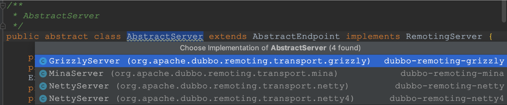
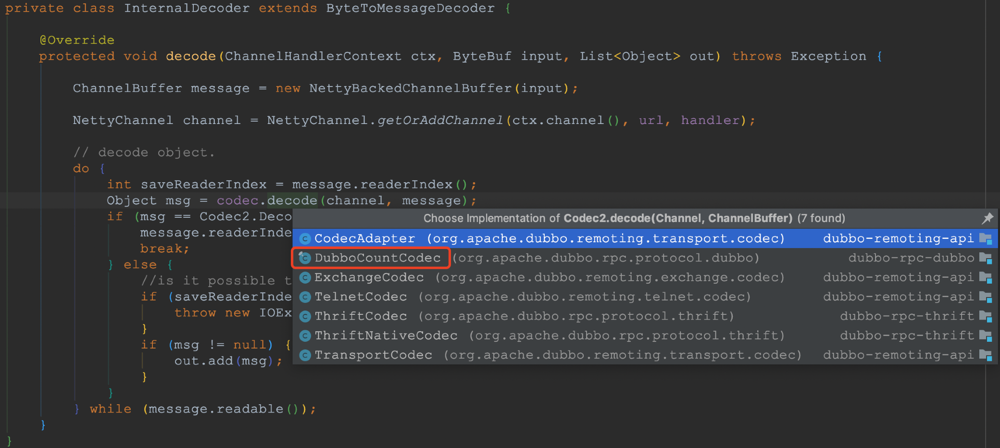
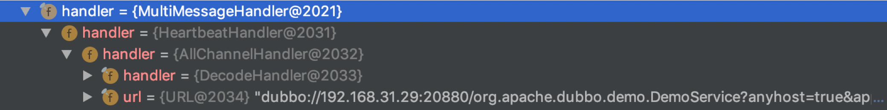

Netty支持多种服务端的server实例，包括mina、netty等，如下所示：



由于开发者目前使用dubbo几乎都是基于**Netty4**的，因此下面的分析就以netty4的NettyServer为例，dubbo启动过程中会调用 `NettyServer#doOpen` 初始化和启动netty server。这里主要操作就是初始化 bossGroup 和 workerGroup，然后进行bind、设置channelHandler，一个标准的netty初始化启动流程，具体代码如下：

```java
protected void doOpen() throws Throwable {
    bootstrap = new ServerBootstrap();

    bossGroup = new NioEventLoopGroup(1, new DefaultThreadFactory("NettyServerBoss", true));
    workerGroup = new NioEventLoopGroup(getUrl().getPositiveParameter(IO_THREADS_KEY, Constants.DEFAULT_IO_THREADS),
            new DefaultThreadFactory("NettyServerWorker", true));

    final NettyServerHandler nettyServerHandler = new NettyServerHandler(getUrl(), this);
    // the cache for alive worker channel
    channels = nettyServerHandler.getChannels();

    bootstrap.group(bossGroup, workerGroup)
            .channel(NioServerSocketChannel.class)
            .childOption(ChannelOption.TCP_NODELAY, Boolean.TRUE)
            .childOption(ChannelOption.SO_REUSEADDR, Boolean.TRUE)
            .childOption(ChannelOption.ALLOCATOR, PooledByteBufAllocator.DEFAULT)
            .childHandler(new ChannelInitializer<NioSocketChannel>() {
                @Override
                protected void initChannel(NioSocketChannel ch) throws Exception {
                    int idleTimeout = UrlUtils.getIdleTimeout(getUrl());
                    NettyCodecAdapter adapter = new NettyCodecAdapter(getCodec(), getUrl(), NettyServer.this);
                    if (getUrl().getParameter(SSL_ENABLED_KEY, false)) {
                        ch.pipeline().addLast("negotiation",
                                SslHandlerInitializer.sslServerHandler(getUrl(), nettyServerHandler));
                    }
                    ch.pipeline()
                            .addLast("decoder", adapter.getDecoder())
                            .addLast("encoder", adapter.getEncoder())
                            // 空闲心跳检测
                            .addLast("server-idle-handler", new IdleStateHandler(0, 0, idleTimeout, MILLISECONDS))
                            .addLast("handler", nettyServerHandler);
                }
            });
    // bind
    ChannelFuture channelFuture = bootstrap.bind(getBindAddress());
    channelFuture.syncUninterruptibly();
    channel = channelFuture.channel();
}
```

dubbo启动netty server时，会创建心跳检查的ChannelHandler，从IdleStateHandler的实现来看，它提供针对了 读空闲检测readerIdleTime、写空闲检测writerIdleTime和读写空闲检测allIdleTime的能力，当`readerIdleTime、writerIdleTime或者allIdleTime`大于0时，会在channelActive时初始化对应的netty的延时任务。

```java
public IdleStateHandler( long readerIdleTime, long writerIdleTime, long allIdleTime, TimeUnit unit) {
    this(false, readerIdleTime, writerIdleTime, allIdleTime, unit);
}
```

当任务到期执行时，会检查上次的读写时间戳是否大于设定的最大空闲时间，如果大于则发送 IdleStateEvent 事件，这时就会触发用户设定的`ChannelHandler`的`fireUserEventTriggered`回调，针对上述代码来说，就会走到dubbo中`org.apache.dubbo.remoting.transport.netty4.NettyServerHandler#userEventTriggered`方法中：

```java
public void userEventTriggered(ChannelHandlerContext ctx, Object evt) throws Exception {
    // server will close channel when server don't receive any heartbeat from client util timeout.
    if (evt instanceof IdleStateEvent) {
        NettyChannel channel = NettyChannel.getOrAddChannel(ctx.channel(), url, handler);
        try {
            logger.info("IdleStateEvent triggered, close channel " + channel);
            channel.close();
        } finally {
            NettyChannel.removeChannelIfDisconnected(ctx.channel());
        }
    }
    super.userEventTriggered(ctx, evt);
}
```

> 默认的心跳超时时间是心跳间隔的3倍，从实现来看，如果心跳超时了，dubbo provider端会主动断开连接，这说明comsumer端可能已经挂了或者重启了。

从上述dubbo启动netty的初始化代码来看，当consumer发出的请求达到provider时，首先要经过解码器InternalDecoder，注意这个解码器只是简单的转发作用，实际上解码工作是靠具体协议对应的解码器的，比如针对dubbo协议来说就是DubboCountCodec。



> 注意：dubbo provider端的解码流程不是本文的关注重点，因此大家只需知道其流程即可，关于编解码这块后续我会写专门的文章来分析。

consumer的请求数据经过解码之后就到达了dubbo业务处理的`ChannelHandler — NettyServerHandler`。

```java
public void channelRead(ChannelHandlerContext ctx, Object msg) throws Exception {
    NettyChannel channel = NettyChannel.getOrAddChannel(ctx.channel(), url, handler);
    // 传递给dubbo处理器
    handler.received(channel, msg);
}
```

关于dubbo中处理各种IO事件，和netty中处理类似也定义了一套处理回调接口，定义如下：

```java
public interface ChannelHandler {
    void connected(Channel channel) throws RemotingException;
    void disconnected(Channel channel) throws RemotingException;
    void sent(Channel channel, Object message) throws RemotingException;
    void received(Channel channel, Object message) throws RemotingException;
    void caught(Channel channel, Throwable exception) throws RemotingException;
}
```

传递给dubbo处理器，会走到MultiMessageHandler处理器，由于dubbo定义的各种处理器实际上就是责任链的体现，为了方便看流程，先看下大致的处理涉及的类图：



- MultiMessageHandler：提供了针对多请求的处理能力；
- HeartbeatHandler：是针对心跳请求的处理逻辑，如果是心跳请求，则更新心跳时间戳，然后直接返回，这时是不会传递个接下来的处理器的；
- AllChannelHandler：all线程模型的实现，这是dubbo provider端默认的线程模型，这种线程模型把所有事件都直接交给业务线程池进行处理了。

> 注意：dubbo的provider线程池模型不是本文关注的重点，因此大家理解节课，后续dubbo provider线程池模型这块后续我会写专门的文章来分析。

将请求数据传递给dubbo provider端的线程池来处理之后，接下来就是dubbo真正的业务处理流程了。也到了本文该结束的时刻了，关于dubbo provider后续的处理流程解析，欢迎大家看接下来的文章哈。