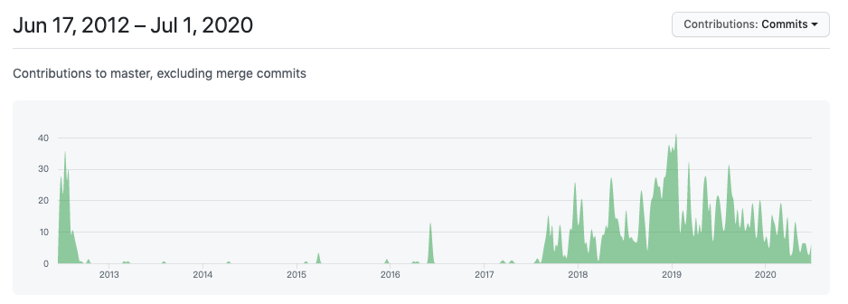

[Apache Dubbo™](http://dubbo.apache.org/zh-cn/) 是一款高性能Java RPC框架。说起dubbo，国内开发者几乎都知道它的大名，既然现在的dubbo很流行，那么让我们回顾下过去的dubbo吧，一起看下dubbo的发展历程：

- 2011年10月27日，阿里巴巴（B2B部门）开源自己的SOA服务化治理方案的核心框架Dubbo。
- 2012年10月23日发布Dubbo2.5.3版本，至此之后，阿里基本停止了对Dubbo的主要升级；仅在13、14年进行过几次更新维护版本然后就停止了所有的维护工作；同时Dubbo对Srping的支持也停留在了Spring 2.5.6版本上。在阿里停止维护和升级Dubbo期间，当当网开始维护自己的Dubbo分支版本Dubbox，支持了新版本的Spring，并对外开源了Dubbox。
- 2017年9月7日发布Dubbo的2.5.4版本，距离上一个版本2.5.3发布已经接近快5年时间了。在随后的几个月中，阿里Dubbo开发团队以差不多每月一版本的速度开始快速升级迭代，修补了Dubbo老版本多年来存在的诸多bug，并对Spring等组件的支持进行了全面升级。（不知道是不是因为KPI的压力 ^_^）
- 2018年1月8日发布Dubbo 2.6.0版本，新版本将之前当当网开源的Dubbo分支Dubbox进行了合并，实现了Dubbo版本的统一整合。
- 2018年1月8日，Dubbo创始人之一梁飞在Dubbo交流群里透露了Dubbo 3.0正在动工的消息。Dubbo 3.0内核与Dubbo2.0完全不同，但兼容Dubbo 2.0。Dubbo 3.0将以Streaming为内核，不再是Dubbo时代的RPC，但是RPC会在Dubbo3.0中变成远程Streaming对接的一种可选形态。Dubbo 3.0将支持可选Service Mesh，多加一层IPC，这主要是为了兼容老系统，而内部则会优先尝试内嵌模式。代理模式Ops可独立升级框架，减少业务侵入，而内嵌模式可以带业务测试、部署节点少、稳定性检测方便。同时，可以将Dubbo3.0启动为独立进程，由dubbo-mesh进行IPC，路由、负载均衡和熔断机制将由独立进程控制。
- 2018年2月15日，阿里将Dubbo开源贡献给Apache，即incubator-dubbo。
- 2019 年 5 月 20 日，Apache 软件基金会在马萨诸塞州维克菲尔德宣布，Apache Dubbo 升级为顶级项目。
- 2019年12月29日，[apache-dubbo-2.7.5](https://github.com/apache/dubbo/releases/tag/dubbo-2.7.5) 发布，支持http2 grpc、服务自省能力，为走向云原生打下基础。

从dubbo最初开源的火热，到14-17年的基本停滞，再到17年下半年到现在的迅猛发展，可以从github上commits图看出来明显变化：

目前已有150+公司在使用，包括阿里巴巴集团、中国人寿、中国电信、当当网、滴滴出行、海尔、中国工商银行、网易、去哪儿、有赞等。dubbo提供的主要能力是基于接口的远程代理，容错和负载均衡，以及自动服务注册和发现等，功能包括：

- 基于透明接口的 RPC：提供基于高性能接口的 RPC，对用户而言是透明的。
- 智能负载平衡：支持多种开箱即用的负载均衡策略，可感知下游服务状态，从而降低整体延迟，提高系统吞吐量。
- 自动服务注册和发现：支持多个服务注册，可即时在线 / 离线检测服务。
- 高可扩展性：微内核和插件设计确保了它可容易地通过第三方实现跨核心功能（如协议、传输和序列化等）。
- 运行时流量路由：可在运行时进行配置，使流量可根据不同的规则进行路由，这使得能够轻松支持蓝绿部署、数据中心感知路由等功能。
- 可视化服务治理：为服务治理和维护提供丰富的工具，如查询服务元数据、运行状况和统计信息。

## dubbo的开源

> 这里不得不提一个人，梁飞，花名（虚极），2009 年加入阿里巴巴，负责中间件的开发，Dubbo 开源分布式服务框架作者。

Dubbo 项目诞生于 2008 年。梁飞最早进入阿里的时候，Dubbo 项目还没有 Dubbo 这个名字，那时的 Dubbo 还是一个阿里内部的系统。2010 年，Dubbo 项目进行了重构。2011 年的阿里，憋了一股劲儿要成为一家技术人向往的企业。那个时候，开发者刚刚成为国内各大厂商争相夺取的宝贵资产,靠什么吸引最顶尖的开发者？黑客文化、工程师文化、开源文化。

当时在淘宝、在阿里 B2B，都有团队在推动开源。阿里 B2B 这边决定先拿 Dubbo 项目开源出去。当时淘宝（2C）也有一个和dubbo类似的项目叫做HSF，也是一个中间件服务框架，跟 Dubbo 做的事情高度重合。当时的情况是：整个淘系都在用 HSF，而阿里金融、集团、B2B 都在用 Dubbo。

在Dubbo和HSF的"竞争"中，从最初的开始让 HSF 合并到 Dubbo 里面，但是由于时间未达到预期实际上并没有合并起来，后来就决定反向合并，把 Dubbo 合并到 HSF 里面去。之后，Dubbo就在14年之后没更新过了，同时Dubbo 团队调整，去到了各个地方。

> 不过，墙内开花墙外香，阿里之外，还是吸引很多公司和开发者使用dubbo的，比如当当网开发的扩展版本Dubbox 后来就在持续发展。

关于dubbo和HSF的竞争中失败，这里不讨论技术上实现哪个更好？（严格来讲，二者实现思想不同，前者更加轻量级、扩展性强，后者稍微重量级、依赖较多）而是结合当时环境来分析，当时阿里处于系统大重构过程中，特别是淘宝的系统大重构，由于淘宝用的是HSF，已经与淘宝系统深度融合了，根植于淘系的基因了，因此后续换一个新的技术，成本较大收益不明显。

## dubbo的重生

既然dubbo都已经好长时间不维护更新了，那么怎么在17年会突然宣布维护并且推动孵化Apache呢？难道是传说中的KPI的原因？

> 实际上dubbo的转机，在于阿里云的流行。

2017 年的阿里云，发现有一批客户上云之后，想要用 Dubbo。因为他们 Dubbo 已经用的很熟了，不想因为上云而被迫改变自己的使用习惯。

于是，阿里云就把 Dubbo 服务作为自己的一个产品，卖给了这些客户。但是，客户们又提出了一个问题：

> “你看你们 Dubbo 都不怎么更新代码了是吧？你们自己都不维护了，我们用你的框架就觉得特别不放心。”

这下好了，真正的客户提出要求了，提升客户对 Dubbo 的信心，成为了一件在公司层面有价值的事情。因此阿里进一步升级Dubbo并把它捐赠给Apache。2018 年初，Dubbo 项目正式进入了 Apache 的孵化器。

## dubbo的进化

dubbo的重生和进入Apache，已经说明dubbo旺盛的生命力了，但是如何让这种生命力更强呢？

拥有更强的生命力，不仅是dubbo本身发展的需要，也是适应未来技术发展的需要。dubbo在Apache孵化阶段，Dubbo正在从一个微服务领域的高性能 Java RPC 框架，演进到微服务框架 Dubbo Ecosystem，打造出一个完整的微服务生态。

为什么dubbo需要完成的微服务生态，这里拿Spring Cloud做个对比：

> Spring Cloud由众多子项目组成，如Spring Cloud Config、Spring Cloud Netflix、Spring Cloud Consul 等，提供了搭建分布式系统及微服务常用的工具，如配置管理、服务发现、断路器、智能路由、微代理、控制总线、一次性token、全局锁、选主、分布式会话和集群状态等，满足了构建微服务所需的所有解决方案。比如使用Spring Cloud Config 可以实现统一配置中心，对配置进行统一管理；使用Spring Cloud Netflix 可以实现Netflix 组件的功能 - 服务发现（Eureka）、智能路由（Zuul）、客户端负载均衡（Ribbon）。

关于服务治理的配置中心、服务发现、降级熔断等等，dubbo同样也是需要的，但是dubbo目前对这些的支持还不是很完善，需要开发人员自定义并引入对应组件，这种就提高了使用成本。因此构建一个dubbo版的微服务生态，也是Dubbo社区满足开发者更高效的构建微服务体系期望的使命和担当。 关于Dubbo Ecosystem系统构建，阿里开源了Nacos、Sentinel、seata等项目。

云原生越来越火热，dubbo为了更好地适配云原生，在2.7.5版本新引入了一种基于实例（应用）粒度的服务发现机制，这是为 Dubbo 适配云原生基础设施的一步重要探索。

除了上述的这些，Dubbo 3.0 的规划也在全面进行中，如何让应用级服务发现成为未来下一代服务框架 Dubbo 3.0 的基础服务模型，解决云原生、规模化微服务集群扩容与可伸缩性问题，也已经成为Dubbo发展的重点。

> 最后，对于Dubbo的发展，我们应该抱有更大的信心，一方面是国内互联网业务复杂度，发展迅猛，将带来更多样的应用场景，对于开源技术和项目的推动落地，提供了一个很好的试验场；另一方面是国内公司对开源技术越来越重视，社区文化越来越浓重。

参考资料：

1. https://www.infoq.cn/article/LHqFdI_X9kdHdeXkZ7xf
2. https://www.infoq.cn/article/3F3Giujjo-QwSw2wEz7u