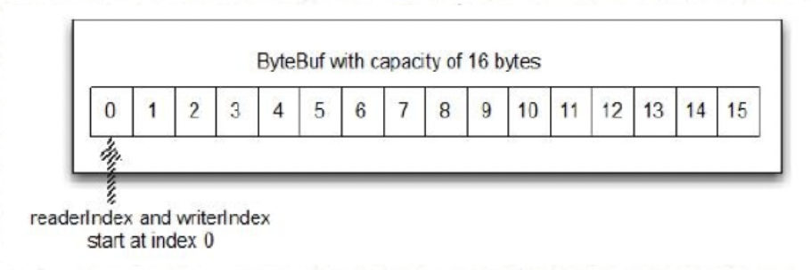
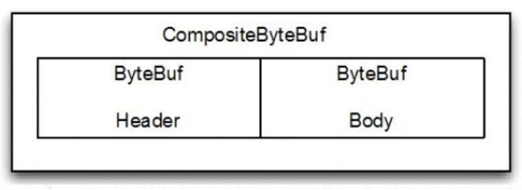

> 缓冲区在计算机世界中随处可见，内存中的多级缓冲区，io设备的缓冲区等等，还有我们经常用的内存队列，分布式队列等等。缓冲区，平衡了数据产生方和数据消费方的处理效率差异，提高了数据处理性能。

JDK为了解决网络通信中的数据缓冲问题，提供了ByteBuffer（heap或者直接内存缓存）来解决缓存问题，通过缓冲区来平衡网络io和CPU之间的速度差异，等待缓冲区积累到一定量的数据再统一交给CPU去处理，从而提升了CPU的资源利用率。

Netty 使用 reference-counting(引用计数)来判断何时可以释放 ByteBuf 或 ByteBufHolder 和其他相关资源，从而可以利用池和其他技巧来提高性能和降低内存消耗。这一点上不需要开发人员做任何事情，但是在开发 Netty 应用程序时，尤其是使用 ByteBuf 和 ByteBufHolder时，你应该尽可能早地释放池资源。 Netty 缓冲 API 有以下几个优势：

- 可以自定义缓冲类型
- 通过一个内置的复合缓冲类型实现零拷贝
- 扩展性好，比如 StringBuilder
- 不需要调用 flip() 来切换读/写模式
- 读取和写入索引分开
- 方法链
- 引用计数
- Pooling(池)

## ByteBuf 字节数据容器

写入数据到 ByteBuf 后，`writerIndex`（写入索引） 增加写入的字节数。读取字节后，`readerIndex`（读取索引） 也增加读取出的字节数。你可以读取字节，直到写入索引和读取索引处在相同的位置，此时ByteBuf不可读，所以下一次读操作将会抛出`IndexOutOfBoundsException`，就像读取数组时越位一样。

调用 ByteBuf 的以 "read" 或 "write" 开头的任何方法都将自动增加相应的索引（默认capaticy增加为原来的2倍）。另一方面，"set" 、 "get"操作字节将不会移动索引位置，它们只会在指定的相对位置上操作字节。可以给ByteBuf指定一个最大容量值，这个值限制着ByteBuf的容量。任何尝试将写入超过这个值的数据的行为都将导致抛出异常。ByteBuf 的默认最大容量限制是Integer.MAX_VALUE。

ByteBuf 类似于一个字节数组，最大的区别是读和写的索引可以用来控制对缓冲区数据的访问。下图显示了一个容量为16的空的 ByteBuf 的布局和状态，writerIndex 和 readerIndex 都在索引位置 0 ：


ByteBuf可以基于heap buffer，也可以基于direct buffer。使用direct buffer，通过免去中间交换的内存拷贝, 提升IO处理速度; 直接缓冲区的内容可以驻留在垃圾回收扫描的堆区以外。DirectBuffer 在` -XX:MaxDirectMemorySize=xxM` 大小限制下, 使用 Heap 之外的内存, GC对此”无能为力”，也就意味着规避了在高负载下频繁的GC过程对应用线程的中断影响。关于堆外内存详细讨论可参考：https://www.cnkirito.moe/nio-buffer-recycle。

> 注意：使用完ByteBuf之后，一定要release，否则会造成内存泄漏。区分ByteBuf底层是heap buffer还是direct buffer，可以根据ByteBuf.hasArray()来判断，因为heap buffer返回true（heap上的ByteBuffy底层实现就是byte[] 数组），direct buffer返回false。

## 复合缓冲区 COMPOSITE BUFFER

复合缓冲区是多个ByteBuf组合的视图，复合缓冲区就像一个列表，我们可以动态的添加和删除其中的 ByteBuf，JDK的 ByteBuffer 没有这样的功能。Netty 提供了 ByteBuf 的子类 CompositeByteBuf 类来处理复合缓冲区。

> 注意：CompositeByteBuf只是一个视图，CompositeByteBuf.hasArray() 总是返回 false，因为它可能既包含堆缓冲区，也包含直接缓冲区。

例如，一条消息由 header 和 body 两部分组成，将 header 和 body 组装成一条消息发送出去，可能 body 相同，只是 header 不同，使用CompositeByteBuf 就不用每次都重新分配一个新的缓冲区。下图显示CompositeByteBuf 组成 header 和 body：


CompositeByteBuf使用示例：

```java
ByteBuf byteBuf1 = UnpooledByteBufAllocator.DEFAULT.buffer();
ByteBuf byteBuf2 = UnpooledByteBufAllocator.DEFAULT.heapBuffer();
 
byteBuf1.writeByte(1);
byteBuf2.writeByte(2);
 
CompositeByteBuf compositeByteBuf = Unpooled.compositeBuffer();
compositeByteBuf.addComponent(byteBuf1);
compositeByteBuf.addComponent(byteBuf2);
System.out.println(compositeByteBuf.getByte(0));
System.out.println(compositeByteBuf.getByte(1));
 
ByteBuf allByteBuf = Unpooled.wrappedBuffer(byteBuf1, byteBuf2);
System.out.println(allByteBuf.getByte(0));
System.out.println(allByteBuf.getByte(1));
```

## Netty Buffer

ByteBuf 是Netty中主要用来数据byte[]的封装类，主要分为`Heap ByteBuf `和` Direct ByteBuf`。为了减少内存的分配回收以及产生的内存碎片，Netty提供了`PooledByteBufAllocator `用来分配可回收的ByteBuf，可以把`PooledByteBufAllocator`看做一个池子，需要的时候从里面获取ByteBuf，用完了放回去，以此提高性能。当然与之对应的还有 `UnpooledByteBufAllocator`，顾名思义Unpooled就是不会放到池子里，所以根据该分配器分配的ByteBuf，不需要放回池子由JVM自己GC回收。

在netty中，根据ChannelHandlerContext 和 Channel获取的Allocator默认都是Pooled，所以需要在合适的时机对其进行释放，避免造成内存泄漏。Netty默认会在ChannelPipline的最后添加一个tail handler帮你完成ByteBuf的release。

在传递过程中自己通过Channel或ChannelHandlerContext创建的但是没有传递下去的ByteBuf也要手动释放。为了帮助你诊断潜在的泄漏问题，netty提供了`ResourceLeakDetector`，该类会采样应用程序中%1的buffer分配，并进行跟踪，不过不用担心这个开销很小。

```java
// 第一种方式
public void channelRead(ChannelHandlerContext ctx, Object msg) {
    ByteBuf in = (ByteBuf) msg;
 
    System.out.println(in.toString(CharsetUtil.UTF_8));
    // 调用ctx.write(msg)不必手动释放了，Netty会自行作释放操作，但是如果调用
    // ctx.write()两次或者调用ctx.write后又将该msg传递到了TailContext了，则就会报异常
    ctx.write(msg);
}
 
// 第二种方式
public void channelRead(ChannelHandlerContext ctx, Object msg) {
    ByteBuf in = (ByteBuf) msg;
    
    ByteBuf result = ctx.channel().alloc().buffer();
    result.writeBytes(in.toString(CharsetUtil.UTF_8).getBytes(CharsetUtil.UTF_8));
    ctx.write(result);
 
    // msg对应的ByteBuf释放工作交给TailChannel来做
    ctx.fireChannelRead(msg);
}
 
// 第三种方式
public void channelRead(ChannelHandlerContext ctx, Object msg) {
    ByteBuf in = (ByteBuf) msg;
    
    ByteBuf result = ctx.channel().alloc().buffer();
    result.writeBytes(in.toString(CharsetUtil.UTF_8).getBytes(CharsetUtil.UTF_8));
    ctx.write(result);
 
    // 手工释放ByteBuf
    in.release();
}
```

> 参考资料：
>
> 1、https://www.cnkirito.moe/nio-buffer-recycle/
>
> 2、https://www.zhihu.com/question/57374068/answer/152691891

