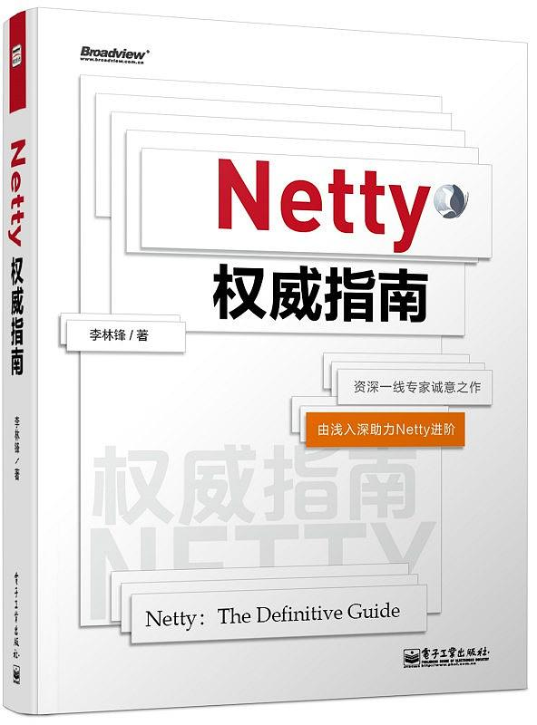
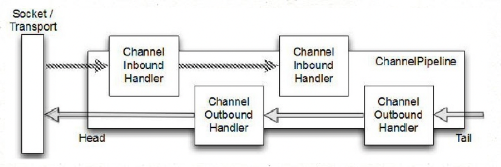

> Netty是Java领域有名的开源网络库，特点是高性能和高扩展性，因此很多流行的框架都是基于它来构建的，比如我们熟知的Dubbo、Rocketmq、Hadoop等，针对高性能RPC，一般都是基于Netty来构建，比如sock-bolt。总之一句话，Java小伙伴们需要且有必要学会使用Netty并理解其实现原理。

netty旨在为可维护的高性能、高可扩展性协议服务器和客户端的快速开发提供异步事件驱动的网络应用程序框架和工具。换句话说，Netty是一个NIO客户端服务器框架，可以快速轻松地开发协议服务器和客户端等网络应用程序。它极大地简化并简化了TCP和UDP套接字服务器开发等网络编程。

> 学习netty原理细节，看netty源码是必不可少的，那首先来看下如何编译源码：
>
> 1. 从github下载netty 4.x源码 
> 2. 如果缺少XxxObjectHashMap类，这些类是在编译时自动生成的，可以执行mvn clean install或者cd common && mvn clean install命令即可。
> 3. 打开idea，开启源码阅读之旅 :)

除了看源码，可以结合一些书籍来看，学习效果更好。关于Netty的书籍，笔者这里推荐一本 李林锋 写的《Netty权威指南》，这本书对于Netty的基础概念和NIO部分讲解的还是不错的，不过有点地方感觉有点贴代码凑字数嫌疑，整体来说还算不错。


## 什么是Netty

Netty是一个事件驱动的高性能Java网络库，是一个隐藏了背后复杂性而提供一个易于使用的API的客户端/服务端框架。Netty以其高性能和可扩展性，使开发者专注于真正感兴趣的地方。它的一个主要目标就是促进“关注点分离”：**使业务逻辑从网络基础设施应用程序中分离**。

>  不仅仅是Netty框架，其他框架的设计目的也大都是为了使业务程序和底层技术解耦，使程序员更加专注于业务逻辑实现，提高开发质量和效率。Netty为什么性能如此之高，主要是其内部的Reactor模型机制。

### Netty核心组件

- **Bootstrap和ServerBootstrap**：Netty应用程序通过设置bootstrap引导类来完成，该类提供了一个用于应用程序网络层配置的容器。Bootstrap服务端的是ServerBootstrap，客户端的是Bootstrap。
- **Channel**：Netty 中的接口 Channel 定义了与 socket 丰富交互的操作集：bind, close, config, connect, isActive, isOpen, isWritable, read, write 等等。
- **ChannelHandler**：ChannelHandler 支持很多协议，并且提供用于数据处理的容器，ChannelHandler由特定事件触发， 常用的一个接口是ChannelInboundHandler，该类型处理入站读数据（socket读事件）。
- **ChannelPipeline**：ChannelPipeline 提供了一个容器给 ChannelHandler 链并提供了一个API 用于管理沿着链入站和出站事件的流动。每个 Channel 都有自己的ChannelPipeline，当 Channel 创建时自动创建的。 下图说明了ChannelHandler和ChannelPipeline二者的关系：


- **EventLoop**：EventLoop 用于处理 Channel 的 I/O 操作。一个单一的 EventLoop通常会处理多个 Channel 事件。一个 EventLoopGroup 可以含有多于一个的 EventLoop 和 提供了一种迭代用于检索清单中的下一个。
- **ChannelFuture**：Netty 所有的 I/O 操作都是异步。因为一个操作可能无法立即返回，我们需要有一种方法在以后获取它的结果。出于这个目的，Netty 提供了接口 ChannelFuture,它的 addListener 方法

Netty 是一个非阻塞、事件驱动的网络框架。Netty 实际上是使用 Threads（ 多线程） 处理 I/O事件的，对于熟悉多线程编程的读者可能会需要关注同步代码。这样的方式不好，因为同步会影响程序的性能，Netty 的设计保证程序处理事件不会有同步。因为某个Channel事件是被添加到一个EventLoop中的，以后该Channel事件都是由该EventLoop来处理的，而EventLoop是一个线程来处理的，也就是说Netty不需要同步IO操作，EventLoop与EventLoopGroup的关系可以理解为线程与线程池的关系一样。

### Buffer（缓冲）

ByteBuf是字节数据的容器，所有的网络通信都是基于底层的字节流传输，ByteBuf 是一个很好的经过优化的数据容器，我们可以将字节数据有效的添加到 ByteBuf 中或从 ByteBuf 中获取数据。为了便于操作，ByteBuf 提供了两个索引：一个用于读，一个用于写。我们可以按顺序读取数据，也可以通过调整读取数据的索引或者直接将读取位置索引作为参数传递给get方法来重复读取数据。

**ByteBuf使用模式**

**堆缓冲区ByteBuf**将数据存储在 JVM 的堆空间，这是通过将数据存储在数组的实现。堆缓冲区可以快速分配，当不使用时也可以快速释放。它还提供了直接访问数组的方法，通过 ByteBuf.array() 来获取 byte[]数据。 

堆缓冲区ByteBuf使用示例：

```java
ByteBuf heapBuf = ...;
if (heapBuf.hasArray()) {
    byte[] array = heapBuf.array();
    int offset = heapBuf.arrayOffset() + heapBuf.readerIndex();
    int length = heapBuf.readableBytes();
    handleArray(array, offset, length);
}
```

**直接缓冲区ByteBuf，**在 JDK1.4 中被引入 NIO 的ByteBuffer 类允许 JVM 通过本地方法调用分配内存，其目的是通过免去中间交换的内存拷贝, 提升IO处理速度; 直接缓冲区的内容可以驻留在垃圾回收扫描的堆区以外。DirectBuffer 在` -XX:MaxDirectMemorySize=xx`M大小限制下, 使用 Heap 之外的内存, GC对此”无能为力”，也就意味着规避了在高负载下频繁的GC过程对应用线程的中断影响。

### Netty示例代码

了解了Netty基础概念之后，一起看下Netty的使用示例，下面以TCP server、TCP client、http server为例，由于示例代码不难，所以不再赘述，直接上代码。

#### TCP Server 

```java
public static void main(String[] args) {
    EventLoopGroup bossGroup = new NioEventLoopGroup(1);
    EventLoopGroup workerGroup = new NioEventLoopGroup();
 
    try {
        ServerBootstrap boot = new ServerBootstrap();
        boot.group(bossGroup, workerGroup)
            .channel(NioServerSocketChannel.class)
            .localAddress(8080)
            .childHandler(new ChannelInitializer<SocketChannel>() {
                @Override
                protected void initChannel(SocketChannel ch) throws Exception {
                    ch.pipeline().addLast(new EchoHandler());
                }
            });
 
        // start
        ChannelFuture future = boot.bind().sync();
        future.channel().closeFuture().sync();
    } catch (Exception e) {
        e.printStackTrace();
    } finally {
        // shutdown
        bossGroup.shutdownGracefully();
        workerGroup.shutdownGracefully();
    }
}
 
public class EchoHandler extends ChannelInboundHandlerAdapter {
    @Override
    public void channelRead(ChannelHandlerContext ctx, Object msg) {
        ByteBuf in = (ByteBuf) msg;
        System.out.println(in.toString(CharsetUtil.UTF_8));
        ctx.write(msg);
    }
 
    @Override
    public void channelReadComplete(ChannelHandlerContext ctx) {
        ctx.flush();
    }
 
    @Override
    public void exceptionCaught(ChannelHandlerContext ctx, Throwable cause) {
        cause.printStackTrace();
        ctx.close();
    }
}
```

#### TCP client

```java
public static void main(String[] args) {
 
    EventLoopGroup group = new NioEventLoopGroup();
    try {
        Bootstrap b = new Bootstrap();
        b.group(group)
        .channel(NioSocketChannel.class)
        .option(ChannelOption.TCP_NODELAY, true)
        .handler(new ChannelInitializer<SocketChannel>() {
            @Override
            public void initChannel(SocketChannel ch) throws Exception {
                ChannelPipeline p = ch.pipeline();
                //p.addLast(new LoggingHandler(LogLevel.INFO));
                p.addLast(new EchoClientHandler());
            }
        });
 
        // Start the client.
        ChannelFuture f = b.connect("localhost", 8081).sync();
        f.channel().closeFuture().sync();
    } catch (Exception e) {
      e.printStackTrace();
    } finally {
        group.shutdownGracefully();
    }
}
 
public class EchoClientHandler extends ChannelInboundHandlerAdapter {
 
    private final ByteBuf message;
 
    public EchoClientHandler() {
        message = Unpooled.buffer(256);
        message.writeBytes("hello netty".getBytes(CharsetUtil.UTF_8));
    }
 
    @Override
    public void channelActive(ChannelHandlerContext ctx) {
        ctx.writeAndFlush(message);
    }
 
    @Override
    public void channelRead(ChannelHandlerContext ctx, Object msg) {
        System.out.println(((ByteBuf) msg).toString(CharsetUtil.UTF_8));
        ctx.write(msg);
        try {
            Thread.sleep(1000);
        } catch (InterruptedException e) {
            e.printStackTrace();
        }
    }
 
    @Override
    public void channelReadComplete(ChannelHandlerContext ctx) {
        ctx.flush();
    }
 
    @Override
    public void exceptionCaught(ChannelHandlerContext ctx, Throwable cause) {
        // Close the connection when an exception is raised.
        cause.printStackTrace();
        ctx.close();
    }
}
```

netty client端在什么时候将channel注册到selector上的呢？是在创建channel之后，就注册到selector的，相关代码在initAndRegister方法中：

```java
final ChannelFuture initAndRegister() {
    Channel channel = null;
    try {
        // 创建(netty自定义)Channel实例，并初始化
        // channel为 NioServerSocketChannel 实例,NioServerSocketChannel的父类AbstractNioChannel保存有nio的ServerSocketChannel
        channel = channelFactory.newChannel();
        init(channel);
    } catch (Throwable t) {
        if (channel != null) {
            // channel can be null if newChannel crashed (eg SocketException("too many open files"))
            channel.unsafe().closeForcibly();
            // as the Channel is not registered yet we need to force the usage of the GlobalEventExecutor
            return new DefaultChannelPromise(channel, GlobalEventExecutor.INSTANCE).setFailure(t);
        }
        // as the Channel is not registered yet we need to force the usage of the GlobalEventExecutor
        return new DefaultChannelPromise(new FailedChannel(), GlobalEventExecutor.INSTANCE).setFailure(t);
    }

    // 向Selector注册channel
    ChannelFuture regFuture = config().group().register(channel);
    if (regFuture.cause() != null) {
        if (channel.isRegistered()) {
            channel.close();
        } else {
            channel.unsafe().closeForcibly();
        }
    }

    // If we are here and the promise is not failed, it's one of the following cases:
    // 1) If we attempted registration from the event loop, the registration has been completed at this point.
    //    i.e. It's safe to attempt bind() or connect() now because the channel has been registered.
    // 2) If we attempted registration from the other thread, the registration request has been successfully
    //    added to the event loop's task queue for later execution.
    //    i.e. It's safe to attempt bind() or connect() now:
    //         because bind() or connect() will be executed *after* the scheduled registration task is executed
    //         because register(), bind(), and connect() are all bound to the same thread.

    return regFuture;
}
```

initAndRegister之后会执行connect动作，注意，真正的channel.connect动作是由NioEventLoop线程来完成的，当连接三次握手完成之后，会触发该channel的ACCEPT事件，也就是NIOEventLoop中处理事件的流程。

#### Http server

```java
public static void main(String[] args) {
    EventLoopGroup bossGroup = new NioEventLoopGroup(1);
    EventLoopGroup workerGroup = new NioEventLoopGroup();
 
    try {
        ServerBootstrap boot = new ServerBootstrap();
        boot.group(bossGroup, workerGroup)
            .channel(NioServerSocketChannel.class)
            .localAddress(8080)
            .childHandler(new ChannelInitializer<SocketChannel>() {
                @Override
                protected void initChannel(SocketChannel ch) throws Exception {
                    ch.pipeline()
                            .addLast("decoder", new HttpRequestDecoder())
                            .addLast("encoder", new HttpResponseEncoder())
                            .addLast("aggregator", new HttpObjectAggregator(512 * 1024))
                            .addLast("handler", new HttpHandler());
                }
            });
 
        // start
        ChannelFuture future = boot.bind().sync();
        future.channel().closeFuture().sync();
    } catch (Exception e) {
        e.printStackTrace();
    } finally {
        // shutdown
        bossGroup.shutdownGracefully();
        workerGroup.shutdownGracefully();
    }
}
 
public class HttpHandler extends SimpleChannelInboundHandler<FullHttpRequest> {
    @Override
    protected void channelRead0(ChannelHandlerContext ctx, FullHttpRequest msg) throws Exception {
        DefaultFullHttpResponse response = new DefaultFullHttpResponse(HttpVersion.HTTP_1_1,
                HttpResponseStatus.OK,
                Unpooled.wrappedBuffer("hello netty".getBytes()));
 
        HttpHeaders heads = response.headers();
        heads.add(HttpHeaderNames.CONTENT_TYPE, HttpHeaderValues.TEXT_PLAIN + "; charset=UTF-8");
        heads.add(HttpHeaderNames.CONTENT_LENGTH, response.content().readableBytes()); // 3
        heads.add(HttpHeaderNames.CONNECTION, HttpHeaderValues.KEEP_ALIVE);
 
        ctx.writeAndFlush(response);
    }
}
```

