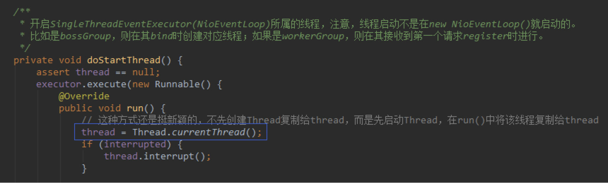
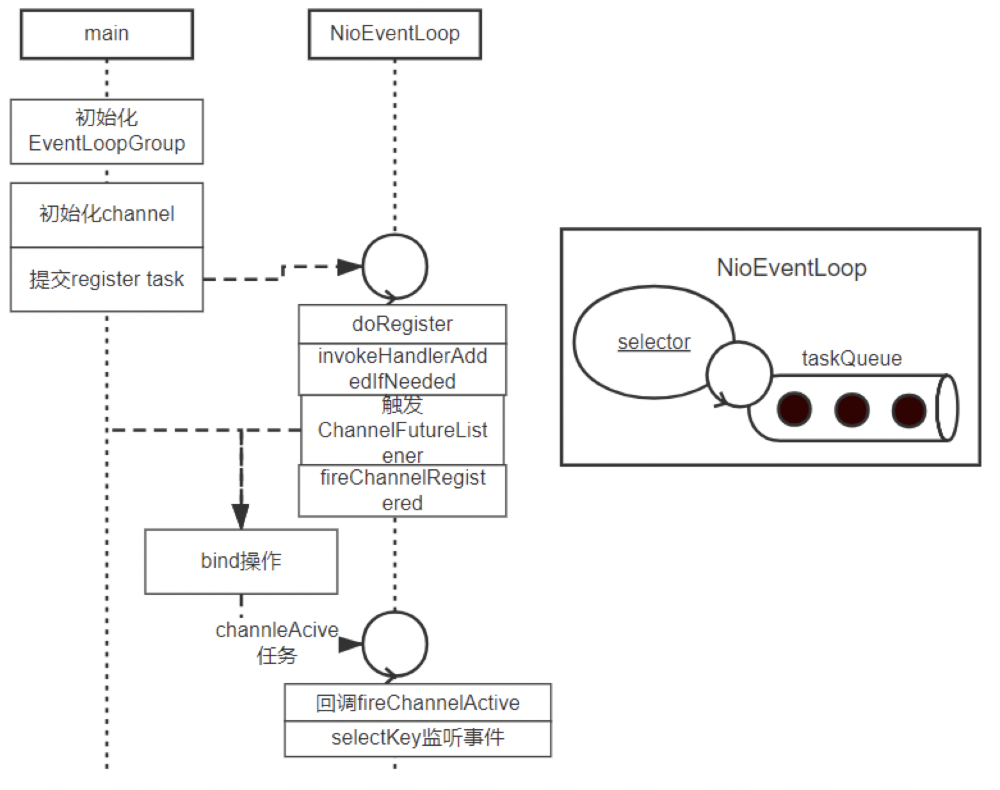
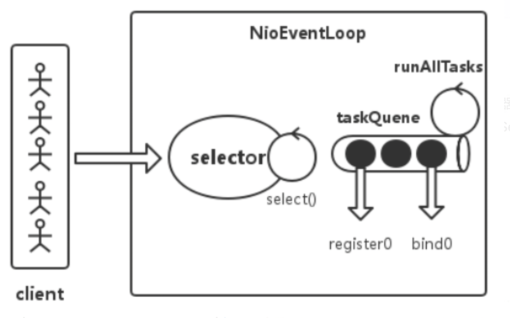
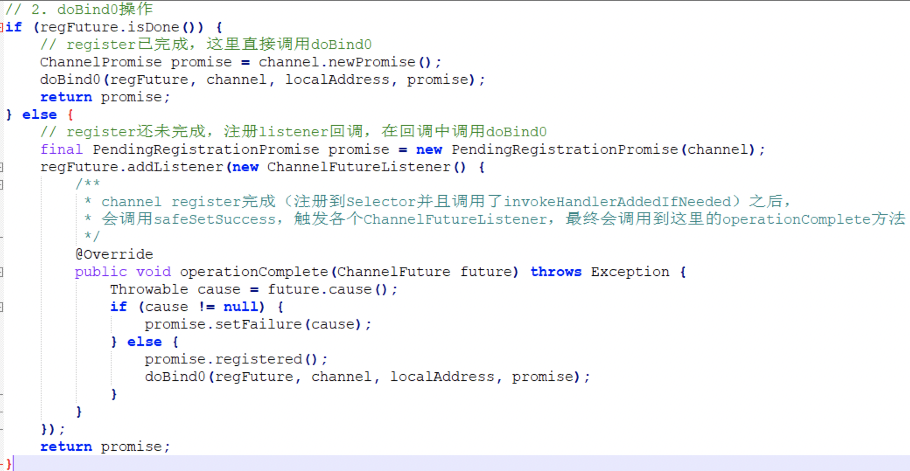

Netty的启动流程(`ServerBootstrap`)，就是创建`NioEventLoopGroup`（内部可能包含多个NioEventLoop，每个eventLoop是一个线程，内部包含一个FIFO的taskQueue和Selector）和ServerBootstrap实例，并进行bind的过程（bind流程涉及到channel的创建和注册），之后就可以对外提供服务了。

Netty的启动流程中，涉及到多个操作，比如register、bind、注册对应事件等，为了不影响main线程执行，这些工作以task的形式提交给NioEventLoop，由NioEventLoop来执行这些task，也就是register、bind、注册事件等操作。

NioEventLoop（准确来说是`SingleThreadEventExecutor`）中包含了`private volatile Thread thread`，该thread变量的初始化是在new的线程第一次执行run方式时才赋值的，这种形式挺新颖的。


Netty启动流程图如下所示：


大致了解了Netty启动流程之后，下面就按照Netty启动流程中涉及到的源码来进行分析。

>  netty启动流程分为server端和client端，不同之处就是前者监听端口，对外提供服务（socket->bind->listen操作），对应类ServerBootstrap；后者主动去连接远端端口（socket->connect），对应类Bootstrap。

## server端启动流程

server端启动流程可以理解成创建ServerBootstrap实例的过程，就以下面代码为例进行分析（echo服务）：

```java
public final class EchoServer {
    static final int PORT = Integer.parseInt(System.getProperty("port", "8007"));

    public static void main(String[] args) throws Exception {
        // bossGroup处理connect事件
        // workerGroup处理read/write事件
        EventLoopGroup bossGroup = new NioEventLoopGroup(1);
        EventLoopGroup workerGroup = new NioEventLoopGroup();
        EchoServerHandler serverHandler = new EchoServerHandler();
        try {
            ServerBootstrap b = new ServerBootstrap();
            b.group(bossGroup, workerGroup)
             .channel(NioServerSocketChannel.class)
             .option(ChannelOption.SO_BACKLOG, 100)
             .handler(new LoggingHandler(LogLevel.INFO))
             .childHandler(new ChannelInitializer<SocketChannel>() {
                 @Override
                 public void initChannel(SocketChannel ch) throws Exception {
                     // 当连接建立后（register到childWorkerGroup前）初始化channel.pipeline
                     ch.pipeline().addLast(serverHandler);
                 }
             });

            // Start the server.
            ChannelFuture f = b.bind(PORT).sync();
            // Wait until the server socket is closed.
            f.channel().closeFuture().sync();
        } finally {
            // Shut down all event loops to terminate all threads.
            bossGroup.shutdownGracefully();
            workerGroup.shutdownGracefully();
        }
    }
}

public class EchoServerHandler extends ChannelInboundHandlerAdapter {
    @Override
    public void channelRead(ChannelHandlerContext ctx, Object msg) {
        ctx.write(msg);
    }

    @Override
    public void channelReadComplete(ChannelHandlerContext ctx) {
        ctx.flush();
    }

    @Override
    public void exceptionCaught(ChannelHandlerContext ctx, Throwable cause) {
        // Close the connection when an exception is raised.
        cause.printStackTrace();
        ctx.close();
    }
}
```

### EventLoopGroup创建

EventLoopGroup中可能包含了多个EventLoop，EventLoop是一个Reactor模型的事件处理器，一个EventLoop对应一个线程，其内部会维护一个selector和taskQueue，负责处理客户端请求和内部任务，内部任务如ServerSocketChannel注册和ServerSocket绑定操作等。关于NioEventLoop，后续专门写一篇文章分析，这里就不再展开，只需知道个大概即可，其架构图如下：


EventLoopGroup创建本质就是创建多个NioEventLoop，这里创建NioEventLoop就是初始化一个Reactor，包括selector和taskQueue。主要逻辑如下：

```java
protected MultithreadEventExecutorGroup(int nThreads, Executor executor,
                                            EventExecutorChooserFactory chooserFactory, Object... args) {
	// 创建NioEventLoop实例
	children = new EventExecutor[nThreads];
	// 初始化NioEventLoop,实际调用的是NioEventLoopGroup.newChild方法
	for (int i = 0; i < nThreads; i ++) {
		children[i] = newChild(executor, args);
	}

	// 多个NioEventLoop中选择策略
	chooser = chooserFactory.newChooser(children);
}

NioEventLoop(NioEventLoopGroup parent, Executor executor, SelectorProvider selectorProvider,
                 SelectStrategy strategy, RejectedExecutionHandler rejectedExecutionHandler) {
	// 创建taskQueue
	super(parent, executor, false, DEFAULT_MAX_PENDING_TASKS, rejectedExecutionHandler);
	// 是不是很熟悉，java nio selector操作
	provider = selectorProvider;
	final SelectorTuple selectorTuple = openSelector();
	selector = selectorTuple.selector;
	unwrappedSelector = selectorTuple.unwrappedSelector;
	selectStrategy = strategy;
}
```

EventLoopGroup创建OK后，启动的第一步就算完成了，接下来该进行bind、listen操作了。

## ServerBootstrap流程

### bind操作

bind操作是ServerBootstrap流程重要的一环，bind流程涉及到NioChannel的创建、初始化和注册(到Selector)，启动NioEventLoop，之后就可以对外提供服务了。

```java
public ChannelFuture bind(SocketAddress localAddress) {
	validate(); // 参数校验
	return doBind(localAddress);
}
private ChannelFuture doBind(final SocketAddress localAddress) {
    // 1. 初始化注册操作
    final ChannelFuture regFuture = initAndRegister();
    final Channel channel = regFuture.channel();
    if (regFuture.cause() != null) {
        return regFuture;
    }
 
    // 2. doBind0操作
    if (regFuture.isDone()) {
        // register已完成，这里直接调用doBind0
        ChannelPromise promise = channel.newPromise();
        doBind0(regFuture, channel, localAddress, promise);
        return promise;
    } else {
        // register还未完成，注册listener回调，在回调中调用doBind0
        final PendingRegistrationPromise promise = new PendingRegistrationPromise(channel);
        regFuture.addListener(new ChannelFutureListener() {
            /**
             * channel register完成（注册到Selector并且调用了invokeHandlerAddedIfNeeded）之后，
             * 会调用safeSetSuccess，触发各个ChannelFutureListener，最终会调用到这里的operationComplete方法
             */
            @Override
            public void operationComplete(ChannelFuture future) throws Exception {
                Throwable cause = future.cause();
                if (cause != null) {
                    promise.setFailure(cause);
                } else {
                    promise.registered();
                    doBind0(regFuture, channel, localAddress, promise);
                }
            }
        });
        return promise;
    }
}
```

这里涉及到2个操作，一个是channel的创建、初始化、注册操作，另一个是bind操作，下面兵分两路，分别来讲。

> 注意，这里如果main线程执行到regFuture.isDone()时，register还未完成，那么main线程是不会直接调用bind操作的，而是往regFuture上注册一个Listenner，这样channel register完成（注册到Selector并且调用了invokeHandlerAddedIfNeeded）之后，会调用safeSetSuccess，触发各个ChannelFutureListener，最终会调用到这里的operationComplete方法，进而在执行bind操作。

### channel初始化、注册操作

```java
final ChannelFuture initAndRegister() {
    Channel channel = null;
    try {
        // 1.创建(netty自定义)Channel实例，并初始化
        // channel为 NioServerSocketChannel 实例,NioServerSocketChannel的父类AbstractNioChannel保存有nio的ServerSocketChannel
        channel = channelFactory.newChannel();
		// 2.初始化channel（）
        init(channel);
    } catch (Throwable t) {
    }
 
    // 3.向Selector注册channel
    ChannelFuture regFuture = config().group().register(channel);
    if (regFuture.cause() != null) {
        if (channel.isRegistered()) {
            channel.close();
        } else {
            channel.unsafe().closeForcibly();
        }
    }
     
    return regFuture;
}
```

这里重点关注下初始化channel流程，主要操作是设置channel属性、设置channel.pipeline的ChannelInitializer，注意，ChannelInitializer是在channel注册到selector之后被回调的。

```java
/**
 * 初始channel属性，也就是ChannelOption对应socket的各种属性。
 * 比如 SO_KEEPALIVE SO_RCVBUF ... 可以与Linux中的setsockopt函数对应起来。
 * 最后将ServerBootstrapAcceptor添加到对应channel的ChannelPipeline中。
 */
@Override
void init(Channel channel) throws Exception {
    final Map<ChannelOption<?>, Object> options = options0();
    synchronized (options) {
        setChannelOptions(channel, options, logger);
    }
	
    ChannelPipeline p = channel.pipeline();
    // 获取childGroup和childHandler，传递给ServerBootstrapAcceptor
    final EventLoopGroup currentChildGroup = childGroup;
    final ChannelHandler currentChildHandler = childHandler;
    final Entry<ChannelOption<?>, Object>[] currentChildOptions;
    final Entry<AttributeKey<?>, Object>[] currentChildAttrs;
    synchronized (childOptions) {
        currentChildOptions = childOptions.entrySet().toArray(newOptionArray(0));
    }
    synchronized (childAttrs) {
        currentChildAttrs = childAttrs.entrySet().toArray(newAttrArray(0));
    }
 
    p.addLast(new ChannelInitializer<Channel>() {
        /**
         * 在register0中，将channel注册到Selector之后，会调用invokeHandlerAddedIfNeeded，
         * 进而调用到这里的initChannel方法
         */
        @Override
        public void initChannel(final Channel ch) throws Exception {
            final ChannelPipeline pipeline = ch.pipeline();
            ChannelHandler handler = config.handler();
            if (handler != null) {
                pipeline.addLast(handler);
            }
 
            // 这里注册一个添加ServerBootstrapAcceptor的任务
            ch.eventLoop().execute(new Runnable() {
                @Override
                public void run() {
                    // 添加ServerBootstrapAcceptor
                    pipeline.addLast(new ServerBootstrapAcceptor(
                            ch, currentChildGroup, currentChildHandler, currentChildOptions, currentChildAttrs));
                }
            });
        }
    });
}
```

channel初始化之后就该将其注册到selector，即下面的register流程：

```java
public ChannelFuture register(Channel channel) {
    // next()挑选一个EventLoop，默认轮询选择某个NioEventLoop
    return next().register(channel);
}
public ChannelFuture register(final ChannelPromise promise) {
	promise.channel().unsafe().register(this, promise);
	return promise;
}
// AbstractChannel
public final void register(EventLoop eventLoop, final ChannelPromise promise) {
    AbstractChannel.this.eventLoop = eventLoop;
 
    // 直接执行register0或者以任务方式提交执行
    // 启动时，首先执行到这里的是main线程，所以是以任务的方式来提交执行的。
    // 也就是说，该任务是NioEventLoop第一次执行的任务，即调用register0
    if (eventLoop.inEventLoop()) {
        register0(promise);
    } else {
        // 往NioEventLoop中(任务队列)添加任务时，如果NioEventLoop线程还未启动，则启动该线程
        eventLoop.execute(new Runnable() {
            @Override
            public void run() {
                register0(promise);
            }
        });
    }
}
```

### register操作

register操作之后伴随着多个回调及listener的触发：

```java
// AbstractChannel$AbstractUnsafe
private void register0(ChannelPromise promise) {
    boolean firstRegistration = neverRegistered;
    // 这里调用的是AbstractNioChannel.doRegister
    // 这里将channel注册上去，并没有关注对应的事件（read/write事件）
    doRegister();
    neverRegistered = false;
    registered = true;
 
    // 调用handlerAdd事件，这里就会调用initChannel方法，设置channel.pipeline，也就是添加 ServerBootstrapAcceptor
    pipeline.invokeHandlerAddedIfNeeded();
 
    // 调用operationComplete回调
    safeSetSuccess(promise);
	// 回调fireChannelRegistered
    pipeline.fireChannelRegistered();
    // Only fire a channelActive if the channel has never been registered. This prevents firing
    // multiple channel actives if the channel is deregistered and re-registered.
    if (isActive()) {
        if (firstRegistration) {
			// 回调fireChannelActive
            pipeline.fireChannelActive();
        } else if (config().isAutoRead()) {
            beginRead();
        }
    }
}
```

上面代码中的initChannel回调也就是设置对外监听channel的channelHanlder为ServerBootstrapAcceptor；operationComplete回调也就是触发`ChannelFutureListener.operationComplete`，这里会进行后续的doBind操作。

```java
// AbstractBootstrap
private static void doBind0(
        final ChannelFuture regFuture, final Channel channel,
        final SocketAddress localAddress, final ChannelPromise promise) {
    // doBind0向EventLoop任务队列中添加一个bind任务来完成后续操作。
    channel.eventLoop().execute(new Runnable() {
        @Override
        public void run() {
            if (regFuture.isSuccess()) {
                // bind操作
                channel.bind(localAddress, promise).addListener(ChannelFutureListener.CLOSE_ON_FAILURE);
            }
        }
    });
}
```

### bind操作

在回顾上面的bind操作代码，bind操作是在register之后进行的，因为register0是由NioEventLoop执行的，所以main线程需要先判断下future是否完成，如果完成直接进行doBind即可，否则添加listener回调进行doBind。


bind操作及后续初始化操作（channelActive回调、设置监听事件）

```java
public final void bind(final SocketAddress localAddress, final ChannelPromise promise) {
	boolean wasActive = isActive();
	try {
		// 调用底层bind操作
		doBind(localAddress);
	} catch (Throwable t) {
		safeSetFailure(promise, t);
		closeIfClosed();
		return;
	}

	if (!wasActive && isActive()) {
		invokeLater(new Runnable() {
			@Override
			public void run() {
				pipeline.fireChannelActive();
			}
		});
	}
	safeSetSuccess(promise);
}

// 最后底层bind逻辑bind入参包括了backlog，也就是底层会进行listen操作
// DefaultChannelPipeline.headContext -> NioMessageUnsafe -> NioServerSocketChannel
protected void doBind(SocketAddress localAddress) throws Exception {
	if (PlatformDependent.javaVersion() >= 7) {
		javaChannel().bind(localAddress, config.getBacklog());
	} else {
		javaChannel().socket().bind(localAddress, config.getBacklog());
	}
}

public void channelActive(ChannelHandlerContext ctx) throws Exception {
	// 回调fireChannelActive
	ctx.fireChannelActive();
	
	// 设置selectKey监听事件，对于监听端口就是SelectionKey.OP_ACCEPT，对于新建连接就是SelectionKey.OP_READ
	readIfIsAutoRead();
}
```

到这里为止整个netty启动流程就基本接近尾声，可以对外提供服务了。