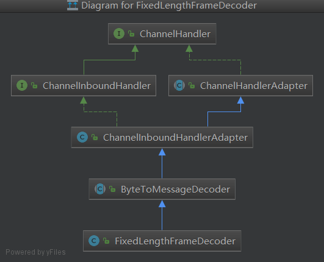

> 学习netty处理黏包和拆包，首先要知道什么是黏包和拆包问题？

黏包和拆包的产生是由于TCP拥塞控制算法（比如[angle算法](https://baike.baidu.com/item/Nagle算法/5645172)）和TCP缓冲区机制导致的，angle算法简单来说就是通过一些规则来尽可能利用网络带宽，尽可能的发送足够大的数据。TCP（发送/接收）缓冲区会暂缓数据，并且是有最大容量的。

黏包的产生是由于一次TCP通信数据量较少，导致多个TCP数据合并在一起（这里的合并可能发生在发送缓冲区合并后发送，也可能发生在接收缓冲区合并后应用程序一次性读取）。拆包的产生是由于一次TCP通信数据量较大（比如超过了MTU），导致发送时分片发送，这样接收时是多次接收后才是一个完整的数据。

**netty处理黏包和拆包问题，思路就是以定长方式读取接收到的数据来处理（比如读取固定长度数据量、以TLV方式读取数据、以固定分隔符读取数据等）**。

下面以一个定长方式读取数据的示例来分析下Netty的处理机制，server端处理TCP黏包和拆包示例代码：

```java
EventLoopGroup bossGroup = new NioEventLoopGroup(1);
EventLoopGroup workerGroup = new NioEventLoopGroup();
try {
    ServerBootstrap boot = new ServerBootstrap();
    boot.group(bossGroup, workerGroup)
            .channel(NioServerSocketChannel.class)
            .localAddress(60000)
            .childHandler(new ChannelInitializer<SocketChannel>() {
                @Override
                protected void initChannel(SocketChannel ch) throws Exception {
                    ch.pipeline()
                            // 定长接收消息，用于处理黏包分包问题
                            .addLast(new FixedLengthFrameDecoder(1))
                            .addLast(new EchoHandler());
                }
            });
 
    // start
    ChannelFuture future = boot.bind().sync();
    future.channel().closeFuture().sync();
} catch (Exception e) {
    e.printStackTrace();
} finally {
    // shutdown
    bossGroup.shutdownGracefully();
    workerGroup.shutdownGracefully();
}
```

FixedLengthFrameDecoder类继承关系如下，下面就以该类为例讲解下netty 处理粘包分包机制。


>  这里思考一下，如果接收到的数据未达到FixedLengthFrameDecoder要求的长度，这个时候Netty该如何处理呢？

首先可以肯定的一点是，接收到数据长度不够，是不会进行后续channelHandler处理的。Netty的处理机制是会将接收到的数据存储到`ByteToMessageDecoder.cumulation`中，暂存一下，等待下次接收到数据时继续处理直到达到要求长度之后才交给后续的ChannelHandler来处理，ByteToMessageDecoder代码如下：

```java
// ByteToMessageDecoder
public void channelRead(ChannelHandlerContext ctx, Object msg) throws Exception {
	if (msg instanceof ByteBuf) {
		CodecOutputList out = CodecOutputList.newInstance();
		try {
			ByteBuf data = (ByteBuf) msg;
			first = cumulation == null;
			if (first) {
				cumulation = data;
			} else {
				// cumulation保存有上次未处理(不完整)的数据
				cumulation = cumulator.cumulate(ctx.alloc(), cumulation, data);
			}
			callDecode(ctx, cumulation, out);
		} catch (DecoderException e) {
			throw e;
		} catch (Exception e) {
			throw new DecoderException(e);
		} finally {
			if (cumulation != null && !cumulation.isReadable()) {
				numReads = 0;
				cumulation.release();
				cumulation = null;
			} else if (++ numReads >= discardAfterReads) {
				numReads = 0;
				discardSomeReadBytes();
			}

			int size = out.size();
			decodeWasNull = !out.insertSinceRecycled();
			// 继续回调channelHandler.channelRead
			fireChannelRead(ctx, out, size);
			out.recycle();
		}
	} else {
		ctx.fireChannelRead(msg);
	}
}

final void decodeRemovalReentryProtection(ChannelHandlerContext ctx, ByteBuf in, List<Object> out)
		throws Exception {
	decodeState = STATE_CALLING_CHILD_DECODE;
	try {
		decode(ctx, in, out);
	} finally {
		boolean removePending = decodeState == STATE_HANDLER_REMOVED_PENDING;
		decodeState = STATE_INIT;
		if (removePending) {
			handlerRemoved(ctx);
		}
	}
}
protected final void decode(ChannelHandlerContext ctx, ByteBuf in, List<Object> out) throws Exception {
    Object decoded = decode(ctx, in);
	if (decoded != null) {
		out.add(decoded);
	}
}
// 已接收数据未达到要求的长度时，继续等待接收
protected Object decode(
		@SuppressWarnings("UnusedParameters") ChannelHandlerContext ctx, ByteBuf in) throws Exception {
	if (in.readableBytes() < frameLength) {
		return null;
	} else {
		return in.readRetainedSlice(frameLength);
	}
}
```

处理粘包拆包，其实思路都是一致的，就是“分分合合”，粘包由于数据过多，那就按照固定策略分割下交给程序来处理；拆包由于一次传输数据较少，那就等待数据传输长度够了再交给程序来处理。