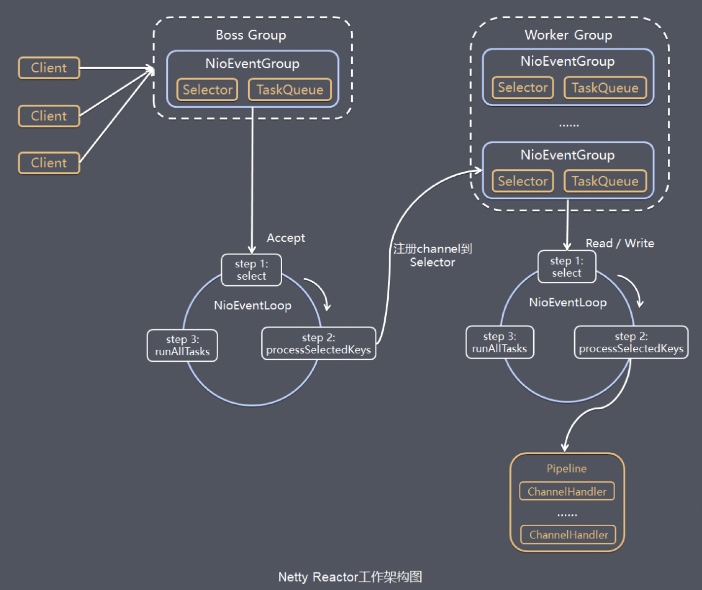

Netty一个主要的目标就是促进“关注点分离”：**使业务逻辑从网络基础设施应用程序中分离**。不仅仅是Netty框架，其他框架的设计目的也大都是为了使业务程序和底层技术解耦，使程序员更加专注于业务逻辑实现，提高开发质量和效率。Netty为什么性能如此之高，主要是其内部的Reactor模型机制。

Netty Reactor流程图如下：


### Netty优缺点

netty优点就不多了，下面谈谈netty有哪些可以优化的地方或者可以改善的地方。

**1、更多的EventLoopGroup负载均衡策略**

目前提交给EventLoopGroup中的某个EventLoop使用的负载均衡策略只有轮询方式，如下：

```java
private static final class PowerOfTwoEventExecutorChooser implements EventExecutorChooser {
    private final AtomicInteger idx = new AtomicInteger();
    private final EventExecutor[] executors;
    PowerOfTwoEventExecutorChooser(EventExecutor[] executors) {
        this.executors = executors;
    }
    @Override
    public EventExecutor next() {
        // 自增取余方式轮询
        return executors[idx.getAndIncrement() & executors.length - 1];
    }
}
```

可考虑增加其他方式的负载均衡策略，比如最少连接等，不过要考虑在netty使用场景中该类负载均衡是否必要，实现难度和增加的效率如何，简单的说就是是否划算，如果划算，就可以考虑增加。

**2、EventLoop中IO事件和定时事件解耦**

目前EventLoop中的IO事件和定时事件是在同一个NIOEventLoop线程执行的，如果延时任务逻辑逻辑复杂，会导致IO事件响应的及时性和效率，因此考虑二者解耦，可使用独立的线程或线程池来执行定时事件。（目前Netty处理中可以通过ioRatio来调节IO事件和任务事件执行事件百分比，一定程度上可以减小二者的相互影响延时）

### 为什么使用netty而不是直接用NIO或者其他NIO框架

1. 使用 JDK 自带的 NIO 需要了解太多的概念，编程复杂。
2. Netty 底层 IO 模型随意切换，而这一切只需要做微小的改动。
3. Netty自带的拆包解包，异常检测等机制让我们从 NIO 的繁重细节中脱离出来，只需关心业务逻辑即可。
4. Netty解决了JDK 的很多包括空轮询在内的 Bug。
5. Netty底层对线程，Selector 做了很多细小的优化，精心设计的 Reactor 线程做到非常高效的并发处理。
6. 自带各种协议栈，让我们处理任何一种通用协议都几乎不用亲自动手。
7. Netty社区活跃，遇到问题随时邮件列表或者 issue。
8. Netty已经历各大RPC框架（Dubbo），消息中间件（RocketMQ），大数据通信（Hadoop）框架的广泛的线上验证，健壮性无比强大。

### JVM如何优雅退出

对于通过注册ShutdownHook实现的优雅退出，需要注意如下几点，防止踩坑。

1. ShutdownHook在某些情况下并不会被执行，例如JVM崩溃、无法接收信号量和kill-9 pid等。

2. 当存在多个ShutdownHook时，JVM无法保证它们的执行先后顺序。
3. 在JVM关闭期间不能动态添加或者去除ShutdownHook。
4. 不能在ShutdownHook中调用System.exit（），它会卡住JVM，导致进程无法退出。

对于采用注册 SignalHandler 实现优雅退出的程序，在 handle 接口中一定要避免阻塞操作，否则它会导致已经注册的 ShutdownHook无法执行，系统也无法退出。

### 网关类产品的优化建议

网关类产品的主要功能就是消息的预处理和转发，请求和响应对象都是“朝生夕灭”类型的，在高并发场景下，一定要防止不合理的内存申请，具体措施如下。

（1）内存按需分配。不要一次性申请较大的内存来保存较小的消息，造成内存空间浪费，引发频繁GC问题。

（2）不要频繁地创建和释放对象。这会增加GC的负担，降低系统的吞吐量，可以采用内存池等机制优化内存的申请和释放。

（3）减少对象拷贝。对于透传类的消息，尽量把涉及业务逻辑处理的字段放入Header，不要对 Body 做解码，直接透传到后端服务即可。这样可以大幅减少内存的申请和对象拷贝，降低内存占用，提升性能。

（4）流控机制必不可少。除了客户端并发连接数流控、QPS流控，还需要针对内存占用等指标做流控，防止业务高峰期的OOM。

### Netty的动态缓冲区分配器

（1）Netty作为一个通用的 NIO框架，不能对用户的应用场景进行假设，可以使用它做流式计算，也可以用它做 RCP 框架，不同的应用场景，传输的码流大小千差万别，无论初始化时分配的是 32KB 还是 1MB，都会随着应用场景的变化而变得不合适。因此，Netty根据上次实际读取的码流大小对下次的接收 Buffer 缓冲区进行预测和调整，能够最大限度地满足不同行业的应用场景的需要。

（2）综合性能更高。分配容量过大会导致内存占用开销增加，后续的Buffer处理性能下降；容量过小需要频繁地内存扩张来接收大的请求消息，同样会导致性能下降。

（3）更节约内存。假如通常情况请求消息大小平均值为1MB左右，接收缓冲区大小为1.2MB，突然某个客户发送了一个10MB的附件，接收缓冲区扩张为10MB以读取该附件，如果缓冲区不能收缩，每次缓冲区创建都会分配 10MB 的内存，但是后续所有的消息都是 1MB左右的，这样会导致内存的浪费，如果并发客户端过多，可能会导致内存溢出并宕机。

### 共享的ChannelHandler 

如果 ChannelHandler 不是共享的，重复向 ChannelPipeline 添加时就会抛出ChannelPipelineException异常，添加失败。所以非共享的同一个ChannelHandler实例不能被重复加入多个ChannelPipeline或者被多次加入某一个ChannelPipeline。如果某个 ChannelHandler 需要全局共享，则通过 Sharable 注解就可以被添加到多个ChannelPipeline，示例代码如下：


用户自定义的ChannelHandler有两种场景需要考虑并发安全。

（1）通过 Sharable注解，多个 ChannelPipeline共享的 ChannelHandler，它将被多个NioEventLoop线程（通常用户创建的 NioEventLoopGroup线程数＞1）并发访问。 在这种场景下，用户需要保证ChannelHandler共享的合理性，同时需要自己保证它的并发安全性，尽量通过原子类等方式降低锁的开销，防止阻塞NioEventLoop线程。

（2）ChannelHandler没有共享，但是在用户的ChannelPipeline中的一些ChannelHandler绑定了新的线程池，这样ChannelPipeline的ChannelHandler就会被异步执行在多线程异步执行过程中，如果某ChannelHandler的成员变量共享给其他ChannelHandler，那么被多个线程并发访问和修改就存在并发安全问题。

### 连接可靠性问题

从技术层面看，要解决链路的可靠性问题，必须周期性地对链路进行有效性检测。目前最流行和通用的做法就是心跳检测。
心跳检测机制分为三个层面。
（1）TCP层面的心跳检测，即TCP的Keep-Alive机制，它的作用域是整个TCP协议栈。
（2）协议层的心跳检测，主要存在于长连接协议中，例如MQTT。
（3）应用层的心跳检测，它主要由各业务产品通过约定方式定时给对方发送心跳消息实现。心跳检测的目的就是确认当前链路是否可用，对方是否活着并且能够正常接收和发送消息。

> 作为高可靠的NIO框架，Netty也提供了心跳检测机制，利用IdleStateHandler可以方便地实现业务层的心跳检测。

> 参考资料：
>
> 1、Netty进阶之路：跟着案例学Netty