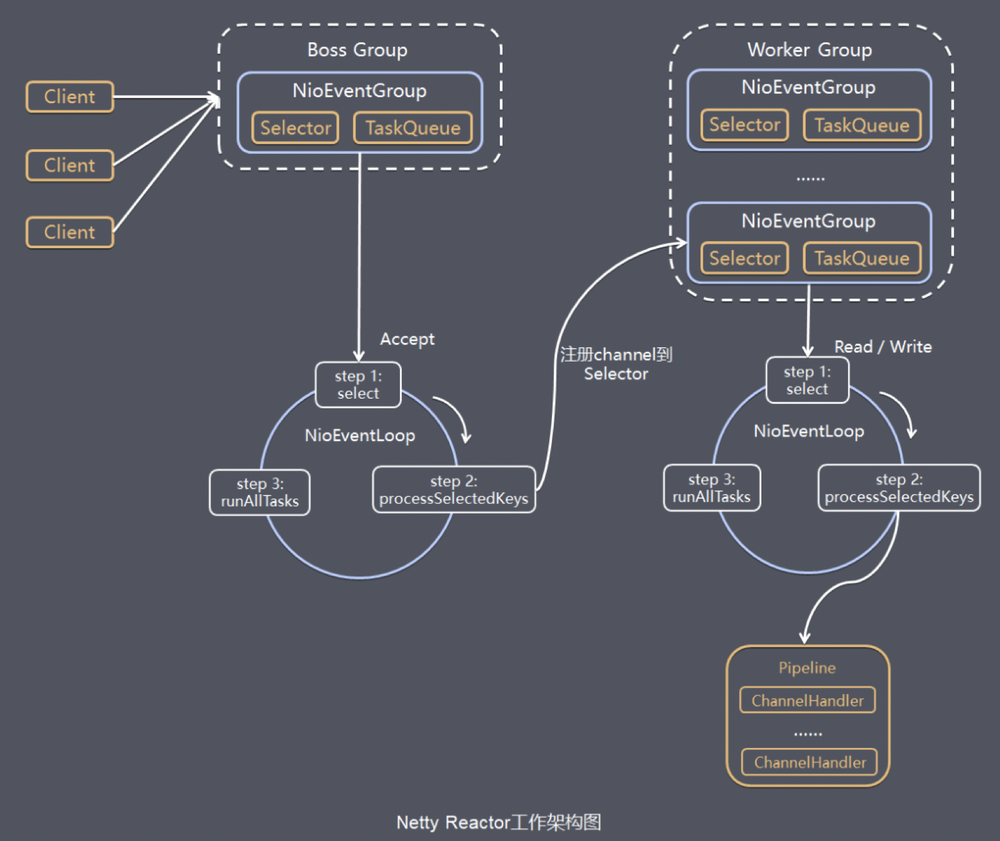

Netty的连接处理就是IO事件的处理，IO事件包括读事件、ACCEPT事件、写事件和OP_CONNECT事件。

>  IO事件的处理是结合ChanelPipeline来做的，一个IO事件到来，首先进行数据的读写操作，然后交给ChannelPipeline进行后续处理，ChannelPipeline中包含了channelHandler链（head + 自定义channelHandler + tail）。
> 使用channelPipeline和channelHandler机制，起到了解耦和可扩展的作用。一个IO事件的处理，包含了多个处理流程，这些处理流程正好对应channelPipeline中的channelHandler。如果对数据处理有新的需求，那么就新增channelHandler添加到channelPipeline中，这样实现很6，以后自己写代码可以参考。

说到这里，一般为了满足扩展性要求，常用2种模式：

- **方法模板模式**：模板中定义了各个主流程，并且留下对应hook方法，便于扩展。

- **责任链模式**：串行模式，可以动态添加链数量和对应回调方法。

netty的`channelHandler`的`channelPipeline`可以理解成就是责任链模式，通过动态增加channelHandler可达到复用和高扩展性目的。

了解netty连接处理机制之前需要了解下NioEventLoop模型，其中处理连接事件的架构图如下：


对应的处理逻辑源码为：

```java
// 处理各种IO事件
private void processSelectedKey(SelectionKey k, AbstractNioChannel ch) {
    final AbstractNioChannel.NioUnsafe unsafe = ch.unsafe();

    try {
        int readyOps = k.readyOps();
        if ((readyOps & SelectionKey.OP_CONNECT) != 0) {
            // OP_CONNECT事件，client连接上客户端时触发的事件
            int ops = k.interestOps();
            ops &= ~SelectionKey.OP_CONNECT;
            k.interestOps(ops);
            unsafe.finishConnect();
        }

        if ((readyOps & SelectionKey.OP_WRITE) != 0) {
            ch.unsafe().forceFlush();
        }

        if ((readyOps & (SelectionKey.OP_READ | SelectionKey.OP_ACCEPT)) != 0 || readyOps == 0) {
            // 注意，这里读事件和ACCEPT事件对应的unsafe实例是不一样的
            // 读事件 -> NioByteUnsafe,  ACCEPT事件 -> NioMessageUnsafe
            unsafe.read();
        }
    } catch (CancelledKeyException ignored) {
        unsafe.close(unsafe.voidPromise());
    }
}
```

从上面代码来看，事件主要分为3种，分别是OP_CONNECT事件、写事件和读事件（也包括ACCEPT事件）。下面分为3部分展开：

### ACCEPT事件

```java
// NioMessageUnsafe
public void read() {
    assert eventLoop().inEventLoop();
    final ChannelConfig config = config();
    final ChannelPipeline pipeline = pipeline();
    final RecvByteBufAllocator.Handle allocHandle = unsafe().recvBufAllocHandle();
    allocHandle.reset(config);
 
    boolean closed = false;
    Throwable exception = null;
    try {
        do {
            // 调用java socket的accept方法，接收请求
            int localRead = doReadMessages(readBuf);
            // 增加统计计数
            allocHandle.incMessagesRead(localRead);
        } while (allocHandle.continueReading());
    } catch (Throwable t) {
        exception = t;
    }
 
	// readBuf中存的是NioChannel
    int size = readBuf.size();
    for (int i = 0; i < size; i ++) {
        readPending = false;
        // 触发fireChannelRead
        pipeline.fireChannelRead(readBuf.get(i));
    }
    readBuf.clear();
    allocHandle.readComplete();
    pipeline.fireChannelReadComplete();
}
```

连接建立好之后就该连接的channel注册到workGroup中某个NIOEventLoop的selector中，注册操作是在fireChannelRead中完成的，这一块逻辑就在ServerBootstrapAcceptor.channelRead中。

```java
// ServerBootstrapAcceptor
public void channelRead(ChannelHandlerContext ctx, Object msg) {
    final Channel child = (Channel) msg;
 
    // 设置channel的pipeline handler，及channel属性
    child.pipeline().addLast(childHandler);
    setChannelOptions(child, childOptions, logger);
 
    for (Entry<AttributeKey<?>, Object> e: childAttrs) {
        child.attr((AttributeKey<Object>) e.getKey()).set(e.getValue());
    }
 
    try {
        // 将channel注册到childGroup中的Selector上
        childGroup.register(child).addListener(new ChannelFutureListener() {
            @Override
            public void operationComplete(ChannelFuture future) throws Exception {
                if (!future.isSuccess()) {
                    forceClose(child, future.cause());
                }
            }
        });
    } catch (Throwable t) {
        forceClose(child, t);
    }
}
```

### READ事件

```java
// NioByteUnsafe
public final void read() {
    final ChannelConfig config = config();
    final ChannelPipeline pipeline = pipeline();
    final ByteBufAllocator allocator = config.getAllocator();
    final RecvByteBufAllocator.Handle allocHandle = recvBufAllocHandle();
    allocHandle.reset(config);
 
    ByteBuf byteBuf = null;
    boolean close = false;
    try {
        do {
            byteBuf = allocHandle.allocate(allocator);
            // 从channel中读取数据，存放到byteBuf中
            allocHandle.lastBytesRead(doReadBytes(byteBuf));
 
            allocHandle.incMessagesRead(1);
            readPending = false;
 
            // 触发fireChannelRead
            pipeline.fireChannelRead(byteBuf);
            byteBuf = null;
        } while (allocHandle.continueReading());

        // 触发fireChannelReadComplete，如果在fireChannelReadComplete中执行了ChannelHandlerContext.flush，则响应结果返回给客户端
        allocHandle.readComplete();
		// 触发fireChannelReadComplete
        pipeline.fireChannelReadComplete();
 
        if (close) {
            closeOnRead(pipeline);
        }
    } catch (Throwable t) {
        if (!readPending && !config.isAutoRead()) {
            removeReadOp();
        }
    }
}
```

### 写事件

正常情况下一般是不会注册写事件的，如果Socket发送缓冲区中没有空闲内存时，再写入会导致阻塞，此时可以注册写事件，当有空闲内存（或者可用字节数大于等于其低水位标记）时，再响应写事件，并触发对应回调。

```java
if ((readyOps & SelectionKey.OP_WRITE) != 0) {
    // 写事件，从flush操作来看，虽然之前没有向socket缓冲区写数据，但是已经写入到
    // 了chnanel的outboundBuffer中，flush操作是将数据从outboundBuffer写入到
    // socket缓冲区
    ch.unsafe().forceFlush();
}
```

### CONNECT事件

该事件是client触发的，由主动建立连接这一侧触发的。

```java
if ((readyOps & SelectionKey.OP_CONNECT) != 0) {
    // OP_CONNECT事件，client连接上客户端时触发的事件
    int ops = k.interestOps();
    ops &= ~SelectionKey.OP_CONNECT;
    k.interestOps(ops);
 
    // 触发finishConnect事件，其中就包括fireChannelActive事件，如果有自定义的handler有channelActive方法，则会触发
    unsafe.finishConnect();
}
```

