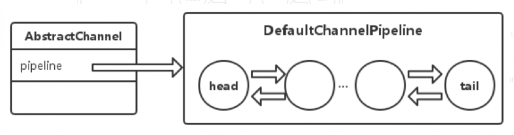
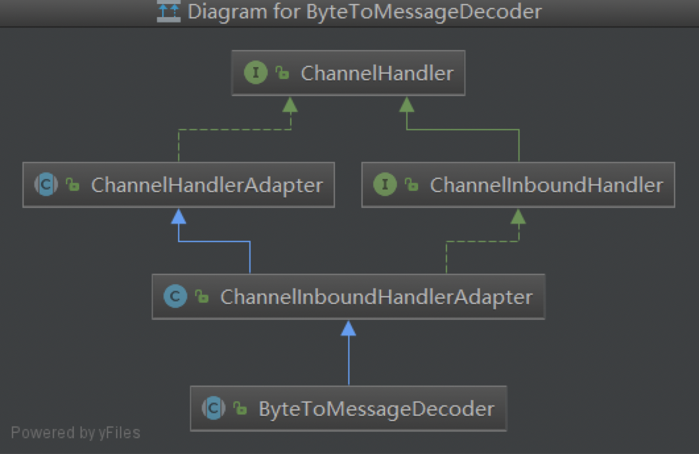
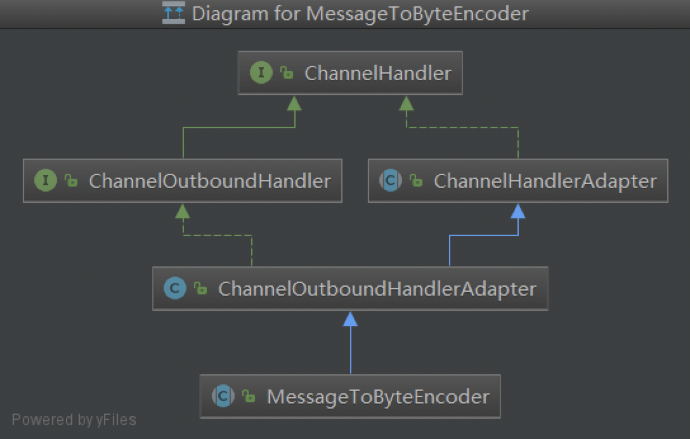
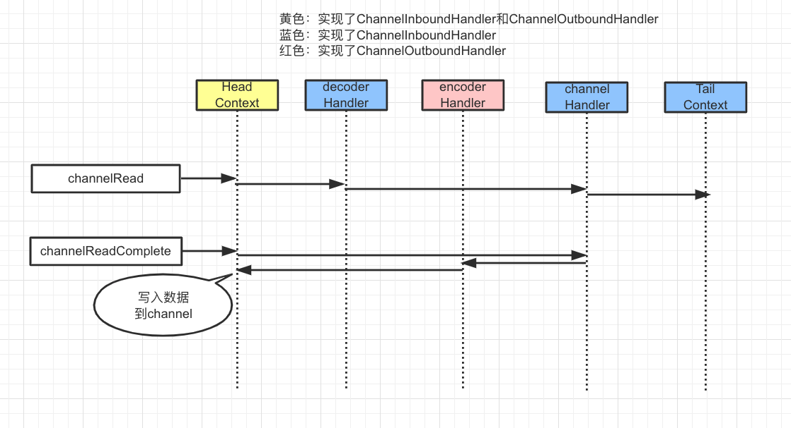

>  Pipeline和ChannelHandler是Netty处理流程的重要组成部分，ChannelHandler对应一个个业务处理器，Pipeline则是负责将各个ChannelHandler串起来的“容器”，二者结合起来一起完成Netty的处理流程。

## Pipeline

每个channel内部都会持有一个ChannelPipeline对象pipeline，pipeline默认实现DefaultChannelPipeline内部维护了一个DefaultChannelHandlerContext链表。


channel的读写操作都会走到DefaultChannelPipeline中，当channel完成register、active、read、readComplete等操作时，会触发pipeline的相应方法。

1. 当channel注册到selector后，触发pipeline的fireChannelRegistered方法；
2. 当channel是可用时，触发pipeline的fireChannelActive方法。（fireChannelActive触发一般是在fireChannelRegistered之后触发的）；
3. 当客户端发送数据时，触发pipeline的fireChannelRead方法；
4. 触发pipeline的fireChannelRead方法之后会触发pipeline的fireChannelReadComplete方法。

`DefaultChannelPipeline`是Netty默认pipeline实现，对应代码如下：

```java
public class DefaultChannelPipeline implements ChannelPipeline {
    // head和tail是handler的处理链/上下文
    final AbstractChannelHandlerContext head;
    final AbstractChannelHandlerContext tail;
    private final Channel channel;
     
    protected DefaultChannelPipeline(Channel channel) {
        this.channel = ObjectUtil.checkNotNull(channel, "channel");
        succeededFuture = new SucceededChannelFuture(channel, null);
        voidPromise =  new VoidChannelPromise(channel, true);
  
        tail = new TailContext(this);
        head = new HeadContext(this);
        head.next = tail;
        tail.prev = head;
    }
}
```

TailContext实现了ChannelOutboundHandler接口，HeadContext实现了ChannelInboundHandler和ChannelOutboundHandler接口，head和tail构成了一个链表。

>  对于Inbound操作，从head开始进行处理，向后遍历；对于OutBound操作，从tail开始处理，向前遍历。那么哪些操作是Inbound哪些是OutBound操作呢？

- **InBound**：channelRegistered、channelActive、channelRead、channelReadComplete；
- **OutBound**：bind、connect、close、flush等。

注意，HeadContext实现了`ChannelInboundHandler`和`ChannelOutboundHandler`接口，对于OutBound操作，最后也是会走到HeadContext来处理的，其实TailContext只是一个浅封装，实际逻辑并不多。HeadContext 中包含了一个netty底层的socket操作类，对于`bind/connect/disconnect/close/deregister/beginRead/read/wirte/flush`操作都是由unsafe对象来完成的。

```java
final class HeadContext extends AbstractChannelHandlerContext
        implements ChannelOutboundHandler, ChannelInboundHandler {
 
    // netty的底层socket操作类
    private final Unsafe unsafe;
 
    HeadContext(DefaultChannelPipeline pipeline) {
        super(pipeline, null, HEAD_NAME, false, true);
        unsafe = pipeline.channel().unsafe();
        setAddComplete();
    }
    // ...
}
```

channelPipeline的channelHandlerContext链表是“责任链”模式的体现，一个请求的处理可能会涉及到多个channelHandler，比如decodeHandler、自定义的业务channelHandler和encodeHandler。业务channelHandler示例如下：

```java
public class EchoHandler extends ChannelInboundHandlerAdapter {
    @Override
    public void channelRead(ChannelHandlerContext ctx, Object msg) {
        ByteBuf in = (ByteBuf) msg;
        System.out.println(in.toString(CharsetUtil.UTF_8));
        ctx.write(msg);
    }
    @Override
    public void channelReadComplete(ChannelHandlerContext ctx) {
        ctx.flush();
    }
    @Override
    public void exceptionCaught(ChannelHandlerContext ctx, Throwable cause) {
        cause.printStackTrace();
        ctx.close();
    }
}
```

> 在channelReadComplete方法中调用flush，其实会走到head.flush方法，最后调用unsafe.flush将数据发送出去。netty pipeline就是责任链（或者说是流水线）模式的体现，通过pipeline机制，使netty处理数据机制具有强大的扩展性和灵活性。

## ChannelHandler

netty的channelHandler是channel处理器，基于netty的业务处理，不管多么复杂，都是由channelHandler来做的，可能涉及到多个channelHandler，channelHandler分为多种类型：encoder、decoder、业务处理等。

#### decoderHandler

decoderHandler大都是接收到数据之后进行转换或者处理的，基本都是ByteToMessageDecoder的子类，其类图如下：


ByteToMessageDecoder中会有一个数据暂存缓冲区，如果接收到数据不完整，可以先暂存下等到下次接收到数据时再处理。

#### encoderHandler

encoderHandler大都是将message转换成bytebuf数据，基本都是MessageToByteEncoder的子类，其类图如下：


#### 业务channelHandler

业务处理channelHanler就是用户自定义的业务逻辑了，一般是在最后才addLast到channel.pipeline的，比如http处理逻辑如下：

```java
ServerBootstrap boot = new ServerBootstrap();
boot.group(bossGroup, workerGroup)
    .channel(NioServerSocketChannel.class)
    .localAddress(8080)
    .childHandler(new ChannelInitializer<SocketChannel>() {
        @Override
        protected void initChannel(SocketChannel ch) throws Exception {
            ch.pipeline()
                    .addLast("decoder", new HttpRequestDecoder())
                    .addLast("encoder", new HttpResponseEncoder())
                    .addLast("aggregator", new HttpObjectAggregator(512 * 1024))
                    .addLast("handler", new HttpHandler());
        }
    });
```

> DefaultChannelPipeline中的headContext（实现了ChannelOutboundHandler和ChannelInboundHandler）、tailContext（实现了ChannelOutboundHandler）和自定义的channelHandler（decoderHandler、ecoderHandler、channelHandler等，一般实现ChannelInboundHandler），通过ChannelHandlerContext的链接，组成了一个请求处理链。

注意，ChannelOutboundHandler和ChannelInboundHandler的顺序如何添加的，其实只要记住一条：ChannelOutboundHandler之间要保证顺序，ChannelInboundHandler之间要保证顺序，二者之间无需保证顺序。

channelHandler的运行流程图：


`TailContesxt`本身代码不多并且挺多方法都是"空实现"，不过它的channelRead方法内部会执行`ReferenceCountUtil.release(msg)`释放msg占用的内存空间，也就是说在`未定义用户ChannelHandler`或者`用户ChannelHandler的channelRead继续传递后续ChannelHandler的channelRead`时，到TailContext的channelRead时会自动释放msg所占用内存。