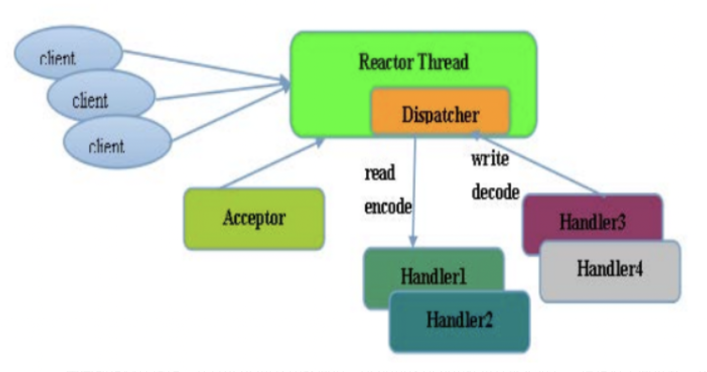
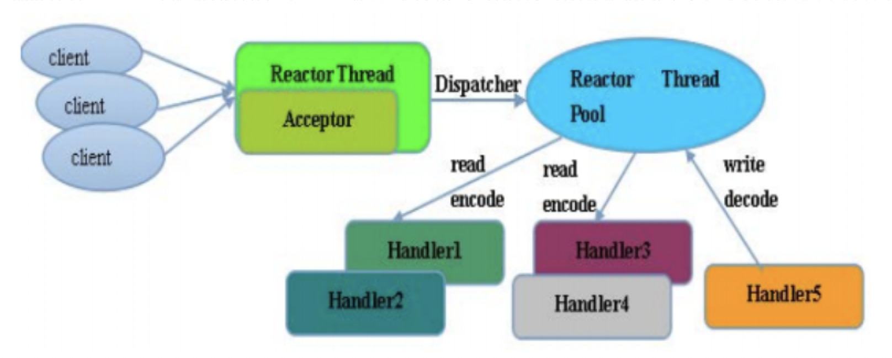
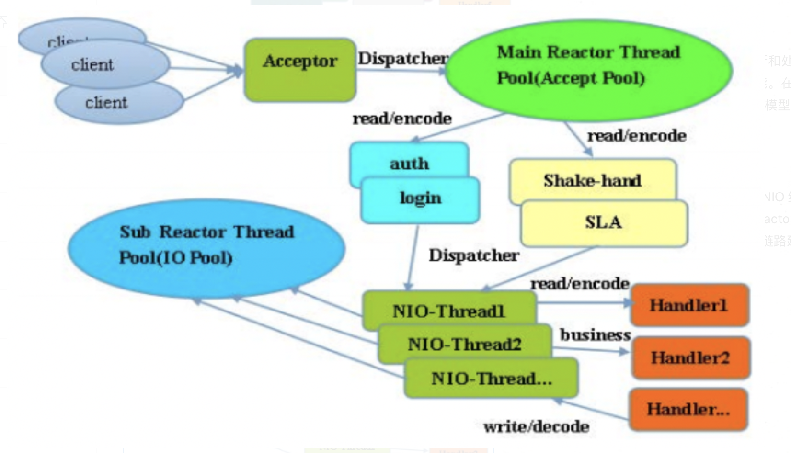
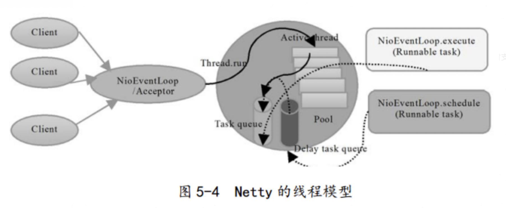
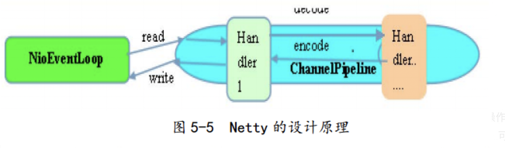
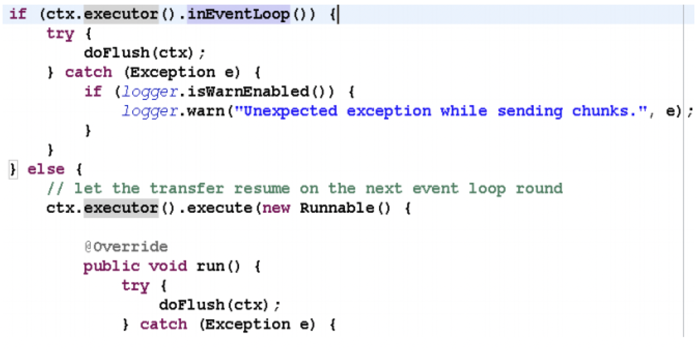

要学习netty线程模型，先了解下NIO和AIO、reactor和proactor模型，这样理解netty线程模型和IO模型更轻松。

**IO模型**

- BIO：同步阻塞IO模型；
- NIO：基于IO多路复用技术的“非阻塞同步”IO模型。简单来说，内核将可读可写事件通知应用，由应用主动发起读写操作；
- AIO：非阻塞异步IO模型。简单来说，内核将读完成事件通知应用，读操作由内核完成，应用只需操作数据即可；应用做异步写操作时立即返回，内核会进行写操作排队并执行写操作。

NIO和AIO不同之处在于应用是否进行真正的读写操作。

**reactor和proactor模型**

- reactor：基于NIO技术，可读可写时通知应用；
- proactor：基于AIO技术，读完成时通知应用，写操作应用通知内核。

## netty线程模型

>  netty的线程模型是基于Reactor模型的。

### netty单线程模型

Reactor 单线程模型，是指所有的 I/O 操作都在同一个 NIO 线程上面完成的，此时NIO线程职责包括：接收新建连接请求、读写操作等。


在一些小容量应用场景下，可以使用单线程模型（`注意，Redis的请求处理也是单线程模型，为什么Redis的性能会如此之高呢？因为Redis的读写操作基本都是内存操作，并且Redis协议比较简洁，序列化/反序列化耗费性能更低`）。但是对于高负载、大并发的应用场景却不合适，主要原因如下：

- 一个NIO线程同时处理成百上千的连接，性能上无法支撑，即便NIO线程的CPU负荷达到100%，也无法满足海量消息的编码、解码、读取和发送。
- 当NIO线程负载过重之后，处理速度将变慢，这会导致大量客户端连接超时，超时之后往往会进行重发，这更加重了NIO线程的负载，最终会导致大量消息积压和处理超时，成为系统的性能瓶颈。
- 可靠性问题：一旦NIO线程意外跑飞，或者进入死循环，会导致整个系统通信模块不可用，不能接收和处理外部消息，造成节点故障。

### Reactor多线程模型

Rector 多线程模型与单线程模型最大的区别就是有一组 NIO 线程来处理连接读写操作，一个NIO线程处理Accept。一个NIO线程可以处理多个连接事件，一个连接的事件只能属于一个NIO线程。


在绝大多数场景下，Reactor 多线程模型可以满足性能需求。但是，在个别特殊场景中，一个 NIO 线程负责监听和处理所有的客户端连接可能会存在性能问题。例如并发百万客户端连接，或者服务端需要对客户端握手进行安全认证，但是认证本身非常损耗性能。在这类场景下，单独一个 Acceptor 线程可能会存在性能不足的问题，为了解决性能问题，产生了第三种 Reactor 线程模型——主从Reactor 多线程模型。

### Reactor主从多线程模型

主从 Reactor 线程模型的特点是：服务端用于接收客户端连接的不再是一个单独的 NIO 线程，而是一个独立的 NIO 线程池。Acceptor 接收到客户端 TCP连接请求并处理完成后（可能包含接入认证等），将新创建的 SocketChannel注 册 到 I/O 线 程 池（sub reactor 线 程 池）的某个I/O线程上， 由它负责SocketChannel 的读写和编解码工作。Acceptor 线程池仅仅用于客户端的登录、握手和安全认证，一旦链路建立成功，就将链路注册到后端 subReactor 线程池的 I/O 线程上，由 I/O 线程负责后续的 I/O 操作。


## netty线程模型思考

netty 的线程模型并不是一成不变的，它实际取决于用户的启动参数配置。通过设置不同的启动参数，Netty 可以同时支持 Reactor 单线程模型、多线程模型。


为了尽可能地提升性能，Netty 在很多地方进行了无锁化的设计，例如在 I/O 线程内部进行串行操作，避免多线程竞争导致的性能下降问题。表面上看，串行化设计似乎 CPU 利用率不高，并发程度不够。但是，通过调整 NIO 线程池的线程参数，可以同时启动多个串行化的线程并行运行，这种局部无锁化的串行线程设计相比一个队列多个工作线程的模型性能更优。（`小伙伴们后续多线程并发流程可参考该类实现方案`）


Netty 的 NioEventLoop 读取到消息之后，直接调用 ChannelPipeline 的`fireChannelRead (Object msg)`。 只要用户不主动切换线程， 一直都是由NioEventLoop 调用用户的 ChannelHandler，期间不进行线程切换。这种串行化处理方式避免了多线程操作导致的锁的竞争，从性能角度看是最优的。

Netty拥有两个NIO线程池，分别是`bossGroup`和`workerGroup`，前者处理新建连接请求，然后将新建立的连接轮询交给workerGroup中的其中一个NioEventLoop来处理，后续该连接上的读写操作都是由同一个NioEventLoop来处理。注意，虽然bossGroup也能指定多个NioEventLoop（一个NioEventLoop对应一个线程），但是默认情况下只会有一个线程，因为一般情况下应用程序只会使用一个对外监听端口。

> 这里试想一下，难道不能使用多线程来监听同一个对外端口么，即多线程epoll_wait到同一个epoll实例上？

epoll相关的主要两个方法是epoll_wait和epoll_ctl，多线程同时操作同一个epoll实例，那么首先需要确认epoll相关方法是否线程安全：**简单来说，epoll是通过锁来保证线程安全的, epoll中粒度最小的自旋锁ep->lock(spinlock)用来保护就绪的队列, 互斥锁ep->mtx用来保护epoll的重要数据结构红黑树**。

看到这里，可能有的小伙伴想到了Nginx多进程针对监听端口的处理策略，Nginx是通过accept_mutex机制来保证的。accept_mutex是nginx的(新建连接)负载均衡锁，让多个worker进程轮流处理与client的新连接。当某个worker进程的连接数达到worker_connections配置（单个worker进程的最大处理连接数）的最大连接数的7/8时，会大大减小获取该worker获取accept锁的概率，以此实现各worker进程间的连接数的负载均衡。accept锁默认打开，关闭它时nginx处理新建连接耗时会更短，但是worker进程之间可能连接不均衡，并且存在“惊群”问题。只有在使能accept_mutex并且当前系统不支持原子锁时，才会用文件实现accept锁。注意，accept_mutex加锁失败时不会阻塞当前线程，类似tryLock。

>  现代linux中，多个socker同时监听同一个端口也是可行的，nginx 1.9.1也支持这一行为。linux 3.9以上内核支持SO_REUSEPORT选项，允许多个socker bind/listen在同一端口上。这样，多个进程可以各自申请socker监听同一端口，当连接事件来临时，内核做负载均衡，唤醒监听的其中一个进程来处理，reuseport机制有效的解决了epoll惊群问题。

再回到刚才提出的问题，java中多线程来监听同一个对外端口，epoll方法是线程安全的，这样就可以使用使用多线程监听epoll_wait了么，当然是不建议这样干的，除了epoll的惊群问题之外，还有一个就是，一般开发中我们使用epoll设置的是LT模式（`水平触发方式，与之相对的是ET默认，前者只要连接事件未被处理就会在epoll_wait时始终触发，后者只会在真正有事件来时在epoll_wait触发一次`），这样的话，多线程epoll_wait时就会导致第一个线程epoll_wait之后还未处理完毕已发生的事件时，第二个线程也会epoll_wait返回，显然这不是我们想要的，关于java nio的测试demo如下：

```java
public class NioDemo {
    private static AtomicBoolean flag = new AtomicBoolean(true);
    public static void main(String[] args) throws Exception {
        ServerSocketChannel serverChannel = ServerSocketChannel.open();
        serverChannel.socket().bind(new InetSocketAddress(8080));
        // non-block io
        serverChannel.configureBlocking(false);
        Selector selector = Selector.open();
        serverChannel.register(selector, SelectionKey.OP_ACCEPT);

        // 多线程执行
        Runnable task = () -> {
            try {
                while (true) {
                    if (selector.select(0) == 0) {
                        System.out.println("selector.select loop... " + Thread.currentThread().getName());
                        Thread.sleep(1);
                        continue;
                    }

                    if (flag.compareAndSet(true, false)) {
                        System.out.println(Thread.currentThread().getName() + " over");
                        return;
                    }

                    Iterator<SelectionKey> iter = selector.selectedKeys().iterator();
                    while (iter.hasNext()) {
                        SelectionKey key = iter.next();

                        // accept event
                        if (key.isAcceptable()) {
                            handlerAccept(selector, key);
                        }

                        // socket event
                        if (key.isReadable()) {
                            handlerRead(key);
                        }

                        /**
                         * Selector不会自己从已选择键集中移除SelectionKey实例，必须在处理完通道时手动移除。
                         * 下次该通道变成就绪时，Selector会再次将其放入已选择键集中。
                         */
                        iter.remove();
                    }
                }
            } catch (Exception e) {
                e.printStackTrace();
            }
        };

        List<Thread> threadList = new ArrayList<>();
        for (int i = 0; i < 2; i++) {
            Thread thread = new Thread(task);
            threadList.add(thread);
            thread.start();
        }
        for (Thread thread : threadList) {
            thread.join();
        }
        System.out.println("main end");
    }

    static void handlerAccept(Selector selector, SelectionKey key) throws Exception {
        System.out.println("coming a new client... " + Thread.currentThread().getName());
        Thread.sleep(10000);
        SocketChannel channel = ((ServerSocketChannel) key.channel()).accept();
        channel.configureBlocking(false);
        channel.register(selector, SelectionKey.OP_READ, ByteBuffer.allocate(1024));
    }

    static void handlerRead(SelectionKey key) throws Exception {
        SocketChannel channel = (SocketChannel) key.channel();
        ByteBuffer buffer = (ByteBuffer) key.attachment();
        buffer.clear();

        int num = channel.read(buffer);
        if (num <= 0) {
            // error or fin
            System.out.println("close " + channel.getRemoteAddress());
            channel.close();
        } else {
            buffer.flip();
            String recv = Charset.forName("UTF-8").newDecoder().decode(buffer).toString();
            System.out.println("recv: " + recv);

            buffer = ByteBuffer.wrap(("server: " + recv).getBytes());
            channel.write(buffer);
        }
    }
}
```

## netty线程模型实践

**(1) 时间可控的简单业务直接在 I/O 线程上处理**

时间可控的简单业务直接在 I/O 线程上处理，如果业务非常简单，执行时间非常短，不需要与外部网络交互、访问数据库和磁盘，不需要等待其它资源，则建议直接在业务 ChannelHandler 中执行，不需要再启业务的线程或者线程池。避免线程上下文切换，也不存在线程并发问题。

**(2) 复杂和时间不可控业务建议投递到后端业务线程池统一处理**

复杂度较高或者时间不可控业务建议投递到后端业务线程池统一处理，对于此类业务，不建议直接在业务 ChannelHandler 中启动线程或者线程池处理，建议将不同的业务统一封装成 Task，统一投递到后端的业务线程池中进行处理。过多的业务ChannelHandler 会带来开发效率和可维护性问题，不要把 Netty 当作业务容器，对于大多数复杂的业务产品，仍然需要集成或者开发自己的业务容器，做好和Netty 的架构分层。

**(3) 业务线程避免直接操作 ChannelHandler**

业务线程避免直接操作 ChannelHandler，对于 ChannelHandler，IO 线程和业务线程都可能会操作，因为业务通常是多线程模型，这样就会存在多线程操作ChannelHandler。为了尽量避免多线程并发问题，建议按照 Netty 自身的做法，通过将操作封装成独立的 Task 由 NioEventLoop 统一执行，而不是业务线程直接操作，相关代码如下所示：


如果你确认并发访问的数据或者并发操作是安全的，则无需多此一举，这个需要根据具体的业务场景进行判断，灵活处理。

参考资料：

1、https://blog.csdn.net/yangguosb/article/details/80053731

2、https://segmentfault.com/a/1190000007403873

3、《深入浅出Netty》

4、[为什么epoll是线程安全？](https://zhuanlan.zhihu.com/p/30937065)

