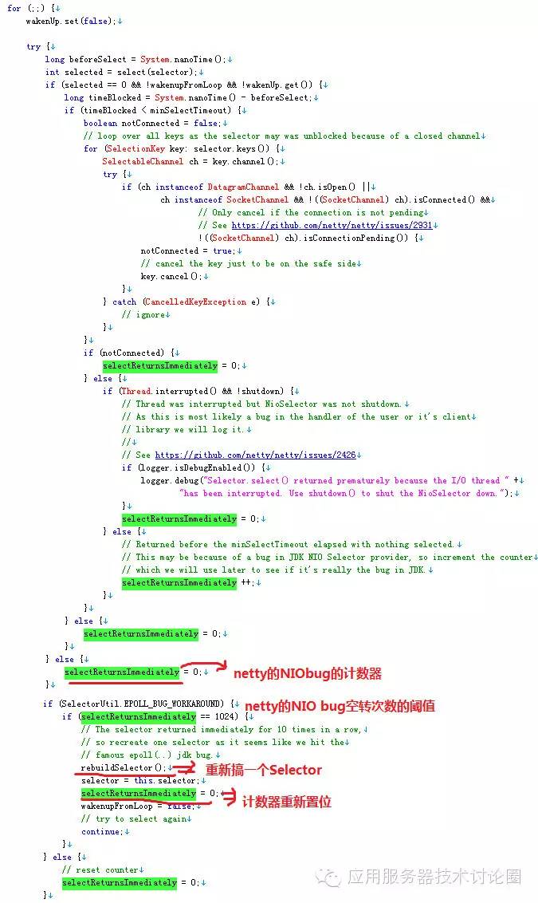

epoll机制是Linux下一种高效的IO复用方式，相较于select和poll机制来说。其高效的原因是将基于事件的fd放到内核中来完成，在内核中基于红黑树+链表数据结构来实现，链表存放有事件发生的fd集合，然后在调用epoll_wait时返回给应用程序，由应用程序来处理这些fd事件。

使用IO复用，Linux下一般默认就是epoll，Java NIO在Linux下默认也是epoll机制，但是JDK中epoll的实现却是有漏洞的，其中最有名的java nio epoll bug就是即使是关注的select轮询事件返回数量为0，NIO照样不断的从select本应该阻塞的`Selector.select()/Selector.select(timeout)`中wake up出来，导致CPU 100%问题。如下图所示：


那么产生这个问题的原因是什么的？其实在 https://bugs.java.com/bugdatabase/view_bug.do?bug_id=6670302 上已经说明的很清楚了，比如下面是bug复现的一个场景：

```
A DESCRIPTION OF THE PROBLEM :
The NIO selector wakes up infinitely in this situation..
0. server waits for connection
1. client connects and write message
2. server accepts and register OP_READ
3. server reads message and remove OP_READ from interest op set
4. client close the connection
5. server write message (without any reading.. surely OP_READ is not set)
6. server's select wakes up infinitely with return value 0
```

上面的场景描述的问题就是连接出现了RST，因为poll和epoll对于突然中断的连接socket会对返回的eventSet事件集合置为POLLHUP或者POLLERR，eventSet事件集合发生了变化，这就导致Selector会被唤醒，进而导致CPU 100%问题。根本原因就是JDK没有处理好这种情况，比如SelectionKey中就没定义有异常事件的类型。

```java
class SelectionKey {
    public static final int OP_READ = 1 << 0;
    public static final int OP_WRITE = 1 << 2;
    public static final int OP_CONNECT = 1 << 3;
    public static final int OP_ACCEPT = 1 << 4;
}
```

既然nio epoll bug存在，那么能不能规避呢？答案是有的，比如netty就很巧妙的规避了这个问题，它的处理机制就是如果发生了这种情况，并且发生次数超过了SELECTOR_AUTO_REBUILD_THRESHOLD（默认512），则调用rebuildSelector()进行Selecttor重建，这样就不用管之前发生了异常情况的那个连接了。因为重建也是根据SelectionKey事件对应的连接来重新注册的。

> 该问题最早在 Java 6 发现，随后很多版本声称解决了该问题，但实际上只是降低了该 bug 的出现频率，目前从网上搜索到的资料显示，Java 8 还是存在该问题（[当 Thrift 遇到 JDK Epoll Bug](https://juejin.im/entry/5995084ef265da247779d23c)）。

最后一起来分析下，nio epoll bug不是linux epoll的问题，而是JDK自己实现epoll时没有考虑这种情况，或者说因为其他系统不存在这个问题，Java为了封装（比如SelectionKey 中的4个事件类型）的统一而没去处理？

> 这里思考下，如果想要从java nio层面上来解决这个问题，该如何做呢？

一种是nio事件类型SelectionKey新加一种"错误"类型，比如针对linux epoll中的epollhup和epollerr，如果出现这种事件，建议程序直接close socket，但这种方式相对来说对于目前的nio SelectionKey改动有点大，因为SelectionKey的定义目前是针对所有jdk平台的；还有一种是针对jdk nio 对epoll的封装中，对于epoll的epollhup和epollerr事件，epoll封装内部直接处理，比如close socket，但是这种方案也有一点尴尬的是，可能上层应用代码还保留有出现问题的socket引用，这时最好是应用程序能够感知这种情况来处理比较好。

> Java nio空转问题由来已久，一般程序中是通过新建Selector的方式来屏蔽掉了JDK5/6的这个问题，因此，对于开发者来讲，还是尽量将JDK的版本更新到最新，或者使用NIO框架如Netty，Grizzly等进行研发，以免出更多的问题。

