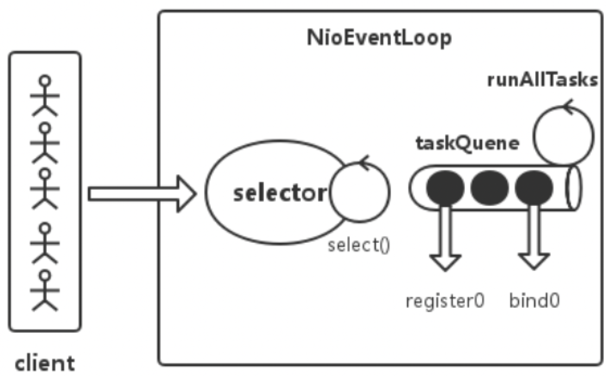
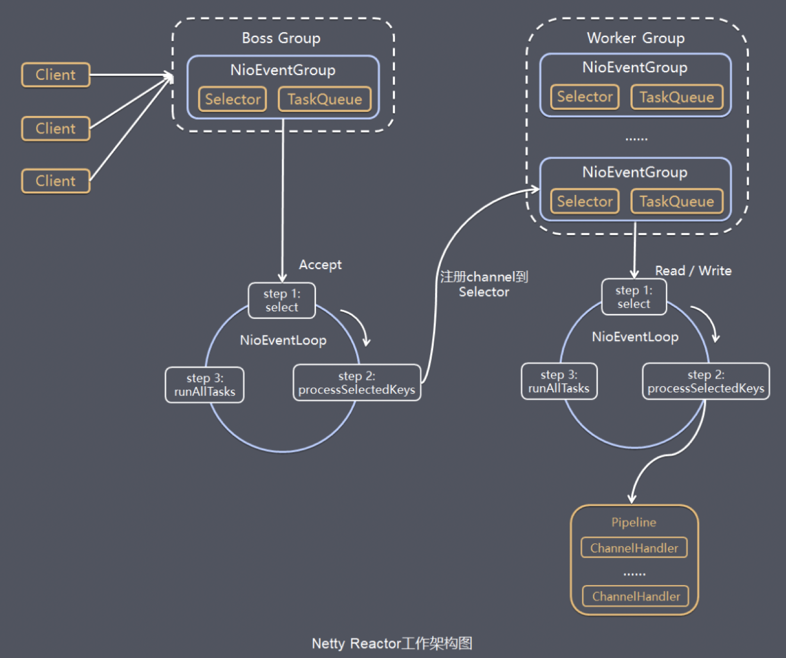

> 本文主要讨论Netty NioEventLoop原理及实践，关于Netty NioEventLoop，首先要知道NioEventLoop是什么，为什么它会是Netty核心Reactor处理器，实现原理是什么，进而再讨论Netty对其的实现及使用上我们可以学到哪些。

EventLoop是一个Reactor模型的事件处理器，一个EventLoop对应一个线程，其内部会维护一个selector和taskQueue，负责处理客户端请求和内部任务，内部任务如ServerSocketChannel注册、ServerSocket绑定和延时任务处理等操作。

EventLoop是由事件驱动的，比如IO事件和任务等，IO事件即selectionKey中ready的事件，如`accept、connect、read、write`等，由processSelectedKeys方法触发。处理完请求时间之后，会处理内部添加到taskQueue中的任务，如`register0、bind0`等任务，由runAllTasks方法触发。注意NioEventLoop在Linux中默认底层是基于epoll机制。


上图是EventLoop的核心流程图，如果从Netty整体视角看EventLoop的事件流转，下图来的更直观：


> 注意：bossGroup和WorkerGroup中的NioEventLoop流程是一致的，只不过前者处理Accept事件之后将连接注册到后者，由后者处理该连接上后续的读写事件。

大致了解了NioEventLoop之后，不知道有没有小伙伴有这样的疑问，为什么Netty要这样实现呢，这种实现方案对于我们后续开发如何借鉴呢？关于这些疑问，本文最后讨论哈 :)

## EventLoop实现原理

EventLoop是一个**Reactor模型**的事件处理器，一个EventLoop对应一个线程，其内部会维护一个selector和taskQueue，负责处理IO事件和内部任务。IO事件和内部任务执行时间百分比通过ioRatio来调节，ioRatio表示执行IO时间所占百分比。任务包括普通任务和已经到时的延迟任务，延迟任务存放到一个优先级队列PriorityQueue中，执行任务前从PriorityQueue读取所有到时的task，然后添加到taskQueue中，最后统一执行task。

### 事件处理机制

EventLoop是由事件驱动的，比如IO事件即selectionKey中ready的事件，如`accept、connect、read、write`等，处理的核心逻辑主要是在`NioEventLoop.run`方法中，流程如下：

```java
protected void run() {
    for (;;) {
        /* 如果hasTasks，则调用selector.selectNow()，非阻塞方式获取channel事件，没有channel事件时可能返回为0。这里用非阻塞方式是为了尽快获取连接事件，然后处理连接事件和内部任务。*/
      switch (selectStrategy.calculateStrategy(selectNowSupplier, hasTasks())) {
        case SelectStrategy.CONTINUE:
          continue;
        case SelectStrategy.SELECT:
          select(wakenUp.getAndSet(false));
          if (wakenUp.get()) {
            selector.wakeup();
          }
        default:
      }

      cancelledKeys = 0;
      needsToSelectAgain = false;
      /* ioRatio调节连接事件和内部任务执行事件百分比
       * ioRatio越大，连接事件处理占用百分比越大 */
      final int ioRatio = this.ioRatio;
      if (ioRatio == 100) {
        try {
          processSelectedKeys();
        } finally {
          runAllTasks();
        }
      } else {
        final long ioStartTime = System.nanoTime();
        try {
          processSelectedKeys();
        } finally {
          final long ioTime = System.nanoTime() - ioStartTime;
          runAllTasks(ioTime * (100 - ioRatio) / ioRatio);
        }
      }
    }
}
```

从代码上，在执行`select()`前有一个`hasTasks()`的操作，这个`hasTasks()`方法判断当前taskQueue是否有元素。如果taskQueue中有元素，执行 selectNow() 方法，最终执行`selector.selectNow()`，该方法会立即返回，保证了EventLoop在有任务执行时不会因为IO事件迟迟不来造成延后处理，这里优先处理IO事件，然后再处理任务。

如果当前taskQueue没有任务时，就会执行`select(wakenUp.getAndSet(false))`方法，代码如下：

```java
/* 这个方法解决了Nio中臭名昭著的bug：selector的select方法导致空轮询 cpu100% */
private void select(boolean oldWakenUp) throws IOException {
    Selector selector = this.selector;
    try {
        int selectCnt = 0;
        long currentTimeNanos = System.nanoTime();
 
        /* delayNanos(currentTimeNanos)：计算延迟任务队列中第一个任务的到期执行时间（即最晚还能延迟多长时间执行），默认返回1s。每个SingleThreadEventExecutor都持有一个延迟执行任务的优先队列PriorityQueue，启动线程时，往队列中加入一个任务。*/
        long selectDeadLineNanos = currentTimeNanos + delayNanos(currentTimeNanos);
        for (;;) {
            /* 如果延迟任务队列中第一个任务的最晚还能延迟执行的时间小于500000纳秒，且selectCnt == 0（selectCnt 用来记录selector.select方法的执行次数和标识是否执行过selector.selectNow()），则执行selector.selectNow()方法并立即返回。*/
            long timeoutMillis = (selectDeadLineNanos - currentTimeNanos + 500000L) / 1000000L;
            if (timeoutMillis <= 0) {
                if (selectCnt == 0) {
                    selector.selectNow();
                    selectCnt = 1;
                }
                break;
            }
             
            if (hasTasks() && wakenUp.compareAndSet(false, true)) {
                selector.selectNow();
                selectCnt = 1;
                break;
            }
 
            // 超时阻塞select
            int selectedKeys = selector.select(timeoutMillis);
            selectCnt ++;
            System.out.println(selectCnt);
 
            // 有事件到来 | 被唤醒 | 有内部任务 | 有定时任务时，会返回
            if (selectedKeys != 0 || oldWakenUp || wakenUp.get() || hasTasks() || hasScheduledTasks()) {
                break;
            }
 
            long time = System.nanoTime();
            if (time - TimeUnit.MILLISECONDS.toNanos(timeoutMillis) >= currentTimeNanos) {
                // 阻塞超时后没有事件到来，重置selectCnt
                selectCnt = 1;
            } else if (SELECTOR_AUTO_REBUILD_THRESHOLD > 0 &&
                    selectCnt >= SELECTOR_AUTO_REBUILD_THRESHOLD) {
                // Selector重建
                rebuildSelector();
                selector = this.selector;
                // Select again to populate selectedKeys.
                selector.selectNow();
                selectCnt = 1;
                break;
            }
            currentTimeNanos = time;
        }
    } catch (CancelledKeyException e) {
        // Harmless exception - log anyway
    }
}
```

当java NIO bug触发时，进行Selector重建，rebuildSelector过程如下：

1. 通过方法openSelector创建一个新的selector。
2. 将old selector的selectionKey执行cancel。
3. 将old selector的channel重新注册到新的selector中。

Netty的连接处理就是IO事件的处理，IO事件包括读事件、ACCEPT事件、写事件和OP_CONNECT事件：

- ACCEPT事件：连接建立好之后将该连接的channel注册到workGroup中某个NIOEventLoop的selector中；
- READ事件：从channel中读取数据，存放到byteBuf中，触发后续的ChannelHandler来处理数据；
- WRITE事件：正常情况下一般是不会注册写事件的，如果Socket发送缓冲区中没有空闲内存时，在写入会导致阻塞，此时可以注册写事件，当有空闲内存（或者可用字节数大于等于其低水位标记）时，再响应写事件，并触发对应回调。
- CONNECT事件：该事件是client触发的，由主动建立连接这一侧触发的。

### 任务处理机制

任务处理也就是处理内部任务，这里也包括延时任务，延时任务到时后会移动到taskQueue然后被执行。任务处理是在IO事件处理之后进行的，IO事件和内部任务执行时间百分比可以通过ioRatio来调节，ioRatio表示执行IO时间所占百分比。

```java
/* timeoutNanos：任务执行花费最长耗时/
protected boolean runAllTasks(long timeoutNanos) {
    // 把scheduledTaskQueue中已经超过延迟执行时间的任务移到taskQueue中等待被执行。
    fetchFromScheduledTaskQueue();
 
    // 非阻塞方式pollTask
    Runnable task = pollTask();
    if (task == null) {
        afterRunningAllTasks();
        return false;
    }
 
    final long deadline = ScheduledFutureTask.nanoTime() + timeoutNanos;
    long runTasks = 0;
    long lastExecutionTime;
    for (;;) {
        // 执行task
        safeExecute(task);
        runTasks ++;
        // 依次从taskQueue任务task执行，每执行64个任务，进行耗时检查。
        // 如果已执行时间超过预先设定的执行时间，则停止执行非IO任务，避免非IO任务太多，影响IO任务的执行。
        if ((runTasks & 0x3F) == 0) {
            lastExecutionTime = ScheduledFutureTask.nanoTime();
            if (lastExecutionTime >= deadline) {
                break;
            }
        }
 
        task = pollTask();
        if (task == null) {
            lastExecutionTime = ScheduledFutureTask.nanoTime();
            break;
        }
    }
    afterRunningAllTasks();
    this.lastExecutionTime = lastExecutionTime;
    return true;
}
```

> 注意，任务的处理过程中有个执行一定量任务后的执行时间耗时检查动作，这里是为了避免任务的处理时间过长，影响Netty网络IO的处理效率，毕竟Netty是要处理大量网络IO的。

## 对于NioEventLoop实现的思考

EventLoop是一个Reactor模型的事件处理器，一个EventLoop对应一个线程，其内部会维护一个selector和taskQueue，负责处理网络IO请求和内部任务，这里的selector和taskQueue是线程内部的。

Netty的BossGroup和WorkerGroup可能包含多个EventLoop，BossGroup接收到请求之后轮询交给WorkerGroup中的其中一个线程（对应一个NioEventLoop）来处理，也就是连接之间的处理是线程独立的，这也就是NioEventLoop流程的无锁化设计。

从EventLoop“无锁化”设计和常见的锁机制对比来看，要实现线程并发安全，有两种实现策略：

- 数据隔离：数据隔离就是数据产生后就提交给不同的线程来处理，线程内部一般有一个数据容器来保存待处理的数据，这里的提交动作需要保证是安全的，比如Netty的BossGroup将建立好的连接注册到WorkerGroup时，是由内核来保证线程安全的（比如Linux就是通过epoll_ctl方法，该方法是线程安全的）；
- 数据分配：数据产生后统一放在数据容器中，由数据消费线程自己来获取数据进行处理，这里的获取动作需要保证是安全的，一般通过锁机制来保护，比如Java线程池中线程从阻塞队列中获取任务进行执行，就是由阻塞队列保证线程安全。

对于数据隔离和数据分配来说，二者都有优缺点及适用场景。对于数据隔离来说，一般“锁”交互少成本较低，并且其隔离性较好，线程内部如果有新数据产生还继续由该线程来处理，但是可能造成数据负载不均衡；对于数据分配来说，“锁”交互较多，但是由于数据处理线程都是从同一数据容器消费数据，所以不会出现数据处理负载不均衡问题。

> 如果想实现类似EventLoop中单个线程对应一个处理队列的方案，可以使用只配置一个线程的Java线程池，达到类似的实现效果。