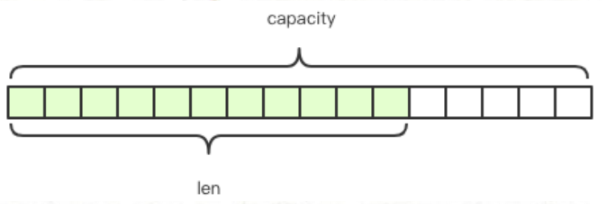
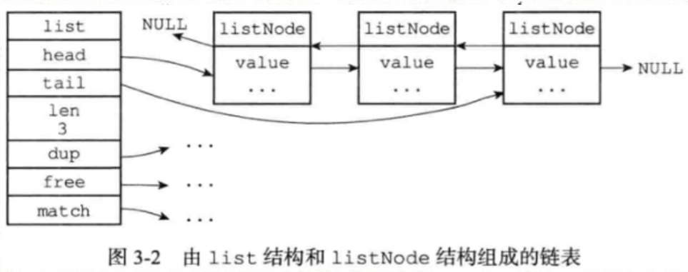
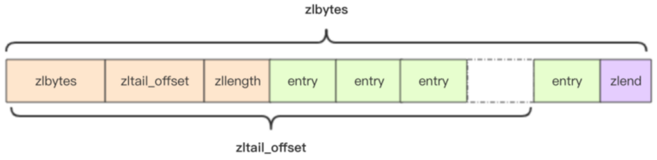
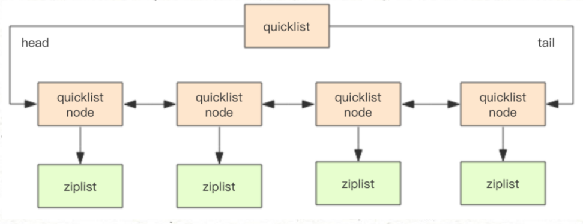
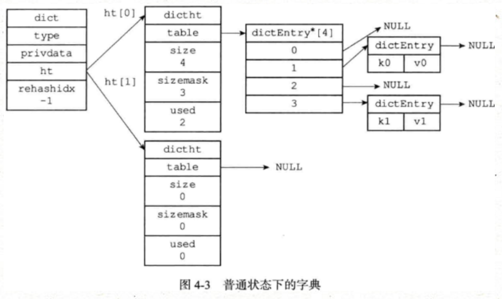
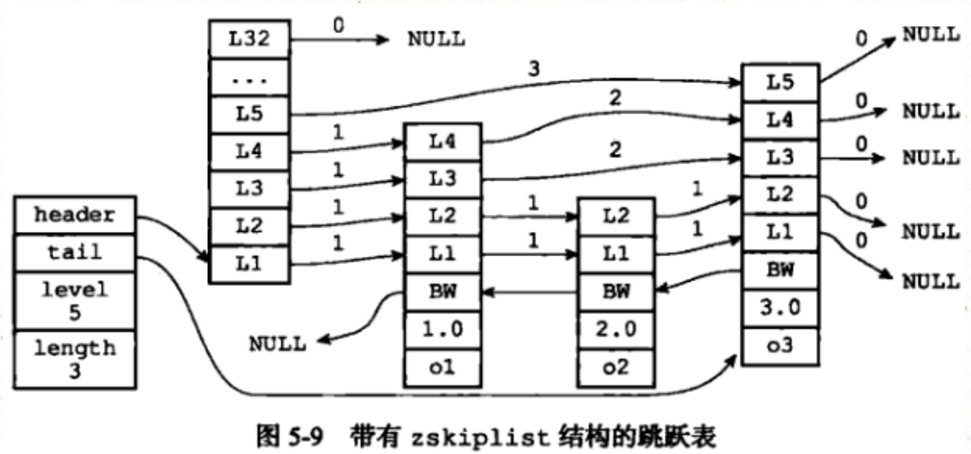
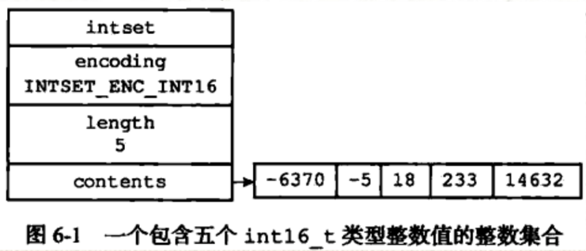
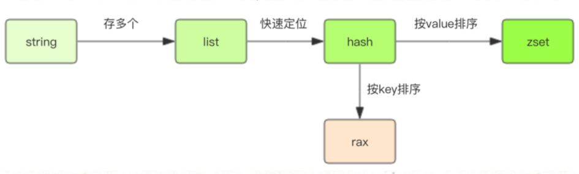
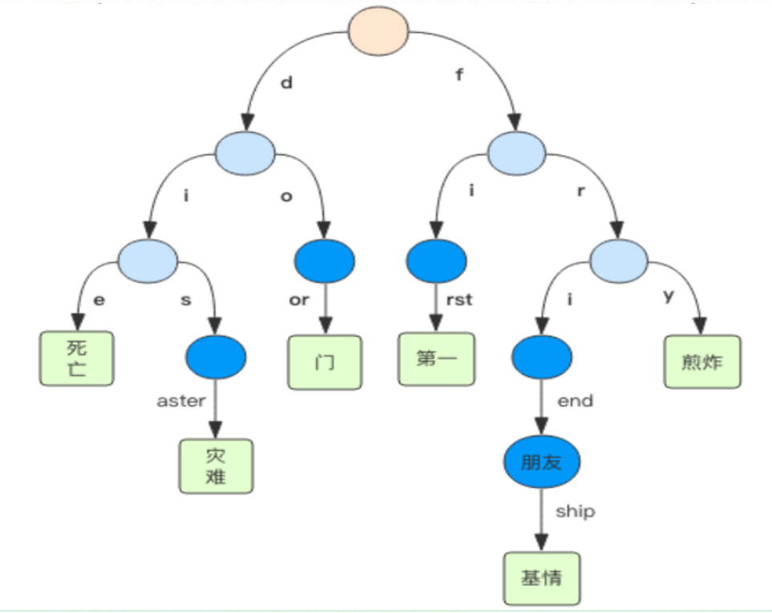

Redis用到的底层数据结构有：简单动态字符串、双端链表、字典、压缩列表、整数集合、跳跃表等，Redis并没有直接使用这些数据结构来实现键值对数据库，而是基于这些基础数据结构创建了一个对象系统，这写对象包括字符串对象、列表对象、哈希对象、集合对象和有序集合对象等。
<!--more-->

## 简单动态字符串

redis自定义了简单动态字符串数据结构（sds），并将其作为默认字符串表示。
```c
struct SDS<T> {
    T capacity; // 数组容量
    T len; // 数组长度
    byte flags; // 特殊标识位，不理睬它
    byte[] content; // 数组内容
}
```
sds结构如下：


因为使用`len`表示当前字符串长度，`capacity`表示内存分配空间，当往sds字符串中添加过多字符(len达到capacity大小)，则会触发扩容，在字符串长度大小小于1M时，扩容策略为成倍扩容；大于1M时，每次新增1M空间，避免空间浪费。

比如执行如下命令 `redis> set name Redis`，Redis将在数据库中创建一个新的键值对，其中键是一个字符串，一个保存着"name"的sds；值是一个字符串，一个保存着"Redis"的sds。使用sds作为字符串存储结构，有以下优势：
* O(1)复杂度获取字符长度
* 避免缓冲区溢出
* 减少修改字符操作时引起的内存分配次数
* 二进制安全的
* 兼容部分C字符串函数（因为字符串后面以'\0'结尾）

## 链表

链表在Redis应用较广泛，比如作为列表的底层实现，当列表中元素较多时会使用链表作为底层数据结构。链表定义如下：
```c
typedef struct listNode {
    struct listNode *prev;
    struct listNode *next;
    void *value;
} listNode;

typedef struct list {
    listNode *head;
    listNode *tail;
    void *(*dup)(void *ptr);
    void (*free)(void *ptr);
    int (*match)(void *ptr, void *key);
    unsigned long len;
} list;
```

链表提供了表头指针head、表尾指针tail及链表长度len，而`dup/free/match`用于实现存储类型无关的特性函数。dup用于复制一个链表节点、free用于释放一个链表节点、match用于匹配链表节点和输入的值是否相等。结构图如下：


每个链表节点由一个listNode结构表示，每个节点都有一个指向前置节点和后置节点的指针，所以Redis中链表是双向链表。每个链表使用一个list结构表示，这个结构有表头节点指针、表尾节点指针、以及链表长度信息。通过将链表设置不同类型的特定函数，使得Redis链表可存储不同类型的值（是不是类似Java中的模板类）。链表被广泛用于实现Redis的各种功能，比如列表键、发布与订阅、慢查询、监视器等。

## 压缩列表

压缩列表是列表和哈希的底层实现之一，当一个列表键只包含少量列表项，并且每个列表项是小整数或者短的字符串，那么会使用压缩列表作为列表键的底层实现。压缩列表是Redis为了节约内存开发的，由一系列特殊编码的连续内存块组成的顺序性数据结构。一个压缩列表可以包含多个节点，每个节点保存一个字节数组或者一个整数值。


zltail_offset记录了左后一个entry的偏移量，通过它可以很快定位到尾节点。entry根据保存元素的不同，会有不一样的结构，不过类似于存储多个TLV消息一样。
```c
struct entry {
    int<var> prevlen; // 前一个 entry 的字节长度
    int<var> encoding; // 元素类型编码
    optional byte[] content; // 元素内容
}
```

## 快速列表

Redis 早期版本存储 list 列表数据结构使用的是压缩列表 ziplist（压缩列表） 和普通的双向链表 linkedlist，也就是元素少时用 ziplist，元素多时用 linkedlist。考虑到链表的附加空间相对太高， prev 和 next 指针就要占去 16 个字节 (64bit 系统的指针是 8 个字节)，另外每个节点的内存都是单独分配，会加剧内存的碎片化，影响内存管理效率。后续版本对列表数据结构进行了改造，使用 quicklist 代替了 ziplist 和 linkedlist。

quicklist 是 ziplist 和 linkedlist 的混合体，它将 linkedlist 按段切分，每一段使用 ziplist 来紧凑存储，多个 ziplist 之间使用双向指针串接起来。


## 字典

字典，又称为符号表、映射，是一种保存键值对的数据结构。字典在Redis中应用相当广泛，比如Redis的数据库就是在使用字典作为底层实现的，对于数据库的CURD操作就是构建在对字典的操之上。比如当执行以下命令时：`redis> set msg "hello world"`

在数据库中创建了一个键为msg，值为hello world的键值对时，这个键值对就保存在代表数据库的字典里面的。除了用作数据库之外，字典还是哈希键的底层实现之一。

Redis的字典由dict结构定义：
```c
typedef struct dictType {
    unsigned int (*hashFunction)(const void *key); // 哈希计算
    void *(*keyDup)(void *privdata, const void *key); // 复制键的函数
    void *(*valDup)(void *privdata, const void *obj); // 复制值的函数
    int (*keyCompare)(void *privdata, const void *key1, const void *key2); // 比较键的函数
    void (*keyDestructor)(void *privdata, void *key); // 销毁键的函数
    void (*valDestructor)(void *privdata, void *obj); // 销毁值的函数
} dictType;

typedef struct dict {
    dictType *type;
    void *privdata;
    dictht ht[2];
    long rehashidx; /* rehashing not in progress if rehashidx == -1 */
    int iterators; /* number of iterators currently running */
} dict;
```

type属性是一个指向dictType结构的指针，每个dictType结构保存了一组用于操作特定类型键值对的函数，Redis会为不同用途的字典设置不同的特定函数。privdata属性则保存了需要传给那些特定函数的可选参数。ht属性包含2项，每一项都是一个dictht哈希表，一般情况下字典只使用ht[0]，ht[1]只在对ht[0]哈希表进行rehash时使用。字典结构图如下：

字典被广泛用于实现Redis的各种功能，其中包括数据库和哈希。哈希表使用分离连接法解决键冲突问题，被分配到同一个索引上多个键值会连接成一个单向链表。在对哈希表进行扩展或者缩容操作时，需要将现有哈希表中键值对rehash到新哈希表中，这个rehash过程不是一次性完成的，而是渐进的。

## 跳跃表

跳跃表是一种有序数据结构，它通过在每个节点维持多个指向其他节点的指针来达到快速访问节点的目的。Redis使用跳跃表作为有序集合的底层实现之一，如果一个有序集合包含的元素数量较多，或者有序集合元素是比较长的字符串，Redis就会使用跳跃表作为有序集合的底层实现。

Redis中的跳跃表由zskiplistNode和zskiplist两个结构体定义，其中zskiplistNode表示跳跃表节点，zskiplist表示跳跃表信息。
```c
typedef struct zskiplistNode {
    robj *obj; // Redis对象
    double score;
    struct zskiplistNode *backward;
    struct zskiplistLevel {
        struct zskiplistNode *forward;
        unsigned int span; // 用于记录两个节点之间的距离，指向NULL的forward值都为0
    } level[];
} zskiplistNode;

typedef struct zskiplist {
    struct zskiplistNode *header, *tail;
    unsigned long length;
    int level;
} zskiplist;
```
header和tail指针分表指向跳跃表的表头和表尾节点，通过length属性记录表长度，level属性用于保存跳跃表中层高最大的节点的层高值。每个跳跃表节点层高都是1~32的随机值，在同一个跳跃表中，多个节点可以包含相同的分值，但是每个节点的成员对象必须是唯一的。当分值相同时，节点按照成员对象的大小排序。


## 整数集合

整数集合是集合的底层实现之一，当一个集合只包含整数元素时，并且集合中元素数量不多时，Redis就会使用整数集合作为集合建的底层实现。整数集合是Redis中用于保存整数的集合抽象数据结构，它可以保存int16_t/int32_t/int64_t的值，并且保证集合中元素不会重复。
```c
typedef struct intset {
    uint32_t encoding; // 16/32/64编码
    uint32_t length; // 数组长度
    int8_t contents[];
} intset;
```
encoding编码的是int型整数的话，那么contents数组中每4项用于保存一个int型整数。

因为contents数组可以保存int16/int32/int64的值，所以可能会出现升级现象，也就是本来是int16编码方式，需要升级到int32编码方式，这时数组会扩容，然后将新元素添加到数组中，这期间数组始终会保持有序性。一旦整数集合进行了升级操作，编码就会一直保持升级后的状态，也就是不会出现降级操作。


## 基数树

Rax 是 Redis 内部比较特殊的一个数据结构，它是一个有序字典树 (基数树 Radix Tree)，按照 key 的字典序排列，支持快速地定位、插入和删除操作。 Redis 五大基础数据结构里面，能作为字典使用的有 hash 和 zset。 hash 不具备排序功能， zset 则是按照 score 进行排序的。 rax 跟 zset 的不同在于它是按照 key 进行排序的（可类比于InnoDB中的B+树） 


Rax 被用在 Redis Stream 结构里面用于存储消息队列，在 Stream 里面消息 ID 的前缀是时间戳 + 序号，这样的消息可以理解为时间序列消息。使用 Rax 结构进行存储就可以快速地根据消息 ID 定位到具体的消息，然后继续遍历指定消息之后的所有消息。

rax 中有非常多的节点，根节点、叶节点和中间节点，有些中间节点带有 value，有些中间节点纯粹是结构性需要没有对应的 value。
```c
struct raxNode {
    int<1> isKey; // 是否没有 key，没有 key 的是根节点
    int<1> isNull; // 是否没有对应的 value，无意义的中间节点
    int<1> isCompressed; // 是否压缩存储，这个压缩的概念比较特别
    int<29> size; // 子节点的数量或者是压缩字符串的长度 (isCompressed)
    byte[] data; // 路由键、子节点指针、 value 都在这里
}
```
rax 是一棵比较特殊的 radix tree，它在结构上不是标准的 radix tree。如果一个中间节点有多个子节点，那么路由键就只是一个字符。如果只有一个子节点，那么路由键就是一个字符串。后者就是所谓的「压缩」形式，多个字符压在一起的字符串。如下结构（蓝色的表示压缩节点）：


参考资料：
1. Redis设计与实现
1. Redis深度历险

