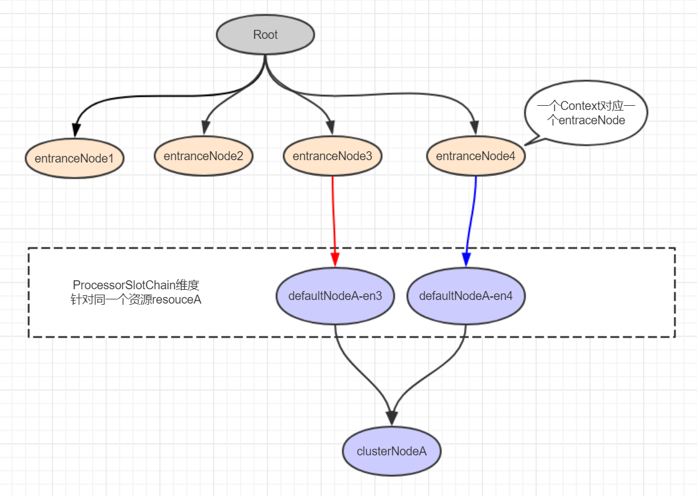

>  前段时间笔者在团队内部分享了sentinel原理设计与实现，主要讲解了sentinel基础概念和工作原理，工作原理部分大家听了基本都了解了，但是对于sentinel的几个概念及其之间的关系还有挺多同学有点模糊的，趁着这几天比较空，针对sentinel的几个核心概念，做了一些总结，希望能帮助一些sentinel初学者理清这些概念之间的关系。
>
>  PS：本文主要参考sentinel源码实现和部分官方文档，建议小伙伴阅读本文的同时也大致看下官方文档和源码，学习效果更好呦 : )*  官方文档讲解的其实还是挺详细的，但是对于这些概念之间的关系可能对于初学者来说还有点不够。
>
>  估计挺多小伙伴还不知道Sentinel是个什么东东，Sentinel是一个以流量为切入点，从流量控制、熔断降级、系统负载保护等多个维度保护服务的稳定性的框架。github地址为：https://github.com/alibaba/Sentinel

### 资源和规则

**资源**是 Sentinel 的关键概念。它可以是 Java 应用程序中的任何内容，例如，由应用程序提供的服务，或由应用程序调用的其它应用提供的服务，甚至可以是一段代码。只要通过 Sentinel API 定义的代码，就是资源，能够被 Sentinel 保护起来。大部分情况下，可以使用方法签名，URL，甚至服务名称作为资源名来标示资源。

围绕资源的实时状态设定的**规则**，可以包括流量控制规则、熔断降级规则以及系统保护规则。所有规则可以动态实时调整。

sentinel中调用SphU或者SphO的entry方法获取限流资源，不同的是前者获取限流资源失败时会抛BlockException异常，后者或捕获该异常并返回false，二者的实现都是基于CtSph类完成的。简单的sentinel示例：

```java
Entry entry = null;
try {
    entry = SphU.entry(KEY);
    System.out.println("entry ok...");
} catch (BlockException e1) {
    // 获取限流资源失败
} catch (Exception e2) {
    // biz exception
} finally {
    if (entry != null) {
        entry.exit();
    }
}

Entry entry = null;
if (SphO.entry(KEY)) {
    System.out.println("entry ok");
} else {
    // 获取限流资源失败
}
```

SphU和SphO二者没有孰优孰略问题，底层实现是一样的，根据不同场景选举合适的一个即可。看了简单示例之后，一起来看下sentinel中的核心概念，便于理解后续内容。

## 核心概念

### Resource

resource是sentinel中最重要的一个概念，sentinel通过资源来保护具体的业务代码或其他后方服务。sentinel把复杂的逻辑给屏蔽掉了，用户只需要为受保护的代码或服务定义一个资源，然后定义规则就可以了，剩下的通通交给sentinel来处理了。并且资源和规则是解耦的，规则甚至可以在运行时动态修改。定义完资源后，就可以通过在程序中埋点来保护你自己的服务了，埋点的方式有两种：

- try-catch 方式（`通过 SphU.entry(...)`），当 catch 到BlockException时执行异常处理(或fallback)
- if-else 方式（`通过 SphO.entry(...)`），当返回 false 时执行异常处理(或fallback)

以上这两种方式都是通过硬编码的形式定义资源然后进行资源埋点的，对业务代码的侵入太大，从0.1.1版本开始，sentinel加入了注解的支持，可以通过注解来定义资源，具体的注解为：SentinelResource 。通过注解除了可以定义资源外，还可以指定 blockHandler 和 fallback 方法。

在sentinel中具体表示资源的类是：ResourceWrapper ，他是一个抽象的包装类，包装了资源的 Name 和EntryType。他有两个实现类，分别是：StringResourceWrapper 和 MethodResourceWrapper。顾名思义，StringResourceWrapper 是通过对一串字符串进行包装，是一个通用的资源包装类，MethodResourceWrapper 是对方法调用的包装。

### Context

Context是对资源操作时的上下文环境，每个资源操作(`针对Resource进行的entry/exit`)必须属于一个Context，如果程序中未指定Context，会创建name为"sentinel_default_context"的默认Context。一个Context生命周期内可能有多个资源操作，Context生命周期内的最后一个资源exit时会清理该Context，这也预示这真个Context生命周期的结束。Context主要属性如下：

```java
public class Context {
    // context名字，默认名字 "sentinel_default_context"
    private final String name;
    // context入口节点，每个context必须有一个entranceNode
    private DefaultNode entranceNode;
    // context当前entry，Context生命周期中可能有多个Entry，所有curEntry会有变化
    private Entry curEntry;
    // The origin of this context (usually indicate different invokers, e.g. service consumer name or origin IP).
    private String origin = "";
    private final boolean async;
}
```

*注意：一个Context生命期内Context只能初始化一次，因为是存到ThreadLocal中，并且只有在非null时才会进行初始化。*

如果想在调用 SphU.entry() 或 SphO.entry() 前，自定义一个context，则通过ContextUtil.enter()方法来创建。context是保存在ThreadLocal中的，每次执行的时候会优先到ThreadLocal中获取，为null时会调用 `MyContextUtil.myEnter(Constants.CONTEXT_DEFAULT_NAME, "", resourceWrapper.getType()) `创建一个context。当Entry执行exit方法时，如果entry的parent节点为null，表示是当前Context中最外层的Entry了，此时将ThreadLocal中的context清空。

### Entry

刚才在Context身影中也看到了Entry的出现，现在就谈谈Entry。每次执行 SphU.entry() 或 SphO.entry() 都会返回一个Entry，Entry表示一次资源操作，内部会保存当前invocation信息。在一个Context生命周期中多次资源操作，也就是对应多个Entry，这些Entry形成parent/child结构保存在Entry实例中，entry类CtEntry结构如下：

```java
class CtEntry extends Entry {
    protected Entry parent = null;
    protected Entry child = null;

    protected ProcessorSlot<Object> chain;
    protected Context context;
}
public abstract class Entry implements AutoCloseable {
    private long createTime;
    private Node curNode;
    /**
     * {@link Node} of the specific origin, Usually the origin is the Service Consumer.
     */
    private Node originNode;
    private Throwable error; // 是否出现异常
    protected ResourceWrapper resourceWrapper; // 资源信息
}
```

Entry实例代码中出现了Node，这个又是什么东东呢 :(，咱们接着往下看：

### DefaultNode

Node（*关于StatisticNode的讨论放到下一小节*）默认实现类DefaultNode，该类还有一个子类EntranceNode；context有一个entranceNode属性，Entry中有一个curNode属性。

- **EntranceNode**：该类的创建是在初始化Context时完成的（ContextUtil.trueEnter方法），注意该类是针对Context维度的，也就是一个context有且仅有一个EntranceNode。
- **DefaultNode**：该类的创建是在NodeSelectorSlot.entry完成的，当不存在context.name对应的DefaultNode时会新建（new DefaultNode(resourceWrapper, null)，对应resouce）并保存到本地缓存（NodeSelectorSlot中private volatile Map<String, DefaultNode> map）；获取到context.name对应的DefaultNode后会将该DefaultNode设置到当前context的curEntry.curNode属性，也就是说，在NodeSelectorSlot中是一个context有且仅有一个DefaultNode。

看到这里，你是不是有疑问？为什么一个context有且仅有一个DefaultNode，我们的resouece跑哪去了呢，其实，这里的一个context有且仅有一个DefaultNode是在NodeSelectorSlot范围内，NodeSelectorSlot是ProcessorSlotChain中的一环，获取ProcessorSlotChain是根据Resource维度来的。总结为一句话就是：**针对同一个Resource，多个context对应多个DefaultNode；针对不同Resource，(不管是否是同一个context)对应多个不同DefaultNode**。这还没看明白 : (，好吧，我不bb了，上图吧：



DefaultNode结构如下：

```java
public class DefaultNode extends StatisticNode {
    private ResourceWrapper id;
    /**
     * The list of all child nodes.
     * 子节点集合，注意：目前版本sentinel中子节点个数最多为1
     */
    private volatile Set<Node> childList = new HashSet<>();
    /**
     * Associated cluster node.
     */
    private ClusterNode clusterNode;
}
```

一个Resouce只有一个clusterNode，多个defaultNode对应一个clusterNode，如果defaultNode.clusterNode为null，则在ClusterBuilderSlot.entry中会进行初始化。

同一个Resource，对应同一个ProcessorSlotChain，这块处理逻辑在lookProcessChain方法中，如下：

```java
ProcessorSlot<Object> lookProcessChain(ResourceWrapper resourceWrapper) {
    ProcessorSlotChain chain = chainMap.get(resourceWrapper);
    if (chain == null) {
        synchronized (LOCK) {
            chain = chainMap.get(resourceWrapper);
            if (chain == null) {
                // Entry size limit.
                if (chainMap.size() >= Constants.MAX_SLOT_CHAIN_SIZE) {
                    return null;
                }

                chain = SlotChainProvider.newSlotChain();
                Map<ResourceWrapper, ProcessorSlotChain> newMap = new HashMap<ResourceWrapper, ProcessorSlotChain>(
                    chainMap.size() + 1);
                newMap.putAll(chainMap);
                newMap.put(resourceWrapper, chain);
                chainMap = newMap;
            }
        }
    }
    return chain;
}
```

### StatisticNode

StatisticNode中保存了资源的实时统计数据（基于滑动时间窗口机制），通过这些统计数据，sentinel才能进行限流、降级等一系列操作。StatisticNode属性如下：

```java
public class StatisticNode implements Node {
    /**
     * 秒级的滑动时间窗口（时间窗口单位500ms）
     */
    private transient volatile Metric rollingCounterInSecond = new ArrayMetric(SampleCountProperty.SAMPLE_COUNT,
        IntervalProperty.INTERVAL);
    /**
     * 分钟级的滑动时间窗口（时间窗口单位1s）
     */
    private transient Metric rollingCounterInMinute = new ArrayMetric(60, 60 * 1000, false);
    /**
     * The counter for thread count. 
	 * 线程个数用户触发线程数流控
     */
    private LongAdder curThreadNum = new LongAdder();
}
public class ArrayMetric implements Metric {
    private final LeapArray<MetricBucket> data;
}
public class MetricBucket {
	// 保存统计值
    private final LongAdder[] counters;
	// 最小rt
    private volatile long minRt;
}
```

其中MetricBucket.counters数组大小为MetricEvent枚举值的个数，每个枚举对应一个统计项，比如PASS表示通过个数，限流可根据通过的个数和设置的限流规则配置count大小比较，得出是否触发限流操作，所有枚举值如下：

```java
public enum MetricEvent {
    PASS, // Normal pass.
    BLOCK, // Normal block.
    EXCEPTION,
    SUCCESS,
    RT,
    OCCUPIED_PASS
}
```

### Slot

slot是另一个sentinel中非常重要的概念，sentinel的工作流程就是围绕着一个个插槽所组成的插槽链来展开的。需要注意的是每个插槽都有自己的职责，他们各司其职完好的配合，通过一定的编排顺序，来达到最终的限流降级的目的。默认的各个插槽之间的顺序是固定的，因为有的插槽需要依赖其他的插槽计算出来的结果才能进行工作。

但是这并不意味着我们只能按照框架的定义来，sentinel 通过 SlotChainBuilder 作为 SPI 接口，使得 Slot Chain 具备了扩展的能力。我们可以通过实现 SlotsChainBuilder 接口加入自定义的 slot 并自定义编排各个 slot 之间的顺序，从而可以给 sentinel 添加自定义的功能。

那SlotChain是在哪创建的呢？是在 CtSph.lookProcessChain() 方法中创建的，并且该方法会根据当前请求的资源先去一个静态的HashMap中获取，如果获取不到才会创建，创建后会保存到HashMap中。这就意味着，同一个资源会全局共享一个SlotChain。默认生成ProcessorSlotChain为：

```java
// DefaultSlotChainBuilder
public ProcessorSlotChain build() {
    ProcessorSlotChain chain = new DefaultProcessorSlotChain();
    chain.addLast(new NodeSelectorSlot());
    chain.addLast(new ClusterBuilderSlot());
    chain.addLast(new LogSlot());
    chain.addLast(new StatisticSlot());
    chain.addLast(new SystemSlot());
    chain.addLast(new AuthoritySlot());
    chain.addLast(new FlowSlot());
    chain.addLast(new DegradeSlot());

    return chain;
```

