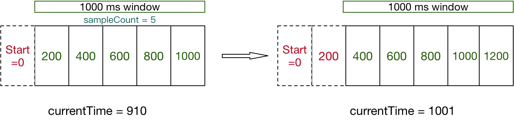

> sentinel的滑动窗口统计机制就是根据当前时间，获取对应的时间窗口，并更新该时间窗口中的各项统计指标（pass/block/rt等），这些指标被用来进行后续判断，比如限流、降级等；随着时间的推移，当前时间点对应的时间窗口是变化的，这时会涉及到时间窗口的初始化、复用等。可以说，sentinel上的功能所用到的数据几乎都是滑动窗口统计机制来维护和更新的。

sentinel 处理流程是基于slot链(ProcessorSlotChain)来完成的，比如限流、熔断等，其中重要的一个slot就是`StatisticSlot`，它是做各种数据统计的，而限流/熔断的数据判断来源就是StatisticSlot，StatisticSlot的各种数据统计都是基于滑动窗口来完成的，因此本文就重点分析StatisticSlot的滑动窗口统计机制。

sentinel 的slot链(`ProcessorSlotChain`)是责任链模式的体现，那SlotChain是在哪创建的呢？是在 `CtSph.lookProcessChain() `方法中创建的，并且该方法会根据当前请求的资源先去一个静态的HashMap中获取，如果获取不到才会创建，创建后会保存到HashMap中。这就意味着，同一个资源会全局共享一个SlotChain。默认生成ProcessorSlotChain逻辑为：

```java
// DefaultSlotChainBuilder
public ProcessorSlotChain build() {
    ProcessorSlotChain chain = new DefaultProcessorSlotChain();
    chain.addLast(new NodeSelectorSlot());
    chain.addLast(new ClusterBuilderSlot());
    chain.addLast(new LogSlot());
    chain.addLast(new StatisticSlot());
    chain.addLast(new SystemSlot());
    chain.addLast(new AuthoritySlot());
    chain.addLast(new FlowSlot());
    chain.addLast(new DegradeSlot());

    return chain;
}
```

整个处理过程从第一个slot往后一直传递到最后一个的，当到达StatisticSlot时，开始统计各项指标，统计的结果又会被后续的Slot所采用，作为各种规则校验的依据。各种指标如下：

```java
public enum MetricEvent {
    PASS, // Normal pass.
    BLOCK, // Normal block.
    EXCEPTION, // 异常统计
    SUCCESS,
    RT, // rt统计
    OCCUPIED_PASS
}
```

### StatisticSlot.entry流程

处理流程走到StatisticSlot时，首先触发后续slot.entry方法，然后统计各项指标，后续slot中数据判断来源就是这里统计的各项指标。StatisticSlot.entry 逻辑如下：

```java
@Override
public void entry(Context context, ResourceWrapper resourceWrapper, DefaultNode node, int count, Object... args) throws Throwable {
    try {
        // 触发下一个Slot的entry方法
        fireEntry(context, resourceWrapper, node, count, args);
        // 如果能通过SlotChain中后面的Slot的entry方法，说明没有被限流或降级
        // 统计信息
        node.increaseThreadNum();
        node.addPassRequest();
        // 省略部分代码
    } catch (BlockException e) {
        context.getCurEntry().setError(e);
        // Add block count.
        node.increaseBlockedQps();
        // 省略部分代码
        throw e;
    } catch (Throwable e) {
        context.getCurEntry().setError(e);
        // Should not happen
        node.increaseExceptionQps();
        // 省略部分代码
        throw e;
    }
}
```

由以上代码可知，StatisticSlot主要就做了3件事：

1. 触发后续slot的entry方法，进行规则校验
2. 校验通过则更新node实时指标数据
3. 校验不通过则更新node异常指标数据

注意：由于后续的`fireEntry`操作和更新本次统计信息是两个操作，不是原子的，会造成限流不准的小问题，比如设置的FlowRule count为20，并发情况下可能稍大于20，不过针对大部分场景来说，这点偏差是可以容忍的，毕竟我们要的是限流效果，而不是必须精确的限流操作。

### 更新node实时指标数据

我们可以看到 node.addPassRequest() 这段代码是在fireEntry执行之后执行的，这意味着，当前请求通过了sentinel的流控等规则，此时需要将当次请求记录下来，也就是执行 node.addPassRequest() 这行代码，具体的代码如下所示：

```java
// DefaultNode
public void addPassRequest() {
    super.addPassRequest();
    this.clusterNode.addPassRequest();
}
```

这里的node是一个 DefaultNode 实例，这里特别补充一个 DefaultNode 和 ClusterNode 的区别：

- DefaultNode：保存着某个resource在某个context中的实时指标，每个DefaultNode都指向一个ClusterNode。
- ClusterNode：保存着某个resource在所有的context中实时指标的总和，同样的resource会共享同一个ClusterNode，不管他在哪个context中。

上面代码不管是 DefaultNode 还是 ClusterNode ，走的都是StatisticNode 对象的 addPassRequest 方法：

```java
private transient volatile Metric rollingCounterInSecond = new ArrayMetric(2, 1000);
private transient Metric rollingCounterInMinute = new ArrayMetric(60, 60 * 1000);

public void addPassRequest(int count) {
    rollingCounterInSecond.addPass(count); // 对每秒指标统计
    rollingCounterInMinute.addPass(count); // 每分钟指标统计
}
```

每一个通过的指标（pass）都是调用Metric 的接口进行操作的，并且是通过 ArrayMetric 这种实现类，代码如下：

```java
public ArrayMetric(int windowLength, int interval) {
    this.data = new WindowLeapArray(windowLength, interval);
}

public void addPass(int count) {
    // 获取当前时间窗口
    WindowWrap<MetricBucket> wrap = data.currentWindow();
    wrap.value().addPass(count);
}
```

首先通过 currentWindow() 获取当前时间窗口，然后更新当前时间窗口对应的统计指标，以下代码重点关注几个判断逻辑：

```java
// LeapArray
public WindowWrap<T> currentWindow() {
    return currentWindow(TimeUtil.currentTimeMillis());
}
// TimeUtil
public static long currentTimeMillis() {
    // currentTimeMillis是由一个tick线程每个1ms更新一次，具体逻辑在TimeUtil类中
    return currentTimeMillis;
}
// LeapArray
public WindowWrap<T> currentWindow(long timeMillis) {
    // 计算当前时间点落在滑动窗口的下标
    int idx = calculateTimeIdx(timeMillis);
    // Calculate current bucket start time.
    long windowStart = calculateWindowStart(timeMillis);

    // 获取当前时间点对应的windowWrap，array为AtomicReferenceArray
    while (true) {
        WindowWrap<T> old = array.get(idx);
        if (old == null) {
            // 1.为空表示当前时间窗口为初始化过，创建WindowWrap并cas设置到array中
            WindowWrap<T> window = new WindowWrap<T>(windowLengthInMs, windowStart, newEmptyBucket());
            if (array.compareAndSet(idx, null, window)) {
                return window;
            } else {
                Thread.yield();
            }
        } else if (windowStart == old.windowStart()) {
            // 2.获取的时间窗口正好对应当前时间，直接返回
            return old;
        } else if (windowStart > old.windowStart()) {
            // 3.获取的时间窗口为老的，进行reset操作复用
            if (updateLock.tryLock()) {
                try {
                    return resetWindowTo(old, windowStart);
                } finally {
                    updateLock.unlock();
                }
            } else {
                Thread.yield();
            }
        } else if (windowStart < old.windowStart()) {
            // 4.时间回拨了，正常情况下不会走到这里
            return new WindowWrap<T>(windowLengthInMs, windowStart, newEmptyBucket());
        }
    }
}
```

获取当前时间窗口对应的WindowWrap之后，就可以进行更新操作了。

```java
// wrap.value().addPass(count);
public void addPass(int n) {
    add(MetricEvent.PASS, n);
}
// MetricBucket
public MetricBucket add(MetricEvent event, long n) {
    // 对应MetricEvent枚举中值
    counters[event.ordinal()].add(n);
    return this;
}
```

到这里为止，整个指标统计流程就完成了，下面重点看下滑动窗口机制。

### 滑动窗口机制

时间窗口是用WindowWrap对象表示的，其属性如下：

```java
private final long windowLengthInMs;  // 时间窗口的长度
private long windowStart; // 时间窗口开始时间
private T value; // MetricBucket对象，保存各个指标数据
```

sentinel时间基准由tick线程来做，每1ms更新一次时间基准，逻辑如下：

```java
currentTimeMillis = System.currentTimeMillis();
Thread daemon = new Thread(new Runnable() {
    @Override
    public void run() {
        while (true) {
            currentTimeMillis = System.currentTimeMillis();
            try {
                TimeUnit.MILLISECONDS.sleep(1);
            } catch (Throwable e) {
            }
        }
    }
});
daemon.setDaemon(true);
daemon.setName("sentinel-time-tick-thread");
daemon.start();
```

sentinel默认有每秒和每分钟的滑动窗口，对应的LeapArray类型，它们的初始化逻辑是：

```java
protected int windowLengthInMs; // 单个滑动窗口时间值
protected int sampleCount; // 滑动窗口个数
protected int intervalInMs; // 周期值（相当于所有滑动窗口时间值之和）

public LeapArray(int sampleCount, int intervalInMs) {
    this.windowLengthInMs = intervalInMs / sampleCount;
    this.intervalInMs = intervalInMs;
    this.sampleCount = sampleCount;

    this.array = new AtomicReferenceArray<WindowWrap<T>>(sampleCount);
}
```

针对每秒滑动窗口，`windowLengthInMs=500，sampleCount=2，intervalInMs=1000`，针对每分钟滑动窗口，`windowLengthInMs=1000，sampleCount=60，intervalInMs=60000`，对应代码：

```java
private transient volatile Metric rollingCounterInSecond = new ArrayMetric(2, 1000);
private transient Metric rollingCounterInMinute = new ArrayMetric(60, 60 * 1000);
```

> currentTimeMillis时间基准（tick线程）每1ms更新一次，通过currentWindow(timeMillis)方法获取当前时间点对应的WindowWrap对象，然后更新对应的各种指标，用于做限流、降级时使用。注意，当前时间基准对应的事件窗口初始化时lazy模式，并且会复用的。

Sentinel 底层采用高性能的滑动窗口数据结构 LeapArray 来统计实时的秒级指标数据，可以很好地支撑写多于读的高并发场景。最后以一张图结束吧：

