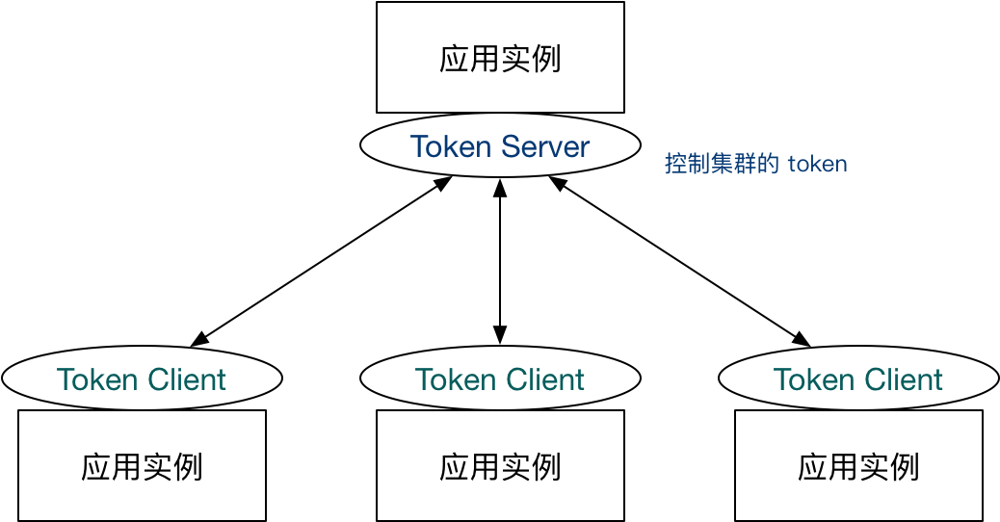

为什么需要集群流控呢？假设需要将某个API的总qps限制在100，机器数可能为50，这时很自然的想到使用一个专门的server来统计总的调用量，其他实例与该server通信来判断是否可以调用，这就是基本的集群流控方式，sentinel的实现就是这样的。

如果服务调用使用轮训或者随机路由方式，理论上可以通过在各个单机上设置流控规则即可（`单机qps上限=总qps上限 / 机器数`）。集群流控可以解决流量分配不均的问题导致总体流控效果不佳的问题，其可以精确地控制整个集群的调用总量，结合单机限流兜底，可以更好地发挥流量控制的效果，不过由于会与server进行通信，所以性能上会有一定损耗。

集群流控中共有两种身份：

- Token Client：集群流控客户端，用于向所属 Token Server 通信请求 token。集群限流服务端会返回给客户端结果，决定是否限流。
- Token Server：即集群流控服务端，处理来自 Token Client 的请求，根据配置的集群规则判断是否应该发放 token（是否允许通过）。

Sentinel 1.4.0 开始引入了集群流控模块，主要包含以下几部分：

- `sentinel-cluster-common-default`: 公共模块，包含公共接口和实体
- `sentinel-cluster-client-default`: 默认集群流控 client 模块，使用 Netty 进行通信，提供接口方便序列化协议扩展
- `sentinel-cluster-server-default`: 默认集群流控 server 模块，使用 Netty 进行通信，提供接口方便序列化协议扩展；同时提供扩展接口对接规则判断的具体实现（TokenService），默认实现是复用 sentinel-core 的相关逻辑

大致了解集群流控概念之后，下面一起分析下集群流控规则、client端和server端各自处理机制~

### 集群流控规则

FlowRule 添加了两个字段用于集群限流相关配置，如下所示。clusterMode在方法`FlowRuleChecker.canPassCheck`中会用到进行判断是否是集群流控，false表示单机流控；true表示集群流控，会调用方法passClusterCheck与集群流控server端通信判断是否触发了流控，此时异常降级策略为本地流控(*fallbackToLocalOrPass方法，fallbackToLocalWhenFail属性为true时执行本地流控，否则直接返回ture不走流控检查*)。

```java
private boolean clusterMode; // 标识是否为集群限流配置
private ClusterFlowConfig clusterConfig; // 集群限流相关配置项

// ClusterFlowConfig属性
private Long flowId; // 全局唯一的规则 ID，由集群限流管控端分配.
private int thresholdType = ClusterRuleConstant.FLOW_THRESHOLD_AVG_LOCAL; // 阈值模式，默认（0）为单机均摊，1 为全局阈值.
private int strategy = ClusterRuleConstant.FLOW_CLUSTER_STRATEGY_NORMAL;
private boolean fallbackToLocalWhenFail = true; // 在 client 连接失败或通信失败时，是否退化到本地的限流模式

public boolean canPassCheck(/*@NonNull*/ FlowRule rule, Context context, DefaultNode node, int acquireCount, boolean prioritized) {
    String limitApp = rule.getLimitApp();
    if (limitApp == null) {
        return true;
    }
    if (rule.isClusterMode()) {// 集群模式
        return passClusterCheck(rule, context, node, acquireCount, prioritized);
    }
    // 单机模式流控
    return passLocalCheck(rule, context, node, acquireCount, prioritized);
}
```

- **flowId** 代表全局唯一的规则 ID，Sentinel 集群限流服务端通过此 ID 来区分各个规则，因此务必保持全局唯一。一般 flowId 由统一的管控端进行分配，或写入至 DB 时生成。
- **thresholdType** 代表集群限流阈值模式。单机均摊模式表示总qps阈值等于机器数*单机qps阈值；全局阈值等于整个集群配置的阈值。
- **strategy** 集群策略，默认`FLOW_CLUSTER_STRATEGY_NORMAL`，针对ClusterFlowConfig配置该属性为FLOW_CLUSTER_STRATEGY_NORMAL才合法，除此之外，暂无太多业务意义。

### client端处理机制

client端的处理机制和单机是一样的，只不过clusterMode和clusterConfig属性配置上了而已，具体的client使用可以参考官方文档 [集群流控](https://github.com/alibaba/Sentinel/wiki/集群流控)，这里不再赘述。如果是集群流控，在`FlowRuleChecker.canPassCheck`方法中会调用方法`passClusterCheck`，如下：

```java
private static boolean passClusterCheck(FlowRule rule, Context context, DefaultNode node, int acquireCount,
                                            boolean prioritized) {
    try {
        TokenService clusterService = pickClusterService();
        if (clusterService == null) {
            // 为null降级处理
            return fallbackToLocalOrPass(rule, context, node, acquireCount, prioritized);
        }
        long flowId = rule.getClusterConfig().getFlowId();
        TokenResult result = clusterService.requestToken(flowId, acquireCount, prioritized);
        return applyTokenResult(result, rule, context, node, acquireCount, prioritized);
    } catch (Throwable ex) {
        RecordLog.warn("[FlowRuleChecker] Request cluster token unexpected failed", ex);
    }
    // 降级处理 本地限流
    return fallbackToLocalOrPass(rule, context, node, acquireCount, prioritized);
}
```

requestToken负责与token server端通信，入参包括` flowId, acquireCount, prioritized`，这里是没有Resource信息的，server端通过flowid来获取对应规则进行流控判断。注意，调用writeAndFlush发送请求之后等待响应结果，最大等待时间`ClusterClientConfigManager.getRequestTimeout()`；请求发送过程中，出现任何异常或者返回错误（这里不包括BLOCKED情况），都会默认走降级本地流控逻辑：`fallbackToLocalOrPass`。

> 了解了client端处理流程，接下来看下server端处理流程，client和server端都是用netty作为底层网络通信服务，关于netty的原理不是本文讨论的重点因此会简单带过。如果小伙伴们还不太熟悉netty，请参阅对应资料即可。对于netty，每个Java开发者都需要了解甚至是熟悉的，这样不仅仅帮助我们理解NIO及Reactor模型，还能再阅读基于netty的框架源码（比如dubbo/rocketmq等）时，将重点关注在框架本身实现上，而不是网络通信流程及细节上。

### server端处理机制

Sentinel 集群限流服务端有两种启动方式：

- **独立模式**（Alone），即作为独立的 token server 进程启动，独立部署，隔离性好，但是需要额外的部署操作。独立模式适合作为 Global Rate Limiter 给集群提供流控服务。
- 
- **嵌入模式**（Embedded），即作为内置的 token server 与服务在同一进程中启动。在此模式下，集群中各个实例都是对等的，token server 和 client 可以随时进行转变，因此无需单独部署，灵活性比较好。但是隔离性不佳，需要限制 token server 的总 QPS，防止影响应用本身。嵌入模式适合某个应用集群内部的流控。
- 

目前针对token server高可用，sentinel并没有对应的解决方案，不过没有并不意味着没考虑，因为默认可以降级走本地流控。sentinel作为一个限流组件，在大部分应用场景中，如果token server挂了降级为本地流控就可以满足了。

>  如果必须考虑token server高可用，可考虑token server集群部署，每个token server都能访问（或存储）全量规则数据，多个client通过特定路由规则分配到不同的token server（相同类型服务路由到同一个token server，不同类型服务可路由到不同token server），token server故障时提供failover机制即可。如果此时考虑到相同类型服务出现网络分区，也就是一部分服务可以正常与token server通信，另一个部分服务无法正常与token server通信，如果无法正常通信的这部分服务直接进行failover，会导致集群限流不准的问题，可通过zookeeper来保存在线的token server，如果zookeeper中token server列表有变化，再进行failover；此情况下再出现任何形式的网络分区，再执行降级逻辑，执行本地限流。

server端不管是独立模式还是嵌入模式，都是通过`NettyTransportServer`来启动的：

```java
public void start() {
    ServerBootstrap b = new ServerBootstrap();
    b.group(bossGroup, workerGroup)
        .channel(NioServerSocketChannel.class)
        .childHandler(new ChannelInitializer<SocketChannel>() {
            @Override
            public void initChannel(SocketChannel ch) throws Exception {
                ChannelPipeline p = ch.pipeline();
                p.addLast(new LengthFieldBasedFrameDecoder(1024, 0, 2, 0, 2));
                p.addLast(new NettyRequestDecoder());
                p.addLast(new LengthFieldPrepender(2));
                p.addLast(new NettyResponseEncoder());
                p.addLast(new TokenServerHandler(connectionPool));
            }
        });
    b.bind(port).addListener(new GenericFutureListener<ChannelFuture>() {
        //
    });
}
```

以上逻辑主要是netty启动逻辑，重点关注initChannel方法，这些是往pipeline添加自定义channelHandler，主要是处理粘包、编解码器和业务处理Handler，这里最重要的是TokenServerHandler，因为是请求处理逻辑，所以重点关注其channelRead方法：

```java
public void channelRead(ChannelHandlerContext ctx, Object msg) throws Exception {
    // 全局保存channel
    globalConnectionPool.refreshLastReadTime(ctx.channel());
    if (msg instanceof ClusterRequest) {
        ClusterRequest request = (ClusterRequest)msg;
        if (request.getType() == ClusterConstants.MSG_TYPE_PING) {
            // ping请求处理，会记录namespace信息
            handlePingRequest(ctx, request);
            return;
        }
        // 根据request type获取对应处理器
           // 针对集群流控，type为MSG_TYPE_FLOW
        RequestProcessor<?, ?> processor = RequestProcessorProvider.getProcessor(request.getType());
        ClusterResponse<?> response = processor.processRequest(request);
        writeResponse(ctx, response);
    }
}
```

针对集群流控，type为`MSG_TYPE_FLOW`，对应处理器为`FlowRequestProcessor`。首先会提取请求入参 `flowId, acquireCount, prioritized`，主要步骤如下：

- 根据flowId获取规则，为空返回结果NO_RULE_EXISTS；
- 获取请求namespace对应的RequestLimiter，非空时进行tryPass限流检查，该检查是针对namespace维度；
- 针对flowId对应规则进行限流检查，acquireCount表示该请求需要获取的token数，数据检查基于滑动时间窗口统计来判断的。

根据限流规则检查之后，会统计相关的`PASS/BLOCK/PASS_REQUEST/BLOCK_REQUEST`等信息，该流程和单机流控流程是类似的，具体代码不再赘述。处理完成之后，会返回client端处理结果，至此整个集群流控流程就分析完了。