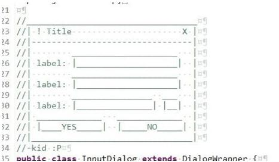

好的代码需不需要注释，这个问题其实不能直接说需要或者不需要，因为要视情况而定。**如果一段代码功能较为简单且独立，同时代码风格较好，是不需要注释的，因为代码本身已经足够说明其用意了（代码即注释）；如果功能较复杂或者较为抽象，是需要合理注释的，方便他人阅读和快速理解代码逻辑。**那么问题来了，什么是好的注释呢？就是简洁的表述自己当时的思考，即为什么，话句话说：应该表达“我的代码为什么要这么做？”，而不是表达“我的代码做了什么？”。必要的时候可以增加图形化说明，更加具体：

关于良好的编程风格，笔者这里推荐一本书：

记住一句话：

> “程序员必须为了让人能阅读代码而书写代码，而机器执行只是顺便的。”