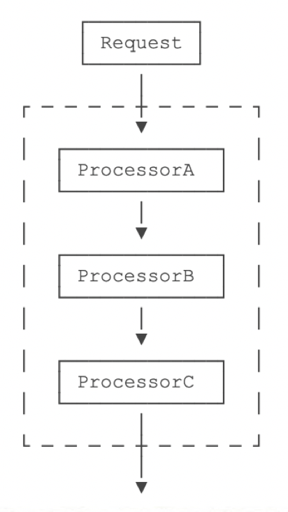
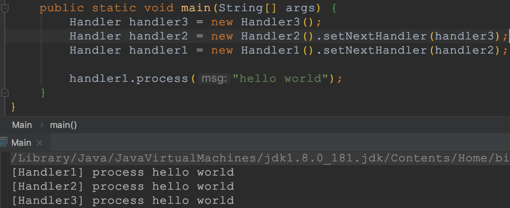
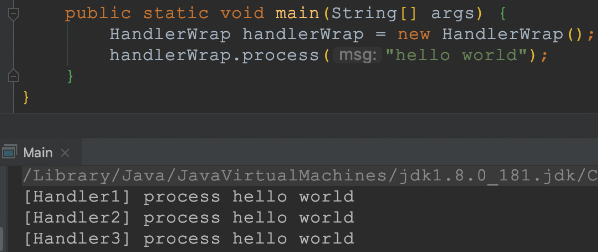

责任链模式是日常开发或者框架中经常被使用的一种设计模式，典型的责任链有2种实现方式，不知道各位小伙伴更pick哪一种呢？下面就一起来比较下这2种实现方式吧~

## 责任链是什么

责任链是属于行为型模式，在这种模式中，通常每个接收者都包含对另一个接收者的引用，如果一个对象不能处理该请求，那么它会把相同的请求传给下一个接收者，依此类推。责任链模式避免请求发送者与接收者耦合在一起，让多个对象都有可能接收请求，将这些对象连接成一条链，并且沿着这条链传递请求，直到有对象处理它为止。

责任链类图下图：


责任链模式在开源项目中应用场景还是比较常见的，比如Tomcat中的Filter处理链、Netty中的ChannelHandler处理链、Dubbo RPC中的consumer侧的Filter链等等。责任链模式应用在业务流程中的 多个同类型操作场景，相当于对一个复杂较长的操作进行分段处理，这样对扩展性友好，新增操作阶段时更加灵活。这种可以理解为分片思想，降低业务流程操作的复杂度。

## 责任链的2种实现

常见的责任链流程如下：



### 节点传递方式

节点传递方式也就是，责任链中当前节点处理完成之后，自己传递给下一个处理节点继续处理。

```java
public interface Handler {
    default boolean match(String msg) {
        return true;
    }
    void process(String msg);
}

public abstract class AbstractHandler implements Handler {
    private Handler next;

    public AbstractHandler setNextHandler(Handler next) {
        this.next = next;
        return this;
    }

    @Override
    public void process(String msg) {
        doProcess(msg);

        if (next != null) {
            next.process(msg);
        }
    }

    protected abstract void doProcess(String msg);
}

// 具体的责任链处理器
public class Handler1 extends AbstractHandler {
    @Override
    public void doProcess(String msg) {
        System.out.println("[Handler1] process " + msg);
    }
}
public class Handler2 extends AbstractHandler {
    @Override
    protected void doProcess(String msg) {
        System.out.println("[Handler2] process " + msg);
    }
}
public class Handler3 extends AbstractHandler {
    @Override
    protected void doProcess(String msg) {
        System.out.println("[Handler3] process " + msg);
    }
}
```

输出结果：



### 统一传递方式

统一传递方式也就是，不由责任链中处理节点传递给下一个节点，而是由统一的传递逻辑进行传递。

```java
public class HandlerWrap {
    private List<Handler> handlerList = new ArrayList<>();

    public HandlerWrap() {
        handlerList.add(new Handler1());
        handlerList.add(new Handler2());
        handlerList.add(new Handler3());
    }

    public void process(String msg) {
        for (Handler handler : handlerList) {
            handler.process(msg);
        }
    }
}

public class Handler1 implements Handler {
    @Override
    public void process(String msg) {
        System.out.println("[Handler1] process " + msg);
    }
}
public class Handler2 implements Handler {
    @Override
    public void process(String msg) {
        System.out.println("[Handler2] process " + msg);
    }
}
public class Handler3 implements Handler {
    @Override
    public void process(String msg) {
        System.out.println("[Handler3] process " + msg);
    }
}
```

输出结果：



## 两种实现方式的比较

上述两种实现方式差别就是谁来进行下一个节点的传递工作，节点传递方式 是责任链中当前处理节点处理完成之后，自己传递给下一个节点；统一传递方式 是在统一的地方进行传递工作，减轻处理节点的“负担”。

二者本质上是一样的，不过前一种实现方式初始化成本较高，还要注意处理节点的前后顺序，这种调整一个节点的位置时特别要注意前后节点的关系，否则处理链顺序就错乱了。

**后续开发中，建议使用第二种实现方式，这种责任链初始化成本较低，调整责任链成本较小**。不过有些责任链使用场景中，会将前一个处理节点的返回结果作为下一个处理节点的入参，这种场景一般推荐使用第一种实现方式，就像Netty中的ChannelHandler处理链流程类似。

